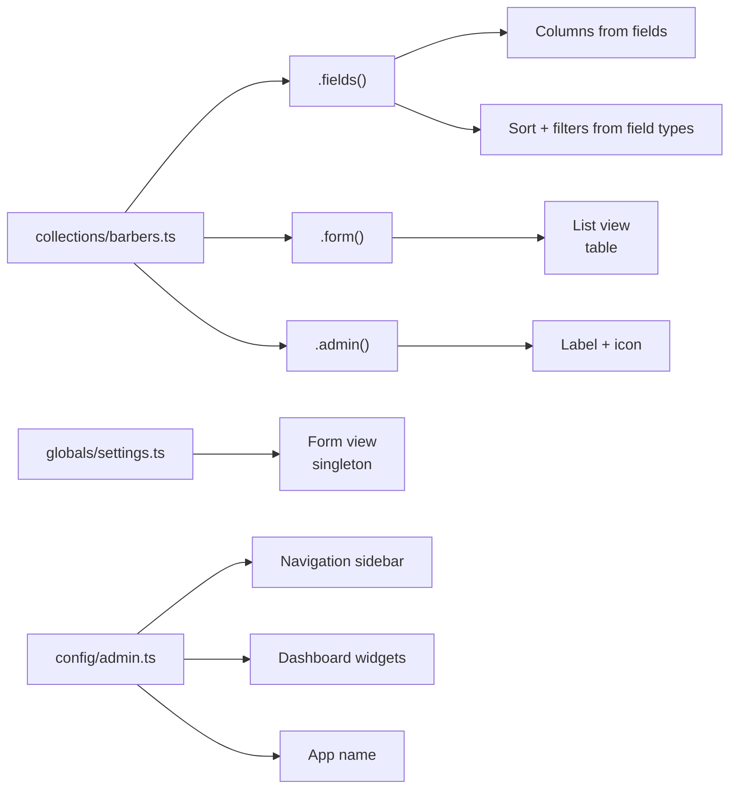

The admin panel is **a projection**, not the framework. It reads your server schema via introspection and generates an interface. Your backend works without it. Add it when you need an internal tool.

## Sections

<Cards>
  <Card title="Admin Setup" href="/docs/admin/setup" description="Enable the admin module, server config, and generated client config." />
  <Card title="Views" href="/docs/admin/views" description="Server-configured views — list views, form views, dashboard, and sidebar." />
  <Card title="Blocks" href="/docs/admin/blocks" description="Content blocks for page builders — define server-side, render client-side." />
  <Card title="Actions" href="/docs/admin/actions" description="CRUD actions and custom actions in the admin panel." />
  <Card title="Live Preview" href="/docs/admin/live-preview" description="Edit content in the existing form while your frontend iframe mirrors changes." />
  <Card title="Branding" href="/docs/admin/branding" description="Customize the admin panel name, brand chrome, and appearance." />
  <Card title="Filters & Saved Views" href="/docs/admin/filters" description="Filter collection records and save filter presets." />
  <Card title="Bulk Actions" href="/docs/admin/bulk-actions" description="Select multiple records and apply actions in batch." />
  <Card title="Media & Uploads" href="/docs/admin/media" description="File uploads, asset management, and the upload field." />
  <Card title="Content Localization" href="/docs/admin/localization" description="Edit localized content with locale switching in the admin panel." />
  <Card title="UI Language & Messages" href="/docs/admin/ui-messages" description="Configure the admin interface language and override translated message keys." />
  <Card title="History & Versions" href="/docs/admin/history" description="Activity audit trail and version snapshots with one-click restore." />
  <Card title="Visibility Rules" href="/docs/admin/visibility" description="Reactive field visibility and state — show, hide, disable, or lock fields based on other field values." />
</Cards>
