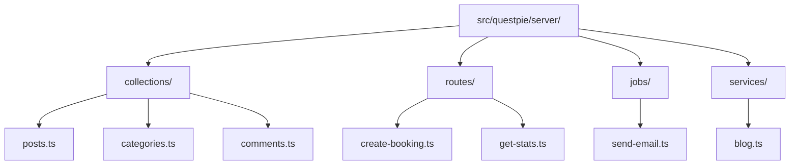
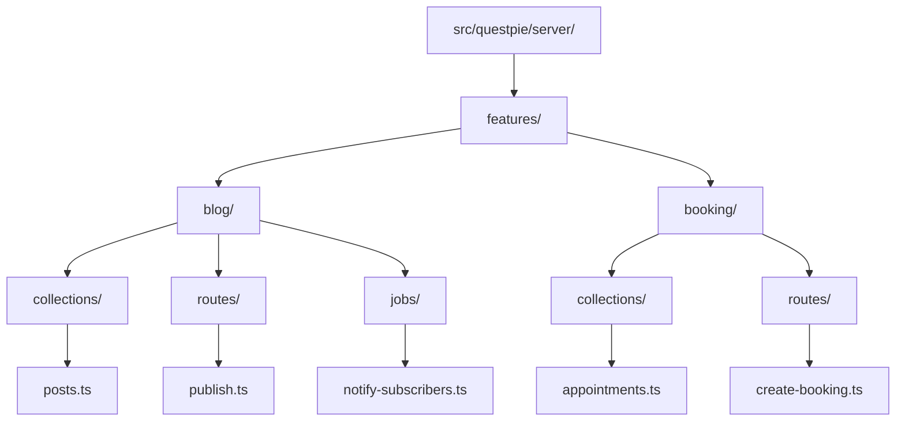
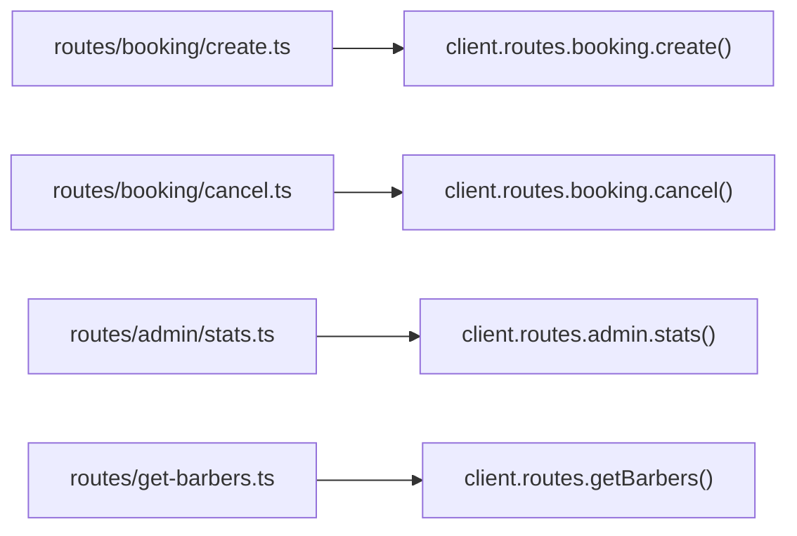

QUESTPIE uses your file system as the source of truth. Drop a file in the right directory, run codegen, and it's part of your app. No manual registration.

## Directory Categories

Each directory maps to a category of entity:

| Directory       | Entity          | Export Style     | Key Derivation                  |
| --------------- | --------------- | ---------------- | ------------------------------- |
| `collections/`  | Collections     | Default or named | Factory arg → export name       |
| `globals/`      | Globals         | Default or named | Factory arg → export name       |
| `routes/`       | Routes          | Default          | Filename → camelCase/slash path |
| `jobs/`         | Jobs            | Default          | Filename → camelCase            |
| `routes/` (raw) | Routes          | Default          | Filename → slash-separated path |
| `services/`     | Services        | Default          | Filename → camelCase            |
| `emails/`       | Email templates | Default          | Filename → camelCase            |
| `blocks/`       | Blocks          | Named exports    | Factory arg → export name       |
| `messages/`     | i18n messages   | Default          | Filename → locale key           |
| `migrations/`   | DB migrations   | Default          | Array (ordered)                 |
| `seeds/`        | DB seeds        | Default          | Array (ordered)                 |

### Name derivation

Factory string args are entity identities for collections, globals, blocks, views, and components. They are converted from kebab-case to camelCase:

```mermaid
flowchart LR
  Collection["collection(\"blog-posts\")"] --> BlogPosts["blogPosts"]
  Block["block(\"hero-banner\")"] --> HeroBanner["heroBanner"]
  Global["global(\"siteSettings\")"] --> SiteSettings["siteSettings"]
```

Only hyphens are camelized. Underscores are preserved, so `global("site_settings")` generates the key `site_settings`, not `siteSettings`.

## Single-File Conventions

Some configs are single files, not directories:

| File                 | Factory                              | Purpose                                            |
| -------------------- | ------------------------------------ | -------------------------------------------------- |
| `questpie.config.ts` | `runtimeConfig({...})`               | DB, plugins, adapters                              |
| `modules.ts`         | `export default [...]`               | Module dependencies                                |
| `config/auth.ts`     | `authConfig({...})`                  | Auth configuration                                 |
| `config/app.ts`      | `export default appConfig({...})`    | App-level config (context, locale, tenant scoping) |
| `config/admin.ts`    | `adminConfig({...})`                 | Admin sidebar, dashboard, branding, locale         |
| `config/openapi.ts`  | `openApiConfig({...})`               | OpenAPI and Scalar UI options                      |
| `fields.ts`          | `export default { ...customFields }` | Custom field type definitions                      |

## Layouts

### By-Type (default)

Group files by entity type:



### By-Feature

Group files by domain:



### Mixed

Both layouts can coexist. Codegen scans all configured paths.

## Nested Namespacing

Routes support nested directories:



## Discovery Process

1. **Scan** — Codegen walks the configured directories
2. **Match** — Files matching the category pattern are picked up
3. **Import** — Each file is imported and its exports are read
4. **Key derivation** — Factory string arg → export name → filename (camelCase)
5. **Merge** — Project entities + module entities are merged
6. **Emit** — Generated types and runtime wiring in `.generated/`

## The `#questpie` Import

Collection and global files use `#questpie` as an import alias:

```ts
import { collection } from "#questpie/factories";
```

This resolves to the generated app context, giving the builders access to field types and relation targets for autocompletion. It's configured via TypeScript path mapping.

## Related Pages

- [Codegen](/docs/backend/architecture/codegen) — What gets generated
- [Modules](/docs/backend/architecture/modules) — Module composition
- [Plugins](/docs/backend/architecture/plugins) — Plugin system
- [Project Structure](/docs/start-here/project-structure) — Full layout reference
