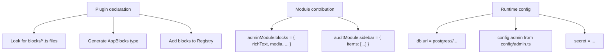

QUESTPIE's plugin system follows a three-level architecture:

- **Plugin** — Declares what CAN exist (file categories, builder extensions, registries)
- **Module** — Contributes what DOES exist (actual values, entities)
- **Config** — Runs the runtime (database, adapters, secrets)

The core framework is intentionally lean. Most functionality — including the admin panel, audit logging, and even builtin fields — comes from plugins and modules.

## How Plugins Work

A plugin tells codegen **what to look for** and **what types to generate**. Built-in modules can contribute their plugins automatically through `modules.ts`:

```ts
import { adminModule } from "@questpie/admin/server";

export default [adminModule] as const;
```

When you add `adminModule`, its plugin makes codegen look for:

- `config/admin.ts` — Sidebar, dashboard, branding, and admin locale
- `blocks/*.ts` — Content block definitions
- admin views, components, and field types contributed by modules

Without the module/plugin contribution, these files are ignored.

## Core vs Plugin Categories

The core framework discovers these categories by default:

| Category       | Pattern                |
| -------------- | ---------------------- |
| `collections/` | Collection definitions |
| `globals/`     | Global definitions     |
| `jobs/`        | Background jobs        |
| `routes/`      | HTTP routes            |
| `services/`    | Singleton services     |
| `emails/`      | Email templates        |

The admin plugin adds:

| Category          | Pattern        |
| ----------------- | -------------- |
| `blocks/`         | Content blocks |
| `config/admin.ts` | Admin config   |

## CodegenPlugin Interface

Plugins implement the `CodegenPlugin` interface:

```ts
interface CodegenPlugin {
	name: string;
	targets: Record<string, CodegenTargetContribution>;
}

interface CodegenTargetContribution {
	// File categories to discover
	categories?: Record<string, CategoryDeclaration>;

	// Single-file or directory patterns
	discover?: Record<string, DiscoverPattern>;

	// Builder method extensions
	registries?: {
		collectionExtensions?: Record<string, RegistryExtension>;
		globalExtensions?: Record<string, RegistryExtension>;
		fieldExtensions?: Record<string, RegistryExtension>;
		singletonFactories?: Record<string, SingletonFactory>;
		builderFactories?: Record<string, BuilderFactory>;
	};

	// Callback params like f, v, c, a
	callbackParams?: Record<string, CallbackParamDefinition>;

	// Post-discovery transformation
	transform?: (ctx: CodegenContext) => void;
}
```

### Category Declaration

```ts
categories: {
  blocks: {
    pattern: "blocks/**/*.ts",
    cardinality: "map",        // Record<string, Block>
    recursive: false,
    featureLayout: true,       // Also scan features/*/blocks/
    mergeStrategy: "record",   // Merge by key
    moduleContributionKey: "blocks",
    registryKey: "blocks",
  },
}
```

| Property                | Description                                   |
| ----------------------- | --------------------------------------------- |
| `pattern`               | Glob pattern for file discovery               |
| `cardinality`           | `"map"` (key-value) or `"single"` (one value) |
| `recursive`             | Support nested directories                    |
| `featureLayout`         | Scan `features/*/` directories                |
| `mergeStrategy`         | How to merge with module contributions        |
| `moduleContributionKey` | Property name on module objects               |
| `registryKey`           | Type name in generated `Registry`             |

## Three Levels in Action



## Related Pages

- [Modules](/docs/backend/architecture/modules) — Module composition
- [Codegen](/docs/backend/architecture/codegen) — Generated output
- [Building a Plugin](/docs/extend/building-a-plugin) — Create your own plugin
