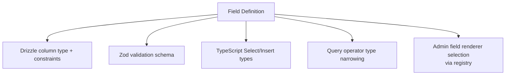

In QUESTPIE, a field definition is not just a form widget or a database column. It's the **single source of truth** that drives every layer of the stack.

## What One Field Definition Produces

```ts
price: f.number().required().label("Price (cents)");
```

From this single line, QUESTPIE derives:

| Layer                | Output                                                    |
| -------------------- | --------------------------------------------------------- |
| **Database**         | `integer NOT NULL` column in Drizzle schema               |
| **API validation**   | `z.number()` in the create/update Zod schema              |
| **Query operators**  | `where: { price: { gte: 1000, lt: 5000 } }`               |
| **TypeScript types** | `price: number` in `Select` and `Insert` types            |
| **Client SDK**       | Typed `find()`, `create()`, `update()` with `price` field |
| **Admin list**       | Numeric column with sorting                               |
| **Admin form**       | Number input with "Price (cents)" label                   |
| **Admin filters**    | Numeric range filter                                      |

## No Dual Definitions

Traditional approaches require you to define schema in multiple places:

```mermaid
flowchart TD
  Without["Without QUESTPIE<br/>same data defined 3+ times"]
  Migration["Database migration<br/>INTEGER price NOT NULL"]
  Validation["API validation<br/>z.object({ price: z.number() })"]
  Type["TypeScript type<br/>interface Post { price: number }"]
  Form["Form component<br/>&lt;NumberInput name=\"price\" required /&gt;"]

  Without --> Migration
  Without --> Validation
  Without --> Type
  Without --> Form
```

With QUESTPIE:

```mermaid
flowchart LR
  Field["f.number().required().label(\"Price\")"]
  Outputs["Database, validation, types, and UI<br/>derived automatically"]

  Field --> Outputs
```

## How It Works

1. **You define fields** in a collection file
2. **Codegen reads** your field definitions
3. **Generated types** flow to the runtime, client, and admin
4. **Each consumer** uses the appropriate projection of the same definition



## Practical Consequences

### Add a field → everything updates

Add a field to a collection, re-run codegen:

```ts
// Before
.fields(({ f }) => ({
  title: f.text().required(),
  body: f.textarea(),
}))

// After — add status field
.fields(({ f }) => ({
  title: f.text().required(),
  body: f.textarea(),
  status: f.select([
    { value: "draft", label: "Draft" },
    { value: "published", label: "Published" },
  ]).default("draft"),
}))
```

After `questpie generate`:

- Database gets a new `status` column
- API validates `status` on create/update
- Client SDK exposes `where: { status: "draft" }`
- Admin form shows a select dropdown
- Admin list gets a new filterable column

### Field type → query operators

The field type determines which query operators are available:

```ts
// text → equals, contains, startsWith, endsWith
where: { title: { contains: "hello" } }

// number → equals, gt, gte, lt, lte, in
where: { price: { gte: 1000, lt: 5000 } }

// datetime → equals, gt, gte, lt, lte
where: { scheduledAt: { gte: startOfDay, lte: endOfDay } }

// select → equals, in
where: { status: "published" }
where: { status: { in: ["draft", "published"] } }

// boolean → equals
where: { isActive: true }

// relation → equals (by ID)
where: { barber: barberId }
```

### Field type → admin renderer

The field type maps to an admin form component:

| Field Type | Default Renderer          |
| ---------- | ------------------------- |
| `text`     | Text input                |
| `textarea` | Textarea                  |
| `richText` | Rich text editor (TipTap) |
| `number`   | Number input              |
| `boolean`  | Checkbox / switch         |
| `date`     | Date picker               |
| `datetime` | Date-time picker          |
| `select`   | Select dropdown           |
| `relation` | Relation picker           |
| `upload`   | File upload with preview  |
| `object`   | Nested form group         |
| `array`    | Repeatable items          |
| `blocks`   | Block editor              |

## Related Pages

- [Fields](/docs/backend/data-modeling/fields) — All field types and options
- [Codegen](/docs/backend/architecture/codegen) — What gets generated
- [Querying](/docs/frontend/querying) — Query operators per field type
