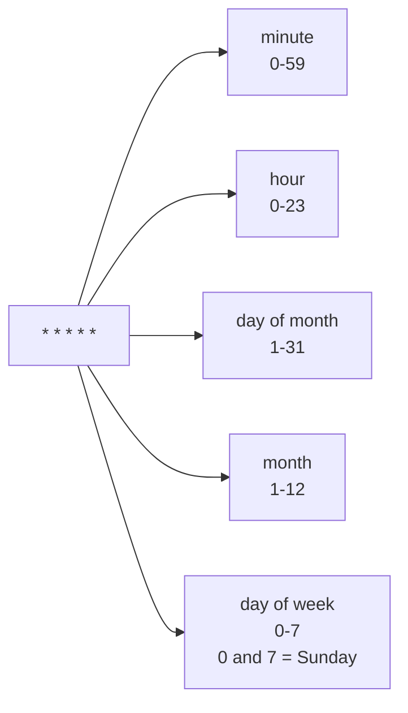

# Cron Triggers

Workflows can be triggered on a recurring schedule using standard cron expressions. The maintenance job checks for due cron workflows and triggers new instances automatically.

## Defining a Cron Workflow

```ts title="workflows/daily-report.ts"
import { workflow } from "@questpie/workflows";
import z from "zod";

export default workflow({
	name: "daily-report",
	schema: z.object({}),
	cron: "0 8 * * *", // Every day at 8:00 AM
	handler: async ({ step }) => {
		const stats = await step.run("gather-stats", async () => {
			// Collect daily metrics
			return { users: 1234, revenue: 56789 };
		});

		await step.run("send-report", async () => {
			await email.send({
				to: "team@example.com",
				template: "daily-report",
				data: stats,
			});
		});
	},
});
```

## Cron Expression Format

Standard five-field cron format:



| Expression    | Schedule                 |
| ------------- | ------------------------ |
| `0 * * * *`   | Every hour               |
| `0 8 * * *`   | Daily at 8 AM            |
| `0 0 * * 1`   | Every Monday at midnight |
| `0 0 1 * *`   | First day of each month  |
| `0 9 * * 1-5` | Weekdays at 9 AM         |

## Overlap Policy

Control what happens when a cron trigger fires while a previous instance is still running.

```ts
export default workflow({
	name: "sync-inventory",
	schema: z.object({}),
	cron: "*/5 * * * *", // Every 5 minutes
	cronOverlap: "skip", // Don't start if previous is still running
	handler: async ({ step }) => {
		// ...
	},
});
```

| Policy              | Behavior                                            |
| ------------------- | --------------------------------------------------- |
| `"skip"` (default)  | Skip this trigger if an instance is already running |
| `"allow"`           | Start a new instance regardless                     |
| `"cancel-previous"` | Cancel the running instance, start fresh            |

## Retention Policy

Automatically clean up old workflow data to prevent unbounded growth.

```ts
export default workflow({
	name: "nightly-cleanup",
	schema: z.object({}),
	cron: "0 2 * * *",
	retention: {
		completedAfter: "30d", // Delete completed instances after 30 days
		failedAfter: "90d", // Keep failed instances longer for debugging
	},
	handler: async ({ step }) => {
		// ...
	},
});
```

| Field            | Type       | Description                                       |
| ---------------- | ---------- | ------------------------------------------------- |
| `completedAfter` | `Duration` | Delete completed instances older than this        |
| `failedAfter`    | `Duration` | Delete failed/timed-out instances older than this |

The maintenance job runs retention cleanup alongside cron scheduling.
