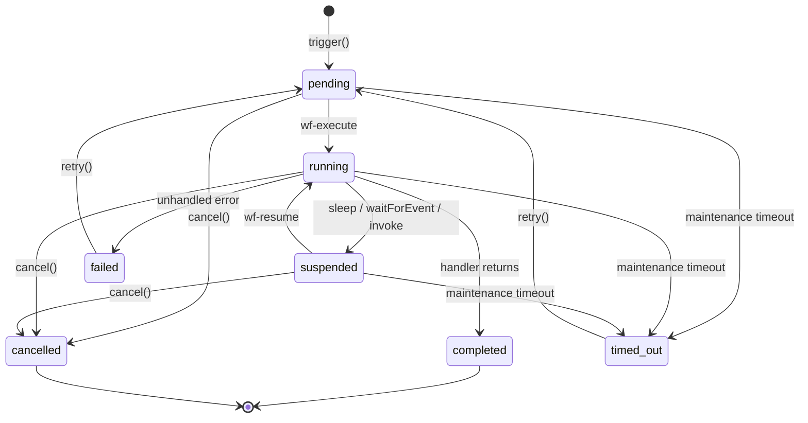
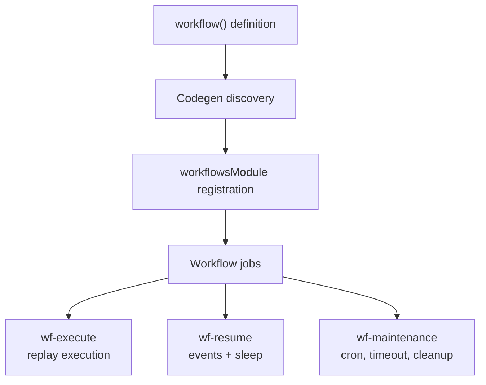

# Workflows

Workflows are long-running, durable processes that survive server restarts, handle failures gracefully, and scale automatically. They're ideal for multi-step business processes like order fulfillment, user onboarding, approval chains, or any work that spans minutes, hours, or days.

`@questpie/workflows` is a separate package that integrates with QUESTPIE via the standard module system.

## Installation

```bash
bun add @questpie/workflows
```

## Quick Start

### 1. Define a Workflow

```ts title="workflows/order-fulfillment.ts"
import { workflow } from "@questpie/workflows";
import z from "zod";

export default workflow({
	name: "order-fulfillment",
	schema: z.object({
		orderId: z.string(),
		customerId: z.string(),
	}),
	timeout: "24h",
	handler: async ({ input, step }) => {
		// Each step is automatically cached and replayed on restart
		const order = await step.run("validate-order", async () => {
			const o = await db.orders.findOne({ id: input.orderId });
			if (!o) throw new Error("Order not found");
			return o;
		});

		await step.run("charge-payment", async () => {
			await stripe.charges.create({
				amount: order.total,
				customer: input.customerId,
			});
		});

		await step.run("send-confirmation", async () => {
			await email.send({
				to: order.email,
				template: "order-confirmed",
				data: { orderId: order.id },
			});
		});

		// Wait up to 7 days for shipping label scan
		const shipment = await step.waitForEvent("shipment-scanned", {
			event: "shipment.label.scanned",
			match: { orderId: input.orderId },
			timeout: "7d",
		});

		await step.run("notify-shipped", async () => {
			await email.send({
				to: order.email,
				template: "order-shipped",
				data: { trackingNumber: shipment.trackingNumber },
			});
		});

		return { status: "fulfilled", orderId: order.id };
	},
});
```

### 2. Register the Module

```ts title="questpie.config.ts"
import { runtimeConfig } from "questpie";
import { workflowsPlugin } from "@questpie/workflows/server";

export default runtimeConfig({
	plugins: [workflowsPlugin()],
	db: { url: process.env.DATABASE_URL! },
	app: { url: process.env.APP_URL! },
});
```

```ts title="modules.ts"
import { workflowsModule } from "@questpie/workflows/server";

export default [workflowsModule] as const;
```

### 3. Trigger a Workflow

```ts title="routes/create-order.ts"
import { route } from "questpie";
import z from "zod";

export default route()
	.post()
	.schema(z.object({ orderId: z.string(), customerId: z.string() }))
	.handler(async ({ input, workflows }) => {
		const result = await workflows.trigger("order-fulfillment", {
			orderId: input.orderId,
			customerId: input.customerId,
		});
		return { instanceId: result.instanceId };
	});
```

## How It Works

The workflow engine uses **replay-based execution**. When a workflow runs, each step result is persisted. If the process restarts, the engine replays the workflow from the beginning but returns cached results for completed steps instead of re-executing them. This means:

- Steps that already completed are never re-run
- The workflow resumes exactly where it left off
- Non-deterministic operations (like API calls) always return the same result on replay
- Failures at any point can be retried without side effects

## Instance Lifecycle

Each workflow trigger creates an instance in `wf_instance`. The engine owns the status transitions:



| Status      | Meaning                                                      |
| ----------- | ------------------------------------------------------------ |
| `pending`   | Instance was created and queued for execution                |
| `running`   | `wf-execute` is currently executing or replaying it          |
| `suspended` | Execution paused at `sleep`, `waitForEvent`, or child invoke |
| `completed` | Handler returned successfully                                |
| `failed`    | Handler or step failed after retries/compensation            |
| `cancelled` | User/API cancelled the active instance                       |
| `timed_out` | Maintenance marked the instance past its timeout boundary    |

`cancel()` only affects `pending`, `running`, and `suspended` instances. `retry()` moves `failed` and `timed_out` instances back to `pending` and queues execution again.

## System Collections

The module automatically creates four collections:

| Collection    | Purpose                                                    |
| ------------- | ---------------------------------------------------------- |
| `wf_instance` | Workflow instance tracking (status, input/output, timeout) |
| `wf_step`     | Step execution records with replay memoization             |
| `wf_event`    | Event persistence for matching                             |
| `wf_log`      | Structured log entries                                     |

These are hidden from the admin UI by default but fully queryable via the API.

## Architecture



- **wf-execute**: Runs workflow handlers using the replay engine
- **wf-resume**: Resumes suspended workflows after events or sleep timers
- **wf-maintenance**: Handles cron triggers, timeout checks, and retention cleanup
