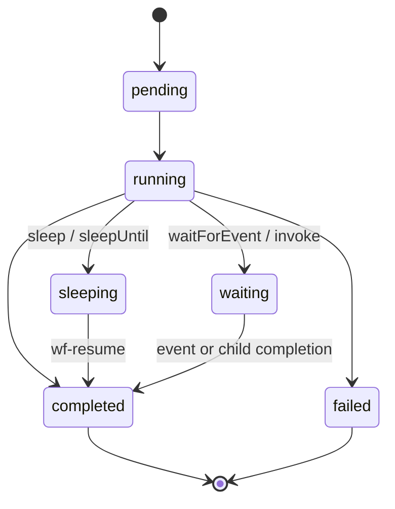

# Steps

Steps are the building blocks of a workflow. Each step has a unique name, is executed at most once, and its result is cached for replay.

## Step Statuses

Step records live in `wf_step` and use a smaller lifecycle than workflow instances:



| Status      | Meaning                                              |
| ----------- | ---------------------------------------------------- |
| `pending`   | Step is known but has not started                    |
| `running`   | Step handler is executing                            |
| `completed` | Result is persisted and will be reused during replay |
| `failed`    | Step failed after retry policy                       |
| `sleeping`  | Step is suspended until `scheduledAt`                |
| `waiting`   | Step is waiting for an event or child workflow       |

## step.run

Execute an arbitrary async function. The result is persisted and replayed on subsequent executions.

```ts
const user = await step.run("fetch-user", async () => {
	return await db.users.findOne({ id: input.userId });
});
```

### With Options

```ts
const result = await step.run(
	"call-api",
	{
		timeout: "30s",
		retry: { maxAttempts: 3, backoff: "1s" },
		compensate: async () => {
			// Called if a later step fails (saga pattern)
			await api.rollback(result.transactionId);
		},
	},
	async () => {
		return await api.createTransaction(input);
	},
);
```

| Option       | Type                  | Description                                                  |
| ------------ | --------------------- | ------------------------------------------------------------ |
| `timeout`    | `Duration`            | Max time for this step. Throws `StepSuspendError` on expiry. |
| `retry`      | `StepRetryPolicy`     | Retry failed attempts with backoff.                          |
| `compensate` | `() => Promise<void>` | Compensation handler for saga rollbacks.                     |

## step.sleep

Pause the workflow for a duration. The workflow is suspended and resumed by the maintenance job.

```ts
// Wait 5 minutes before sending a follow-up
await step.sleep("wait-before-followup", "5m");
```

## step.sleepUntil

Pause until a specific date/time.

```ts
await step.sleepUntil("wait-for-deadline", new Date("2025-01-01T00:00:00Z"));
```

## step.waitForEvent

Suspend the workflow until an external event is received.

```ts
const approval = await step.waitForEvent("wait-for-approval", {
	event: "approval.decision",
	match: { requestId: input.requestId },
	timeout: "48h",
});

if (approval.approved) {
	await step.run("process-approved", async () => {
		/* ... */
	});
} else {
	await step.run("handle-rejection", async () => {
		/* ... */
	});
}
```

| Option    | Type                      | Description                              |
| --------- | ------------------------- | ---------------------------------------- |
| `event`   | `string`                  | Event name to listen for.                |
| `match`   | `Record<string, unknown>` | JSONB-containment match criteria.        |
| `timeout` | `Duration`                | Max wait time. Returns `null` on expiry. |

See the [Events](/docs/backend/business-logic/workflows/events) page for details on event matching.

## step.invoke

Start a child workflow and wait for its completion.

```ts
const result = await step.invoke("process-sub-order", {
	workflow: "process-sub-order",
	input: { subOrderId: item.id },
	timeout: "1h",
});
```

Child workflows inherit the parent's timeout boundary. If the parent times out, all children are cancelled.

## step.sendEvent

Emit an event that other waiting workflows can consume.

```ts
await step.sendEvent("notify-ready", {
	event: "order.ready-for-pickup",
	data: { orderId: input.orderId, location: "Store #42" },
	match: { orderId: input.orderId },
});
```

## Duration Format

All duration strings use a compact format:

| Unit | Meaning | Example |
| ---- | ------- | ------- |
| `s`  | Seconds | `"30s"` |
| `m`  | Minutes | `"5m"`  |
| `h`  | Hours   | `"2h"`  |
| `d`  | Days    | `"7d"`  |
| `w`  | Weeks   | `"1w"`  |

## Compensation (Saga Pattern)

When a step fails and the workflow has an `onFailure` handler, all completed steps with `compensate` functions are called in reverse order (LIFO).

```ts
export default workflow({
	name: "transfer-funds",
	schema: z.object({ from: z.string(), to: z.string(), amount: z.number() }),
	handler: async ({ input, step }) => {
		await step.run(
			"debit",
			{
				compensate: async () => {
					await accounts.credit(input.from, input.amount);
				},
			},
			async () => {
				await accounts.debit(input.from, input.amount);
			},
		);

		await step.run("credit", async () => {
			// If this fails, "debit" compensation runs automatically
			await accounts.credit(input.to, input.amount);
		});
	},
	onFailure: async ({ error, completedSteps }) => {
		console.error(`Transfer failed: ${error.message}`);
		// Compensations already ran at this point
	},
});
```
