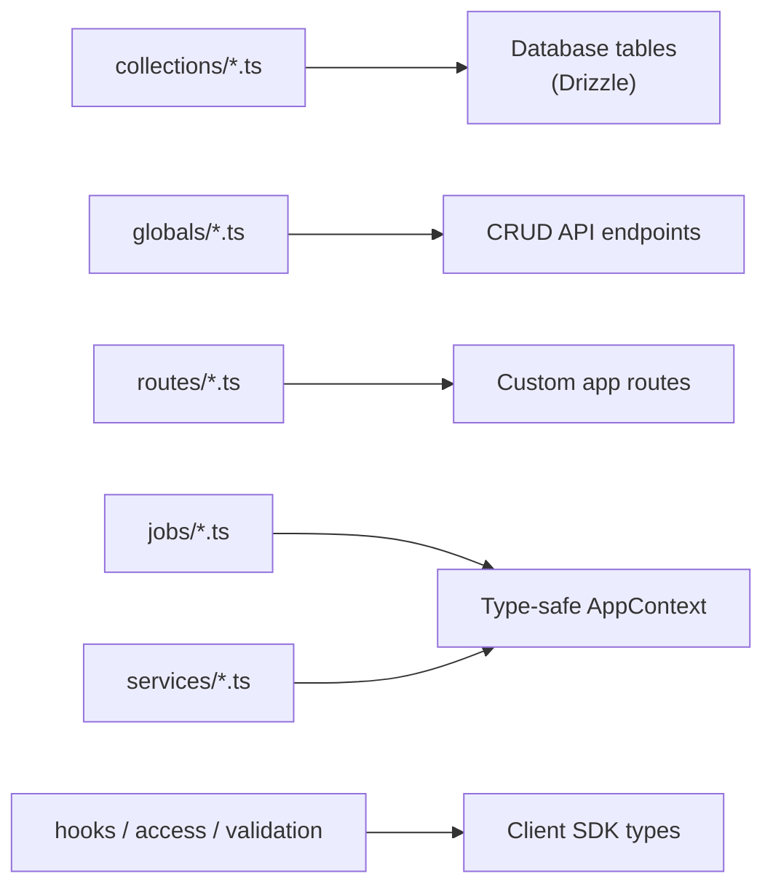

QUESTPIE backends follow a simple flow: **define schema → run codegen → get typed runtime**.

## Sections

### [Data Modeling](/docs/backend/data-modeling)

Define your collections, globals, fields, and relations. Fields are the single source of truth — they drive database schema, API validation, query operators, and UI rendering.

### [Rules](/docs/backend/rules)

Add validation, access control, and lifecycle hooks to your collections. Control who can do what, when, and how.

### [Business Logic](/docs/backend/business-logic)

Write server routes (JSON or raw HTTP), background jobs, and shared services. All handlers receive typed context with DI.

### [Architecture](/docs/backend/architecture)

Understand file conventions, the plugin system, modules, codegen, and the CLI.
