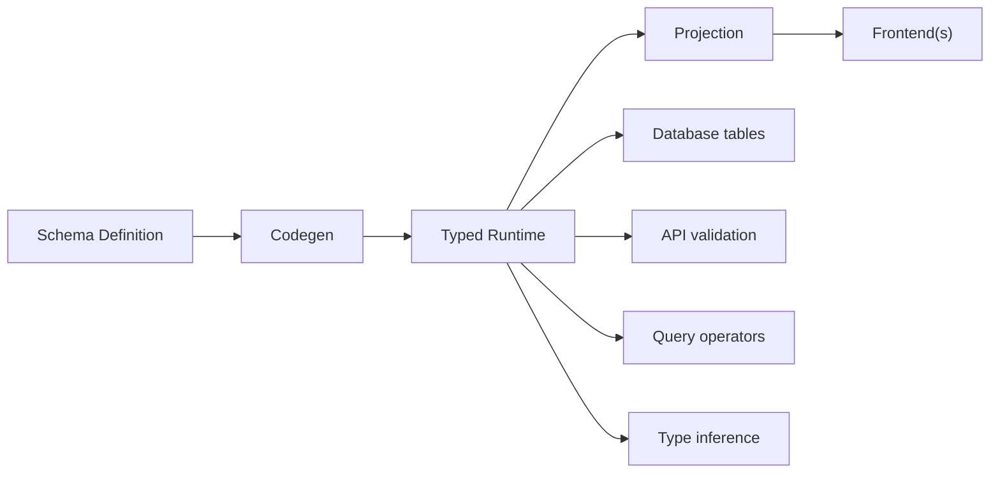

QUESTPIE is a **backend-first TypeScript framework**. You define your data schema once, codegen generates the typed runtime, and any frontend can consume it through introspection.

The admin panel is one projection of your schema — the same way an SDK, an OpenAPI spec, or a mobile app would be. The framework exists independently of any UI.

## The Core Idea



You write a collection file. Codegen reads it and generates:

1. **Database schema** — Drizzle ORM table definitions
2. **API layer** — CRUD endpoints with Zod validation
3. **Type exports** - `AppConfig`, `AppCollections`, `AppRoutes` for end-to-end type safety
4. **Module augmentation** — `AppContext` with typed `collections`, `queue`, `email`, and any custom services

The admin panel, client SDK, and OpenAPI spec all consume these generated types. Nothing is defined twice.

## Single Source of Truth

A field definition is not just a form widget or a database column. It's the **single source of truth** that drives every layer of the stack.

```ts
price: f.number().required().label("Price (cents)");
```

From this single line, QUESTPIE derives:

| Layer                | Output                                                    |
| -------------------- | --------------------------------------------------------- |
| **Database**         | `integer NOT NULL` column in Drizzle schema               |
| **API validation**   | `z.number()` in the create/update Zod schema              |
| **Query operators**  | `where: { price: { gte: 1000, lt: 5000 } }`               |
| **TypeScript types** | `price: number` in `Select` and `Insert` types            |
| **Client SDK**       | Typed `find()`, `create()`, `update()` with `price` field |
| **Admin list**       | Numeric column with sorting                               |
| **Admin form**       | Number input with "Price (cents)" label                   |
| **Admin filters**    | Numeric range filter                                      |

Traditional approaches require you to define schema in multiple places:

```mermaid
flowchart TD
  Without["Without QUESTPIE<br>same data defined 3+ times"]
  Migration["Database migration<br>INTEGER price NOT NULL"]
  Validation["API validation<br>z.object({ price: z.number() })"]
  Type["TypeScript type<br>interface Post { price: number }"]
  Form["Form component<br>#lt;NumberInput name=\"price\" required /#gt;"]

  Without --> Migration
  Without --> Validation
  Without --> Type
  Without --> Form
```

With QUESTPIE:

```mermaid
flowchart LR
  Field["f.number().required().label(\"Price\")"]
  Outputs["Database, validation, types, and UI<br>derived automatically"]

  Field --> Outputs
```

### Add a field → everything updates

Add a field to a collection, re-run codegen:

```ts title="collections/posts.ts"
// Before
.fields(({ f }) => ({
  title: f.text().required(),
  body: f.textarea(),
}))

// After — add status field
.fields(({ f }) => ({
  title: f.text().required(),
  body: f.textarea(),
  status: f.select([
    { value: "draft", label: "Draft" },
    { value: "published", label: "Published" },
  ]).default("draft"),
}))
```

After `questpie generate`:

- Database gets a new `status` column
- API validates `status` on create/update
- Client SDK exposes `where: { status: "draft" }`
- Admin form shows a select dropdown
- Admin list gets a new filterable column

### Field type → query operators

The field type determines which query operators are available:

```ts title="Query operators by field type"
// text → equals, contains, startsWith, endsWith
where: { title: { contains: "hello" } }

// number → equals, gt, gte, lt, lte, in
where: { price: { gte: 1000, lt: 5000 } }

// datetime → equals, gt, gte, lt, lte
where: { scheduledAt: { gte: startOfDay, lte: endOfDay } }

// select → equals, in
where: { status: "published" }
where: { status: { in: ["draft", "published"] } }

// boolean → equals
where: { isActive: true }

// relation → equals (by ID)
where: { barber: barberId }
```

### Field type → admin renderer

The field type maps to an admin form component:

| Field Type | Default Renderer          |
| ---------- | ------------------------- |
| `text`     | Text input                |
| `textarea` | Textarea                  |
| `richText` | Rich text editor (TipTap) |
| `number`   | Number input              |
| `boolean`  | Checkbox / switch         |
| `date`     | Date picker               |
| `datetime` | Date-time picker          |
| `select`   | Select dropdown           |
| `relation` | Relation picker           |
| `upload`   | File upload with preview  |
| `object`   | Nested form group         |
| `array`    | Repeatable items          |
| `blocks`   | Block editor              |

## Mental Model

Think of QUESTPIE in three layers:

### Layer 1: Schema (you write this)

```ts title="collections/posts.ts"
import { collection } from "#questpie/factories";

export default collection("posts").fields(({ f }) => ({
	title: f.text().required(),
	body: f.textarea(),
	status: f.select([
		{ value: "draft", label: "Draft" },
		{ value: "published", label: "Published" },
	]),
}));
```

### Layer 2: Codegen (automatic)

Running `questpie generate` discovers your files and generates:

- Type-safe `app` instance with all collections, routes, jobs, services
- `AppContext` module augmentation so every handler gets typed DI
- `AppConfig` type for the client SDK

### Layer 3: Projection (consumers)

```ts title="Client SDK"
const posts = await client.collections.posts.find({
	where: { status: "published" },
	orderBy: { createdAt: "desc" },
});
// posts is fully typed from your schema
```

```ts title="Admin Panel"
// Reads the same schema via introspection
// Generates list views, form fields, filters automatically
```

## Why Not Just Use [X]?

| If you need...                | QUESTPIE gives you...                                           |
| ----------------------------- | --------------------------------------------------------------- |
| A typed API from schema       | Collections → CRUD endpoints + Zod validation + query operators |
| Business logic alongside data | Routes, hooks, jobs - all in the same project with DI           |
| An admin panel                | `@questpie/admin` reads your schema, no separate config         |
| Multiple frontends            | One schema, typed client SDK for any framework                  |
| Full-stack type safety        | Schema types flow from server → codegen → client                |

## Context-First Architecture

Every handler in QUESTPIE receives its dependencies through context — no imports, no singletons, no god objects:

```ts title="routes/create-booking.ts"
import { route } from "questpie/services";
import z from "zod";

export default route()
	.post()
	.schema(
		z.object({
			barberId: z.string(),
			serviceId: z.string(),
			scheduledAt: z.string().datetime(),
		}),
	)
	.handler(async ({ input, collections, queue }) => {
		const service = await collections.services.findOne({
			where: { id: input.serviceId },
		});

		const appointment = await collections.appointments.create({
			barber: input.barberId,
			service: input.serviceId,
			scheduledAt: new Date(input.scheduledAt),
			status: "pending",
		});

		await queue.sendAppointmentConfirmation.publish({
			appointmentId: appointment.id,
		});

		return { success: true, appointmentId: appointment.id };
	});
```

`collections`, `queue`, `email`, `db`, `session` — all injected through `AppContext`. Codegen generates the type augmentation, so everything is discoverable and typed.

## What's Next

<Cards>
  <Card title="Installation" href="/docs/getting-started/installation" description="Get QUESTPIE running" />
  <Card title="First App" href="/docs/getting-started/quickstart" description="Build a working API in 5 minutes" />
  <Card title="Project Structure" href="/docs/getting-started/project-structure" description="File conventions and discovery rules" />
  <Card title="Fields" href="/docs/collections/fields" description="All field types and options" />
  <Card title="Codegen" href="/docs/concepts/codegen" description="What gets generated" />
</Cards>
