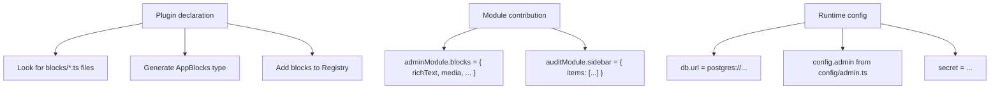

QUESTPIE's extension system follows a three-level architecture:

- **Plugin** — Declares what CAN exist (file categories, builder extensions, registries)
- **Module** — Contributes what DOES exist (actual values, entities)
- **Config** — Runs the runtime (database, adapters, secrets)

The core framework is intentionally lean. Most functionality — including the admin panel, audit logging, and even builtin fields — comes from plugins and modules.

## Modules

Modules are **static objects** that contribute entities to your app. They're pre-built packages (like admin, audit) or custom bundles you create.

### Using Modules

List your module dependencies in `modules.ts`:

```ts title="modules.ts"
import { adminModule } from "@questpie/admin/modules/admin";
import { auditModule } from "@questpie/admin/modules/audit";
export default [adminModule, auditModule] as const;
```

Codegen merges module contributions with your project-level entities. The admin module contributes:

- `user` collection (for authentication)
- Administration sidebar section
- Audit log entries (via audit module)

Keep `modules.ts` statically discoverable. Codegen imports it before runtime app creation, so codegen-aware modules should not be hidden behind environment checks or configured through `module(options)` calls.

### Configuration Pattern

Codegen-aware modules use a two-file pattern:

```ts title="modules.ts"
import mcpModule from "@questpie/mcp";
import { adminModule } from "@questpie/admin/modules/admin";
import { openApiModule } from "@questpie/openapi/modules/openapi";

export default [adminModule, openApiModule, mcpModule] as const;
```

```ts title="config/mcp.ts"
import { mcpConfig } from "@questpie/mcp";

export default mcpConfig({
	crud: {
		defaults: {
			collections: { read: true, write: false, delete: false },
		},
	},
});
```

Use this rule of thumb:

- `modules.ts` declares static module identity and must be codegen-discoverable.
- `config/*.ts` holds runtime options for modules that need codegen discovery.
- `runtimeConfig({ plugins })` is for standalone or custom plugin setups that are not loaded through modules.
- `module(options)` is only appropriate for runtime-only modules whose options do not change file conventions, generated factories, type registries, builder extensions, or generated app state.

This keeps the generated app deterministic. Codegen can always see the same module graph, while environment-specific or project-specific settings live in config files discovered by the module plugin.

### What Modules Contribute

A module is a plain object of entities:

```ts
const myModule = module({
	name: "my-module",

	// Entity contributions
	collections: {
		/* ... */
	},
	globals: {
		/* ... */
	},
	jobs: {
		/* ... */
	},
	routes: {
		/* ... */
	},
	services: {
		/* ... */
	},
	fields: {
		/* ... */
	},

	// Admin contributions (when admin plugin is active)
	sidebar: {
		/* ... */
	},
	dashboard: {
		/* ... */
	},

	// Infrastructure
	auth: {
		/* ... */
	},
	migrations: [
		/* ... */
	],
	seeds: [
		/* ... */
	],
	messages: {
		en: {
			/* ... */
		},
		sk: {
			/* ... */
		},
	},
});
```

### Merging Rules

When codegen merges modules with your project:

1. **Your project wins** — Project-level entities override module contributions with the same key
2. **Sidebar merges** — Module sidebar sections/items are added alongside project sidebar
3. **Dashboard merges** — Module dashboard items are added to project dashboard
4. **Collections merge** — Module collections are added to the app

### Module Composition

Modules can depend on other modules:

```ts
const auditModule = module({
	name: "audit",
	modules: [adminModule], // Depends on admin
	collections: {
		auditLog: auditLogCollection,
	},
	sidebar: {
		items: [
			{
				sectionId: "administration",
				type: "collection",
				collection: "auditLog",
			},
		],
	},
});
```

### Built-in Modules

| Module        | Package                  | Provides                              |
| ------------- | ------------------------ | ------------------------------------- |
| `adminModule` | `@questpie/admin/server` | User collection, admin UI, auth pages |
| `auditModule` | `@questpie/admin/server` | Audit log collection, timeline widget |

`adminModule` includes the starter auth model and owns the canonical Better Auth `user` collection shape used by admin setup and login guards. That contract includes `user.role` (`admin` or `user`). If you customize users, merge `starterModule.collections.user` and extend it instead of replacing `collection("user")` from scratch.

### Creating Custom Modules

```ts
import { module } from "questpie/app";
export const notificationsModule = module({
	name: "notifications",
	collections: {
		notifications: notificationsCollection,
	},
	jobs: {
		sendPushNotification: pushJob,
	},
	sidebar: {
		items: [
			{
				sectionId: "operations",
				type: "collection",
				collection: "notifications",
			},
		],
	},
});
```

## Plugins

Plugins tell codegen **what to look for** and **what types to generate**. Built-in modules can contribute their plugins automatically through `modules.ts`:

```ts
import { adminModule } from "@questpie/admin/modules/admin";
export default [adminModule] as const;
```

When you add `adminModule`, its plugin makes codegen look for:

- `config/admin.ts` — Sidebar, dashboard, branding, and admin locale
- `blocks/*.ts` — Content block definitions
- admin views, components, and field types contributed by modules

Without the module/plugin contribution, these files are ignored.

### Core vs Plugin Categories

The core framework discovers these categories by default:

| Category       | Pattern                |
| -------------- | ---------------------- |
| `collections/` | Collection definitions |
| `globals/`     | Global definitions     |
| `jobs/`        | Background jobs        |
| `routes/`      | HTTP routes            |
| `services/`    | Singleton services     |
| `emails/`      | Email templates        |

The admin plugin adds:

| Category          | Pattern        |
| ----------------- | -------------- |
| `blocks/`         | Content blocks |
| `config/admin.ts` | Admin config   |

### CodegenPlugin Interface

Plugins implement the `CodegenPlugin` interface:

```ts
interface CodegenPlugin {
	name: string;
	targets: Record<string, CodegenTargetContribution>;
}

interface CodegenTargetContribution {
	// File categories to discover
	categories?: Record<string, CategoryDeclaration>;

	// Single-file or directory patterns
	discover?: Record<string, DiscoverPattern>;

	// Builder method extensions
	registries?: {
		collectionExtensions?: Record<string, RegistryExtension>;
		globalExtensions?: Record<string, RegistryExtension>;
		fieldExtensions?: Record<string, RegistryExtension>;
		singletonFactories?: Record<string, SingletonFactory>;
		builderFactories?: Record<string, BuilderFactory>;
	};

	// Callback params like f, v, c, a
	callbackParams?: Record<string, CallbackParamDefinition>;

	// Post-discovery transformation
	transform?: (ctx: CodegenContext) => void;
}
```

#### Category Declaration

```ts
categories: {
  blocks: {
    pattern: "blocks/**/*.ts",
    cardinality: "map",        // Record<string, Block>
    recursive: false,
    featureLayout: true,       // Also scan features/*/blocks/
    mergeStrategy: "record",   // Merge by key
    moduleContributionKey: "blocks",
    registryKey: "blocks",
  },
}
```

| Property                | Description                                   |
| ----------------------- | --------------------------------------------- |
| `pattern`               | Glob pattern for file discovery               |
| `cardinality`           | `"map"` (key-value) or `"single"` (one value) |
| `recursive`             | Support nested directories                    |
| `featureLayout`         | Scan `features/*/` directories                |
| `mergeStrategy`         | How to merge with module contributions        |
| `moduleContributionKey` | Property name on module objects               |
| `registryKey`           | Type name in generated `Registry`             |

### Three Levels in Action



## Related Pages

<Cards>
  <Card title="Building a Module" href="/docs/extend/building-a-module" description="Create reusable modules" />
  <Card title="Building a Plugin" href="/docs/extend/building-a-plugin" description="Create your own plugin" />
  <Card title="Codegen" href="/docs/concepts/codegen" description="Generated output" />
  <Card title="File Convention" href="/docs/concepts/file-convention" description="Project-level entities" />
</Cards>
