The barbershop example is a complete booking app built with TanStack Start and QUESTPIE. It demonstrates every major feature of the framework.

**Source:** `examples/tanstack-barbershop/`

## Project Structure

```mermaid
flowchart TD
	App["examples/tanstack-barbershop/"]
	CliConfig["questpie.config.ts<br/>CLI config"]
	Src["src/"]
	Questpie["questpie/"]
	Server["server/"]
	RuntimeConfig["questpie.config.ts<br/>Runtime config"]
	Modules["modules.ts<br/>adminModule + auditModule"]
	Config["config/<br/>auth.ts, app.ts, admin.ts, openapi.ts"]
	Collections["collections/"]
	Barbers["barbers.ts<br/>Working hours, social links, M2M"]
	ServicesCollection["services.ts<br/>Localized, relations"]
	Appointments["appointments.ts<br/>Hooks, virtual fields, visibility"]
	BarberServices["barber-services.ts<br/>Junction table"]
	Reviews["reviews.ts<br/>Conditional fields"]
	BlogPosts["blog-posts.ts<br/>Service injection in hooks"]
	Pages["pages.ts<br/>Blocks, preview, workflow"]
	Globals["globals/site-settings.ts<br/>Nested config, versioning"]
	ServerRoutes["routes/<br/>create-booking.ts, get-available-time-slots.ts, get-active-barbers.ts, get-revenue-stats.ts"]
	Jobs["jobs/<br/>send-appointment-confirmation.ts, send-appointment-cancellation.ts, notify-blog-subscribers.ts"]
	ServerServices["services/blog.ts<br/>Singleton service"]
	Blocks["blocks/<br/>Content blocks"]
	Emails["emails/<br/>Email templates"]
	ServerGenerated[".generated/<br/>Codegen output"]
	Admin["admin/"]
	AdminEntry["admin.ts<br/>Re-exports generated admin config"]
	AdminHooks["hooks.ts<br/>Typed React hooks"]
	AdminGenerated[".generated/client.ts<br/>Admin client config"]
	AdminBlocks["blocks/<br/>Block renderers"]
	Lib["lib/<br/>client.ts, server-helpers.ts"]
	Routes["routes/"]
	Api["api/$.ts<br/>API catch-all"]
	AppRoutes["_app/<br/>index.tsx, booking.tsx"]

	App --> CliConfig
	App --> Src
	Src --> Questpie
	Questpie --> Server
	Server --> RuntimeConfig
	Server --> Modules
	Server --> Config
	Server --> Collections
	Collections --> Barbers
	Collections --> ServicesCollection
	Collections --> Appointments
	Collections --> BarberServices
	Collections --> Reviews
	Collections --> BlogPosts
	Collections --> Pages
	Server --> Globals
	Server --> ServerRoutes
	Server --> Jobs
	Server --> ServerServices
	Server --> Blocks
	Server --> Emails
	Server --> ServerGenerated
	Questpie --> Admin
	Admin --> AdminEntry
	Admin --> AdminHooks
	Admin --> AdminGenerated
	Admin --> AdminBlocks
	Src --> Lib
	Src --> Routes
	Routes --> Api
	Routes --> AppRoutes
```



## Key Patterns

### Runtime Config

```ts title="questpie.config.ts"
import { pgBossAdapter, runtimeConfig, SmtpAdapter } from "questpie";

export default runtimeConfig({
	app: { url: process.env.APP_URL || "http://localhost:3000" },
	db: { url: process.env.DATABASE_URL || "postgres://localhost/barbershop" },
	storage: { basePath: "/api" },
	secret: process.env.BETTER_AUTH_SECRET || "demo-secret",
	queue: { adapter: pgBossAdapter({ connectionString: DATABASE_URL }) },
});
```

### Collection with Hooks

```ts title="collections/appointments.ts"
export const appointments = collection("appointments")
	.fields(({ f }) => ({
		customer: f.relation("user").required(),
		barber: f.relation("barbers").required(),
		service: f.relation("services").required(),
		scheduledAt: f.datetime().required(),
		status: f
			.select([
				{ value: "pending", label: { en: "Pending" } },
				{ value: "confirmed", label: { en: "Confirmed" } },
				{ value: "completed", label: { en: "Completed" } },
				{ value: "cancelled", label: { en: "Cancelled" } },
			])
			.required()
			.default("pending"),
		cancellationReason: f.textarea(),
		displayTitle: f.text()
			.virtual(sql`(SELECT name FROM "user" WHERE id = appointments.customer)
      || ' - ' || TO_CHAR(appointments."scheduledAt", 'YYYY-MM-DD HH24:MI')`),
	}))
	.form(({ v, f }) =>
		v.collectionForm({
			fields: [
				{
					type: "section",
					fields: [
						f.cancelledAt,
						{
							field: f.cancellationReason,
							hidden: ({ data }) => data.status !== "cancelled",
						},
					],
				},
			],
		}),
	)
	.hooks({
		afterChange: async ({ data, operation, queue }) => {
			if (operation === "create") {
				await queue.sendAppointmentConfirmation.publish({
					appointmentId: data.id,
					customerId: data.customer,
				});
			}
		},
	});
```

### Service Injection

```ts title="services/blog.ts"
import { service } from "questpie";

export default service({
	lifecycle: "singleton",
	create: () => ({
		computeReadingTime(content: string): number {
			/* ... */
		},
		generateSlug(title: string): string {
			/* ... */
		},
		extractExcerpt(content: string): string {
			/* ... */
		},
	}),
});
```

Used in hooks via `services` — no imports:

```ts
.hooks({
  beforeChange: async ({ data, services }) => {
    data.slug = services.blog.generateSlug(data.title);
    data.readingTime = services.blog.computeReadingTime(data.content);
  },
})
```

### Client Setup

```ts title="lib/client.ts"
import { createClient } from "questpie/client";
import type { AppConfig } from "#questpie";

export const client = createClient<AppConfig>({
	baseURL:
		typeof window !== "undefined"
			? window.location.origin
			: process.env.APP_URL,
	basePath: "/api",
});
```

### Frontend Booking

```tsx title="routes/_app/booking.tsx"
import { client } from "@/lib/client";
import { useMutation, useQuery } from "@tanstack/react-query";

function BookingWizard() {
	const { data: barbers } = useQuery({
		queryKey: ["barbers"],
		queryFn: () => client.routes.getActiveBarbers({}),
	});

	const booking = useMutation({
		mutationFn: (data) => client.routes.createBooking(data),
		onSuccess: (result) => {
			// Navigate to confirmation
		},
	});

	// Multi-step wizard UI...
}
```

### Pages, Workflow, And Preview

The barbershop page collection demonstrates the standard page-builder setup: blocks for page content, `.preview({ url })` for the existing Live Preview button, `v.collectionForm()` for the normal editor, and workflow stages for publishing.

```ts title="src/questpie/server/collections/pages.ts"
export const pages = collection("pages")
	.fields(({ f }) => ({
		title: f.text(255).required().localized(),
		slug: f.text(255).required(),
		description: f.textarea().localized(),
		content: f.blocks().localized(),
	}))
	.preview({
		enabled: true,
		position: "right",
		defaultWidth: 50,
		url: ({ record }) => {
			const slug = record.slug as string;
			return slug === "home" ? "/?preview=true" : `/${slug}?preview=true`;
		},
	})
	.options({
		versioning: {
			workflow: {
				initialStage: "draft",
				stages: {
					draft: { transitions: ["review", "published"] },
					review: { transitions: ["draft", "published"] },
					published: { transitions: ["draft"] },
				},
			},
		},
	})
	.form(({ v, f }) =>
		v.collectionForm({
			fields: [
				{ type: "section", label: "Page", fields: [f.title, f.description] },
				{ type: "section", label: "Content", fields: [f.content] },
			],
			sidebar: { fields: [f.slug] },
		}),
	);
```

Public frontend routes read only published page snapshots. Preview requests use the draft-mode cookie set by the preview token flow to load the working stage for the editor.

```ts title="src/lib/get-page.function.ts"
const page = await app.collections.pages.findOne(
	{
		where: { slug },
		...(draftMode ? {} : { stage: "published" }),
	},
	ctx,
);
```

The page renderer uses the exported preview APIs and `BlockRenderer` so custom block renderers can annotate fields with `PreviewField`.

```tsx title="src/components/pages/page-renderer.tsx"
const preview = useCollectionPreview({
	initialData: page,
	onRefresh: () => router.invalidate(),
});

return (
	<PreviewProvider preview={preview}>
		<PreviewField field="title" editable="text" as="h1">
			{preview.data.title}
		</PreviewField>
		<BlockRenderer
			content={preview.data.content}
			renderers={admin.blocks}
			data={preview.data.content?._data}
			selectedBlockId={preview.selectedBlockId}
			onBlockClick={
				preview.isPreviewMode ? preview.handleBlockClick : undefined
			}
		/>
	</PreviewProvider>
);
```

## What This Example Demonstrates

| Feature                                  | Where                                                            |
| ---------------------------------------- | ---------------------------------------------------------------- |
| Complex fields (objects, arrays, select) | `collections/barbers.ts`                                         |
| Many-to-many relations                   | `barbers ↔ barberServices ↔ services`                            |
| Virtual SQL fields                       | `appointments.ts` → `displayTitle`                               |
| Lifecycle hooks                          | `appointments.ts` → `afterChange`                                |
| Service injection                        | `blog.ts` → used in `blog-posts.ts` hooks                        |
| Background jobs                          | `jobs/send-appointment-confirmation.ts`                          |
| Email templates                          | `emails/appointment-confirmation.ts`                             |
| Server routes                            | `routes/create-booking.ts`                                       |
| Admin dashboard                          | `config/admin.ts` — stats, charts, timeline                      |
| Admin sidebar                            | `config/admin.ts` — 6 sections, mixed items                      |
| Content blocks                           | `blocks/hero.ts`, `pages.ts` with `f.blocks()`                   |
| Conditional visibility                   | `appointments.ts` form → `hidden`                                |
| Computed form fields                     | `barbers.ts` form → slug from name                               |
| Multi-language (i18n)                    | Labels, content, admin UI                                        |
| Access control                           | `site-settings.ts` → admin-only update                           |
| Live preview                             | `pages.ts` → Preview button, iframe, field and block annotations |
| Workflow publishing                      | `pages.ts` → public reads use `stage: "published"`               |

## Related Pages

- [First App](/docs/start-here/first-app) — Minimal getting started
- [Collections](/docs/backend/data-modeling/collections) — Collection API
- [Typed Routes](/docs/backend/business-logic/routes) — Typed JSON route handlers
- [Dashboard](/docs/workspace/views/dashboard) — Dashboard widgets
