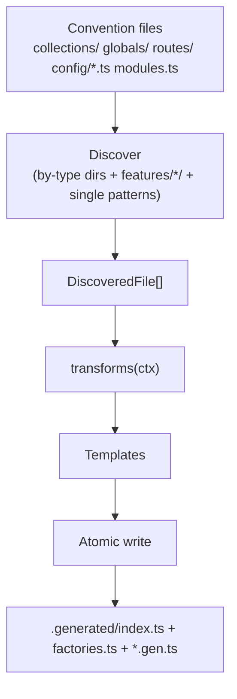

**Codegen** is what makes QUESTPIE's "define once, get everything" promise real. You drop files in conventional directories (`collections/`, `globals/`, `routes/`, `jobs/`, `config/…`), run one command, and codegen discovers every file, merges in your modules, and emits a fully typed `.generated/` app: the `app` instance, the `AppContext`, the `#questpie/factories` builders, and the `#questpie` type barrel (`CollectionDoc`, `CollectionWhere`, `App`, `AppConfig`). There is no central registry to edit and nothing is wired by hand — the file system *is* the registry, and codegen is the compiler.

This page covers the pipeline (file convention → `.generated/`), the export-discovery rules, the `questpie generate` / `dev` / `add` commands, the committed outputs you get, and — for plugin and module authors — the full `CodegenPlugin` API that lets a package contribute its own file conventions without you touching `questpie.config.ts`.

## What it does

- **Compiles file convention into a typed app.** Scans your conventional dirs, derives a key per file, and emits `.generated/index.ts` (the `createApp()` call), `.generated/factories.ts` (the `collection()` / `global()` builders that know your modules), and the `#questpie` type barrel — all in one shot.
- **Discovers, never registers.** Add a file under `collections/`, run codegen, and it appears on `app.collections.*`, the admin, REST, OpenAPI, and the typed client. No import list, no manifest.
- **Folds in modules and their plugins.** `modules.ts` is read in a pre-pass; each module can contribute collections, globals, jobs — and its *own* codegen plugin — auto-wired before the rest of discovery runs.
- **Watches in dev.** `questpie dev` regenerates on file add/remove (content-only edits are skipped — `typeof import` is stable), so the typed surface tracks your file tree live.
- **Scaffolds from the same registry.** `questpie add <type> <name>` writes the right boilerplate into every target that declares that scaffold, then re-runs codegen.
- **Is extensible to the core.** Every built-in category (collections, globals, routes, …) is declared through the *same* `CodegenPlugin` API a third-party package uses. Modules add `views`, `blocks`, `config/admin.ts` the same way you would — there are no privileged internal codegen hooks.

## Quick start

You rarely call codegen's API directly — you run the CLI. After adding or renaming a convention file, regenerate the typed app:

```bash
questpie generate   # discover every file, merge modules, emit .generated/
```

That command reads `questpie.config.ts`, runs the `modules.ts` pre-pass, discovers every convention file, and writes the `.generated/` directory. For a normal app it produces:

```
src/questpie/server/.generated/
  index.ts         # the createApp() call + App / AppConfig / CollectionDoc / createContext
  factories.ts     # collection() / global() builders pre-wired with your module fields
  entities.gen.ts  # flat category maps (AppCollections, AppGlobals, AppRoutes, AppServices)
  context.gen.ts   # the AppContext builder + session / route / block types
  names.gen.ts     # the names-only entity-key registries (relation-target autocomplete)
```

During development, run the watcher instead and forget about it — it regenerates whenever you add or remove a file:

```bash
questpie dev        # same pipeline, in watch mode (100ms debounce)
```

<Callout type="info" title="Codegen is what wires the `#questpie/*` imports">
The `#questpie/factories` and `#questpie` imports your app code uses resolve to codegen's output. Until you run `questpie generate` they don't exist — which is why a fresh checkout or a CI build starts with `questpie generate`. Mode is auto-detected from the config file shape (root app vs. module vs. package).
</Callout>

## The pipeline

Codegen runs the same ordered pipeline every time, whatever the mode:

1. **Resolve the target graph.** The built-in `coreCodegenPlugin()` is *always* prepended, then your config plugins, then module-extracted plugins. All contributions to a given target (e.g. `"server"`) merge into one `ResolvedTarget`.
2. **Discover files.** Scan each category's `dirs` (both `dir/` and `features/{name}/dir/`) plus the single-file `discover` patterns. Each match becomes a `DiscoveredFile` with a derived `key`, `varName`, `importPath`, and detected `exportType`.
3. **Run transforms.** Each plugin's `transform(ctx)` runs in order, accumulating extra imports / type declarations / runtime code into the context.
4. **Generate.** Emit `index.ts` (root-app `createApp()`) or `module.ts` (static module def), plus `factories.ts`, validating the output with Bun's transpiler.
5. **Write atomically.** Files are written to a temp path and renamed — a crashed run never leaves a half-written `.generated/`.



<Callout type="info" title="`coreCodegenPlugin()` is the canonical category map">
Every built-in category and scaffold lives in one place: `coreCodegenPlugin()`. It declares `collections` (factory `collection`), `globals` (factory `global`), `jobs`, `routes` (dirs `routes` + `functions`, recursive, `/`-separated keys), `messages`, `services`, `emails` (emitted as `emailTemplates`), `migrations` + `seeds` (array emit), and `fieldTypes` (factory `fieldType`). It is prepended automatically — you never register it. Reading it is the fastest way to see exactly which dirs are scanned.
</Callout>

## Export & discovery rules

Codegen has to turn a file into a `key` and an import. The rules are deterministic, identical across every category, and worth knowing because they decide what your entity is *named* on `app.*`.

### The key comes from the factory argument, then the file name

For categories that declare `factoryFunctions` (collections → `["collection"]`, globals → `["global"]`), the **string you pass to the factory is the key**, kebab-cased to camelCase:

```ts title="collections/blog-posts.ts"
import { collection } from "#questpie/factories";

// Keyed as app.collections.blogPosts — the file name is only a fallback.
export const blogPosts = collection("blog-posts").fields(/* … */);
```

`collection("blog-posts")` registers as `blogPosts` regardless of the file name. Keep the file name matching the argument by convention (`collections/blog-posts.ts`) so the two never drift, and keep one entity per file. Hyphens convert to camelCase; **underscores pass through unchanged** — collection and global names use the snake_case PostgreSQL convention, and that name *is* the canonical runtime identifier (e.g. for relation targets).

For files **without** a factory string argument, the fallback depends on the category:

- **Non-factory categories** (jobs, services, emails, …) always key off the **file name** — never the export name. A single-entity file resolves its key as `kebabToCamelCase(basename(path))` unconditionally, so `jobs/send-newsletter.ts` is `sendNewsletter` whether you `export default` or `export const sendNewsletter`. The export name is used only as the *import binding* (`import { sendNewsletter as _job_sendNewsletter }`), not as the entity key.
- **Factory categories** (collections, globals, …) fall back to the **export name** for a named factory export with no string argument, and to the **file name** for a default factory export.

### Default OR named export — both are discovered

Codegen detects the export style from the file content (no AST — a fast content scan), in priority order: `export default` → default; `export const X = { … }` (an object **literal**, not a factory call) → a named *bundle* (spread into the parent); `export const/function/class X` → a single named export; `export { X }` → named.

```ts
// Both of these are picked up identically:
export const posts = collection("posts"); // named
export default collection("posts");        // default
```

<Callout type="info" title="Multi-export files are allowed for factory categories">
Categories with `factoryFunctions` use a two-pass scan that finds *every* matching factory call in a file, so one route file can hold several `route()` definitions. Files with **zero** matching factory calls are skipped entirely — that's how utility and type-only files in a scanned dir are ignored. Entity key still comes from the factory's first string argument when present, else the export name.
</Callout>

### What codegen skips

Discovery only considers `.ts` / `.tsx` / `.mts` files and skips: `index.ts` / `.mts` / `.tsx`, `*.d.ts` / `*.d.mts`, anything starting with `_`, `__tests__/`, and `*.test.*` / `*.spec.*`. So a `_helpers.ts` next to your collections is invisible to codegen.

## Committed outputs

`.generated/` is **committed to git**, not gitignored. It is build output, but it's the typed contract the rest of your code imports, so it lives in version control: a clone, a CI job, or a teammate's editor all resolve `#questpie/*` immediately, and a diff in `.generated/` is a visible, reviewable consequence of a schema change.

| File | What it is | You import it as |
|---|---|---|
| `index.ts` | The `createApp()` call + the public type barrel (`App`, `AppConfig`, `CollectionDoc`, `CollectionWhere`, `createContext`) | `#questpie` (the type barrel) |
| `factories.ts` | `collection()` / `global()` (and module factories like `block()`) pre-wired with your merged field defs | `#questpie/factories` |
| `entities.gen.ts` | Flat category maps (`AppCollections`, `AppGlobals`, `AppRoutes`, `AppServices`) | (re-exported via `#questpie`) |
| `context.gen.ts` | The `AppContext` builder + session / route / block types | (re-exported via `#questpie`) |
| `names.gen.ts` | The names-only entity-key registries that power relation-target autocomplete | (ambient) |

The rule of thumb: **import `collection` / `global` from `#questpie/factories`** (they know your enabled modules, so `f.richText()` and friends appear on `f`), and **import types from `#questpie`**. Run `questpie generate` after any schema change and commit the result alongside your source.

<Callout type="warn" title="Regenerate before you migrate, seed, or push">
`questpie.config.ts` carries `app.url` but is not itself the built app — on a CLI command it auto-resolves `.generated/index.ts` for the real instance and errors with *"Run `questpie generate` first"* if that file is missing. A stale or absent `.generated/` is the most common cause of "my new collection isn't on `app.collections`". Generate first.
</Callout>

## The `#questpie` type barrel

`index.ts` re-exports a small, stable public type surface off the `#questpie` package root. These are the aliases you reach for instead of `Record<string, any>`:

```ts
import type {
  CollectionDoc,
  CollectionWhere,
  GlobalDoc,
  App,
  AppConfig,
} from "#questpie";

type Post = CollectionDoc<"posts">;          // full selected row for app.collections.posts
type PostFilter = CollectionWhere<"posts">;  // typed `where` clause for posts
type Settings = GlobalDoc<"siteSettings">;   // selected row for a global
```

| Type | Resolves to | Use for |
|---|---|---|
| `CollectionDoc<K>` | `CollectionSelect<AppCollections[K]>` | A typed document/row of collection `K`. |
| `CollectionWhere<K>` | `Where<AppCollections[K], AppConfig>` | A `where` filter built dynamically before `find` / `findOne`. |
| `GlobalDoc<K>` | `GlobalSelect<AppGlobals[K]>` | A typed row of global `K`. |
| `AppConfig` | `{ collections, globals, routes, storage, auth }` | The **client** APIs: `createClient<AppConfig>()`, `createAdminAuthClient<AppConfig>()`. |
| `App` | `typeof app` | The fully typed app instance. |

Two more — `AccessRuleContext<K>` and `HookRuleContext<K>` — narrow `ctx.data` to a collection's row inside shared access/hook helpers. They carry a **cycle rule**: import them only from files *not* imported by a collection (routes, services, jobs, scripts); helpers a collection imports take the package-level `AccessContext` / `HookContext` from `questpie` instead.

The barrel also emits `createContext()` — a typed `AppContext` factory for scripts, tests, and standalone code that resolves all services and gives flat access to infrastructure.

## CLI reference

Codegen is driven by three commands (the broader migrate / seed / push surface is in [Configuration](/docs/concepts/configuration)).

### `questpie generate`

```bash
questpie generate [-c, --config <path>] [--dry-run] [--verbose]
```

Runs codegen **once**. The mode is auto-detected from the config file: a root-app `runtimeConfig()` runs **all** targets (`index.ts` + `factories.ts`, plus `../admin` if the admin module is present); a `{ module: { name } }` config runs module mode; a `packageConfig()` iterates `modulesDir` subdirectories. The root-app path runs the `modules.ts` plugin pre-pass first. Codegen sets `QUESTPIE_SKIP_ENV_VALIDATION=1` for the run — it imports your user code (config, env, modules) and must not require a populated environment — and exits `1` on target or cross-target projection errors.

### `questpie dev`

```bash
questpie dev [-c, --config <path>] [--verbose]
```

Watch mode. Regenerates all targets on file **add / remove** — content-only edits are skipped because `typeof import("…")` is stable, so editing a collection's fields doesn't churn `.generated/`. A change to a config file triggers a full regen. It watches every target root (including `../admin`) and ignores `.generated/` and non-`.ts`/`.tsx`/`.mts` files, with a 100ms debounce.

### `questpie add`

```bash
questpie add [type] [name] [-c, --config <path>] [--dry-run] [--list] [--target <target>]
```

Plugin-driven scaffolding from each target's `scaffolds`. Built-in types (from `coreCodegenPlugin()`): `collection`, `global`, `job`, `service`, `email` (`.tsx`), `route`, `seed`, `migration`. Modules add more (the admin module contributes `block`). `--list` prints every scaffold type with its description and the targets that declare it. When a scaffold type is declared by multiple targets, `questpie add` writes a file in **all** of them (e.g. a server block definition *and* its admin-client renderer) — pass `--target` to scope to one. Existing files are skipped with a warning, and codegen re-runs afterward. The name is expanded to kebab / camel / pascal / title casings and passed to each template.

```bash
questpie add collection invoice   # → collections/invoice.ts, then re-runs codegen
questpie add --list               # see every scaffold type + which targets provide it
```

## Modules and codegen

`modules.ts` default-exports the pre-built modules your app depends on. Codegen reads it in a dedicated pre-pass *before* the rest of discovery, so a module's collections, globals, jobs — and its **own codegen plugin** — are folded in first.

```ts title="src/questpie/server/modules.ts"
import { adminModule } from "@questpie/admin/modules/admin";
import { openApiModule } from "@questpie/openapi";

const modules = [adminModule, openApiModule] as const;
export default modules;
```

A module is plain static data shaped like `ModuleDefinition`, with one special key for codegen:

```ts
import { module } from "questpie";

export const myModule = module({
  name: "billing",
  collections: { invoices: /* … */ },
  plugin: myCodegenPlugin(), // CodegenPlugin | CodegenPlugin[] — codegen-only
});
```

The `plugin` key is **auto-extracted at codegen time and excluded from the runtime module merge** — it exists purely so a package ships its file conventions without you editing `questpie.config.ts`. Extraction is a depth-first walk (sub-modules before self), deduped by plugin `name` (first occurrence wins); config-registered plugins win over module-extracted ones on a name collision.

<Callout type="info" title="`module()` is type-only">
`module(def)` is an identity function — it returns the definition unchanged and has no runtime behavior. It exists so TypeScript captures the literal module shape. Modules are *static plain data*; there are no factory functions inside a module definition.
</Callout>

## Extending codegen: the `CodegenPlugin` API

This is the part that makes "core = module = userland" literal. A `CodegenPlugin` declares the *same* category / discover / registry contributions the core plugin uses — that's how `@questpie/admin` adds `views`, `blocks`, `components`, and a `config/admin.ts` file without a single change to framework code. Import everything from `questpie/codegen`:

```ts
import type { CodegenPlugin } from "questpie/codegen";

export function billingPlugin(): CodegenPlugin {
  return {
    name: "questpie-billing", // unique; dedup key
    targets: {
      server: {
        root: ".",
        outputFile: "index.ts",
        // Scan a new conventional directory:
        categories: {
          webhooks: { dirs: ["webhooks"], prefix: "wh", factoryFunctions: ["webhook"] },
        },
        // Claim a composite config file:
        discover: {
          billingConfig: { pattern: "config/billing.ts", configKey: "billing" },
        },
      },
    },
  };
}
```

Register it on `runtimeConfig({ plugins: [...] })` **or** ship it from a module's `plugin` key — both reach the same merge.

<Callout type="info" title="`questpie/codegen` is the plugin-author entry point">
`questpie/codegen` re-exports the full surface: every codegen type (`CodegenPlugin`, `CodegenTargetContribution`, `CategoryDeclaration`, `DiscoverPattern`, `RegistryExtension`, `SingletonFactory`, `BuilderFactory`, `ScaffoldConfig`, …) plus the emit helpers (`categoryRecordEntry`, `categoryTypeEntry`, `importStatement`, `safeKey`, `sortedValues`, `sourceBasename`). This is the only entry point that exposes the codegen types — `questpie/types` does **not** re-export any of them.
</Callout>

### `CodegenPlugin` shape

```ts
interface CodegenPlugin {
  name: string;                                   // unique; dedup key
  targets: Record<string, CodegenTargetContribution>;
  validators?: CrossTargetValidator[];            // run after ALL targets generate
}
```

Well-known target IDs are `"server"` (emits `index.ts` + `factories.ts`) and `"admin-client"` (emits `client.ts`); plugins may add custom IDs.

### `CodegenTargetContribution`

One plugin's contribution to one target. Multiple plugins' contributions to the same target ID are merged into a single `ResolvedTarget`.

| Field | Type | Purpose |
|---|---|---|
| `root` | `string` | Discovery root, relative to the server root (`"."`, or `"../admin"` for the admin target). |
| `outDir` | `string` | Output dir within `root`. Default `".generated"`. |
| `outputFile` | `string` | Primary output filename (`"index.ts"`, `"client.ts"`). |
| `moduleRoot` | `string` | Subdir within each module dir where this target discovers (admin uses `"client"`). |
| `categories` | `Record<string, CategoryDeclaration>` | Directory-pattern categories to scan + emit. |
| `discover` | `Record<string, DiscoverPattern>` | Single-file / spread / config patterns. |
| `transform` | `(ctx: CodegenContext) => void` | Runs after discovery, before generate; mutates the context. |
| `registries` | `{ collectionExtensions, globalExtensions, fieldExtensions, singletonFactories, builderFactories }` | Typed factory methods / wrappers to generate into `factories.ts`. |
| `callbackParams` | `Record<string, CallbackParamDefinition>` | Named factories for callback-context proxies. |
| `generate` | `(ctx) => CodegenTargetOutput \| Promise<…>` | Custom generator that *replaces* the default template for this target. |
| `scaffolds` | `Record<string, ScaffoldConfig>` | `questpie add` templates this target provides. |

<Callout type="warn" title="`root` / `outDir` / `outputFile` / `moduleRoot` must agree across contributors">
When several plugins contribute to the same target ID, `resolveTargetGraph()` merges them — but a conflict in `root`, `outDir`, `outputFile`, or `moduleRoot` **throws**, and a second `generate` per target **throws**. Categories are shallow-merged per key (with one exception: `factoryImports` arrays are *concatenated*), and `transforms` run in plugin order.
</Callout>

### `CategoryDeclaration`

The primary unit of the plugin system — one declaration scans a directory and emits its entities. The essentials:

```ts
interface CategoryDeclaration {
  dirs: string[];                 // scanned as dir/ AND features/{name}/dir/
  prefix: string;                 // generated var prefix (varName = _<prefix>_<key>)
  recursive?: boolean;            // descend subdirs (routes)
  keySeparator?: "." | "/";       // for recursive keys (routes: "webhooks/stripe")
  emit?: "record" | "array";      // "record" (default) | flat array (migrations/seeds)
  typeEmit?: "standard" | "services" | "emails" | "messages" | "none";
  registryKey?: string | boolean; // include in Registry; string overrides the key
  factoryFunctions?: string[];    // enable multi-export factory discovery
  keyFromProperty?: string;       // use a runtime prop as the key (views → "name")
  keyFromSource?: "basename";     // use the source filename as the key
  createAppKey?: string;          // emit under a different createApp key (emails → emailTemplates)
  factoryImports?: Array<{ name: string; from: string }>; // spread runtime values into factories.ts
  // …includeInAppState, extractFromModules, placeholder, recordPlaceholder, typeRegistry…
}
```

Key behaviors:

- **`dirs`** scans both `dir/` and every `features/*/dir/`, so feature folders contribute without a central importer.
- **`factoryFunctions`** turns on multi-export discovery (each matching factory call → a separate entity; non-matching files skipped). Without it, one file = one entity.
- **`keyFromProperty`** uses a runtime property as the object key — views key off `.name`, blocks off `.state.name` — emitted as `[_var.prop]: _var`. **`keyFromSource: "basename"`** keys off the source filename instead (a client-convention pattern).
- **`emit: "array"`** and **`typeEmit: "messages" | "none"`** exclude the category from the names-only key registry that powers relation-target autocomplete.
- **`registryKey`** controls the value-typed `Registry`: `true` uses the category name; a string overrides it (e.g. `fieldTypes` → `"~fieldTypes"`; tilde-prefixed keys are intentional internal registry keys); `false`/omitted excludes it.
- **`factoryImports`** injects spread-merged runtime imports into `factories.ts` (the admin module adds `adminFields` to the field defs this way). When two plugins target the same category, these arrays are concatenated.


### `DiscoverPattern`

For single files and spreads rather than directory categories:

```ts
type DiscoverPattern =
  | string                                   // shorthand
  | {
      pattern: string;
      resolve?: "default" | "named" | "all" | "auto"; // default "auto"
      keyFrom?: "filename" | "exportName";
      cardinality?: "single" | "map";
      mergeStrategy?: "spread";              // collect root + every features/*/pattern
      registryKey?: string;                  // augment Registry with typeof the single
      configKey?: string;                    // emit the whole file as config.<key>
    };
```

The string shorthand: a pattern containing `*` (or with no file extension) is a **map / directory** pattern; a single file with an extension (`"config/auth.ts"`, `"sidebar.ts"`) is a **single**. `mergeStrategy: "spread"` collects the root file plus every `features/*/pattern` into an ordered array — that's how sidebar entries and dashboard widgets accumulate from many feature modules. `configKey` emits the whole file as one entry in the config bucket — the modern way to add a composite `config/<name>.ts` file.

<Callout type="warn" title="Use `configKey` for config files">
Use `configKey`, which maps the whole file to one key under the `config` bucket (`AppStateConfig`). The canonical recipe for a plugin's config file is `discover: { xConfig: { pattern: "config/x.ts", configKey: "x" } }` paired with `declare module "questpie" { interface AppStateConfig { x?: XConfig } }`. Modules contributing the same key are merged per sub-key.
</Callout>

### Generating typed factory methods

Three registry declarations let a plugin generate typed wrappers into `factories.ts`:

- **`RegistryExtension`** — a typed method on `collection()` / `global()` / a field instance. `stateKey` is the builder `.set()` key (the admin module adds `admin`, `adminList`, `adminForm`, …). `isCallback` + `callbackContextParams` make codegen emit runtime proxy helpers; `configTypePlaceholders` swaps tokens (`$COMPONENT_NAMES`) for module-extracted type aliases; `defaults` wraps user config as `{ ...defaults, ...userConfig }`.
- **`SingletonFactory`** — a typed identity wrapper for a config file: `export function branding<T extends ServerBrandingConfig>(config: T): T { return config }`. Core declares `appConfig` and `authConfig` here.
- **`BuilderFactory`** — a builder factory that needs the wrapped field defs at construction (the admin module's `block()`): codegen emits `export function block<TName extends string>(name) { return BlockBuilder.create(name, _allFieldDefs) }`. Unlike `collection()` / `global()` (always generated), builder factories are plugin-contributed.

`CallbackParamDefinition` ties callback contexts to a **real exported factory** — never an inline JS string. Core declares `f: { factory: "createFieldNameProxy", from: "questpie/builders" }`, which makes `f.title` resolve to the string `"title"` inside a `.fields()` callback. When an extension lists `callbackContextParams: ["f"]`, codegen looks `f` up in the merged params and emits that proxy.

### Scaffolds

A `ScaffoldConfig` powers `questpie add <type>`:

```ts
interface ScaffoldConfig {
  dir: string;                 // relative to the target root
  extension?: string;          // default ".ts"
  description?: string;        // shown in `questpie add --list`
  template: (ctx: ScaffoldContext) => string;
}
// ScaffoldContext = { kebab, camel, pascal, title, targetId }
```

Declaring the **same** scaffold name on two targets is the point: `questpie add block hero` then writes a server block definition *and* an admin-client renderer in one command.

### Custom generators

When a target needs more than the default templates, give it a `generate(ctx)` returning `{ code, additionalFiles? }`. Transforms run **before** `generate`, so `ctx.extraImports` / `extraTypeDeclarations` / `extraRuntimeCode` / `extraEntities` are already populated; `additionalFiles` are written relative to the target `outDir` and each is syntax-validated. The admin module uses this for its `admin-client` target. Only one `generate` per target is allowed.

### Cross-target validation

Register `validators` on the plugin (not on a target) to enforce consistency between targets after **all** have generated. A `CrossTargetValidator` receives the full result map and returns `ProjectionError[]`; a `ProjectionError` with `severity: "error"` fails codegen (exit `1`). This is how the admin module catches a server file referencing a block / view / component the admin-client target never registered.

## Programmatic API

You almost never need these — the CLI is the interface — but they're public for tooling:

- **`runCodegen(options: CodegenOptions): Promise<CodegenResult>`** — single target. Resolves the graph (core plugin prepended), discovers, transforms, generates `index.ts` (root-app) or `module.ts` (module mode) + `factories.ts`, validates syntax, atomic-writes. Setting `options.module` switches to module mode.
- **`runAllTargets(options): Promise<MultiTargetCodegenResult>`** — every resolved target, then all plugin validators. Per-target errors are collected (non-fatal); `validationErrors` with `severity: "error"` fail the CLI. Module mode is **not** supported here — use `runCodegen` directly.
- **`generateModule(options: GenerateModuleOptions): Promise<CodegenResult>`** — convenience wrapper for npm packages that emit `.generated/module.ts` at build time.

## Packages: the static-module pattern

A package that ships file conventions (its own collections, routes, etc.) uses `packageConfig()` in its dev-only `questpie.config.ts`. `questpie generate` then scans `modulesDir/*`, derives a module name `${modulePrefix}-${dirName}`, and runs codegen in **module mode** per subdir — emitting a `.generated/module.ts` static module definition for each. Only the generated `module.ts` ships with the package; the dev config does not.

```ts title="questpie.config.ts (in a package)"
import { packageConfig } from "questpie/cli";

export default packageConfig({
  modulesDir: "src/server/modules",
  modulePrefix: "questpie", // module "admin" → name "questpie-admin"
});
```

QUESTPIE's own core uses exactly this (`modulesDir: "src/server/modules"`, `modulePrefix: "questpie"`). `importRewriteMap` (on the module options) rewrites self-package specifiers so generated imports resolve to source rather than stale `dist/` types. `packageConfig` and `config` are exported from `questpie/cli`.

<Callout type="warn" title="Importing `questpie/cli` must not start a command">
The CLI is side-effect-free on import — command parsing is guarded by `import.meta.main`. Importing `questpie/cli` just to grab `packageConfig` will **not** kick off a command run, which matters in a workspace where a src-vs-dist double-instance could otherwise corrupt `.generated/`.
</Callout>

## TypeScript

The plugin-author types all come from `questpie/codegen`:

```ts
import type {
  CodegenPlugin,
  CodegenTargetContribution,
  CategoryDeclaration,
  DiscoverPattern,
  RegistryExtension,
  SingletonFactory,
  BuilderFactory,
  ScaffoldConfig,
  ScaffoldContext,
  CodegenContext,
  CrossTargetValidator,
  ProjectionError,
} from "questpie/codegen";

import { categoryRecordEntry, importStatement, safeKey } from "questpie/codegen";
```

App-level generated types — `CollectionDoc<K>`, `CollectionWhere<K>`, `GlobalDoc<K>`, `App`, `AppConfig` — come from `#questpie` (above). The codegen types are exposed **only** via `questpie/codegen`; `questpie/types` does not re-export them.

## Related

- [Configuration](/docs/concepts/configuration) — the convention files codegen discovers (`questpie.config.ts`, `config/app.ts`, `config/auth.ts`, `modules.ts`) and how `runtimeConfig` registers `plugins`.
- [Environment](/docs/concepts/environment) — `env.ts` / `env.client.ts`, also discovered by codegen, and boot-time validation.
- [Collections](/docs/concepts/collections) — the export/discovery rules in practice and the `#questpie/factories` builder.
- [Blocks](/docs/concepts/blocks) — a category contributed by the admin module's codegen plugin (the `block()` builder factory).
- [Get started](/docs/getting-started) — where `questpie generate` first appears in the workflow.
