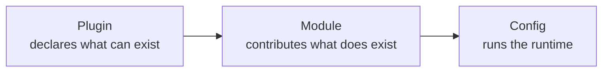

QUESTPIE is designed to be extensible. The core framework provides primitives — everything else comes from plugins and modules.

<Cards>
  <Card title="Registries" href="/docs/extend/registries" description="Field, view, and component registries — how the admin resolves renderers from schema." />
  <Card title="Custom Fields" href="/docs/extend/custom-fields" description="Create custom field types with custom storage, validation, and admin rendering." />
  <Card title="Custom Views" href="/docs/extend/custom-views" description="Create custom list and form view types for the admin panel." />
  <Card title="Custom Adapters" href="/docs/extend/custom-adapters" description="Build your own KV, queue, search, realtime, storage, and email adapters for QUESTPIE." />
  <Card title="Building a Module" href="/docs/extend/building-a-module" description="Create a reusable module — collections, globals, jobs, routes, services, and more." />
  <Card title="Building a Plugin" href="/docs/extend/building-a-plugin" description="Create a QUESTPIE codegen plugin — categories, extensions, module registries." />
  <Card title="Codegen Internals" href="/docs/extend/codegen-internals" description="Deep dive into the codegen pipeline — discovery, key derivation, template emission, type augmentation, and the plugin extension system." />
  <Card title="Package Distribution" href="/docs/extend/package-distribution" description="How QUESTPIE packages are built, versioned, and published — tsdown, exports strategy, changesets." />
</Cards>

## Extension Points

| Extension                                           | What it does                                                 |
| --------------------------------------------------- | ------------------------------------------------------------ |
| [Custom Fields](/docs/extend/custom-fields)         | New field types with custom storage and rendering            |
| [Custom Views](/docs/extend/custom-views)           | New list/form view types                                     |
| [Custom Adapters](/docs/extend/custom-adapters)     | New KV, queue, search, realtime, storage, and email adapters |
| [Registries](/docs/extend/registries)               | Field, view, and component registry deep dive                |
| [Building a Plugin](/docs/extend/building-a-plugin) | Create a codegen plugin package                              |
| [Building a Module](/docs/extend/building-a-module) | Create a reusable module                                     |

## Architecture

The extension system follows three levels:

Plugins tell codegen what to discover. Modules provide the actual implementations. Config wires infrastructure.
