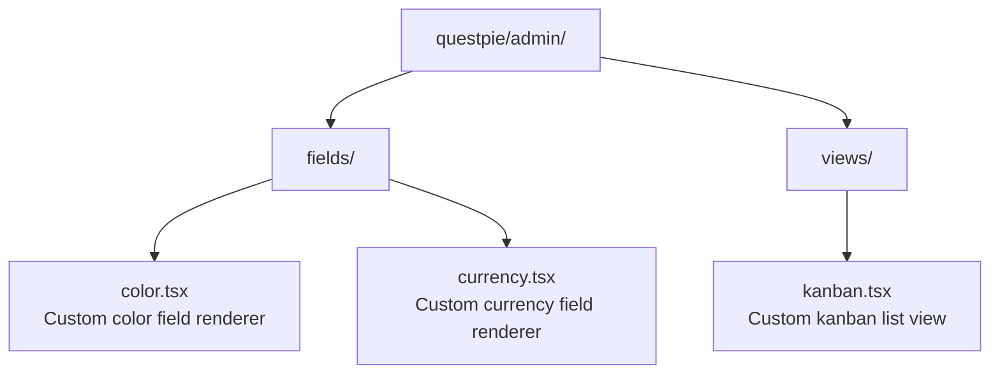

Registries are the mechanism that connects server-side schema to client-side rendering. When the admin panel encounters a `text` field, it looks up the `text` renderer in the field registry.

## How Registries Work

```mermaid
flowchart TD
  Server["Server<br/>f.text()"]
  Generated["Generated schema<br/>{ type: \"text\", options: { ... } }"]
  Registry["Admin client<br/>fieldRegistry.get(\"text\")"]
  React["React<br/>&lt;TextFieldRenderer value={...} onChange={...} /&gt;"]

  Server --> Generated --> Registry --> React
```

## Field Registry

Maps field types to React components:

| Field type | Renderer                  |
| ---------- | ------------------------- |
| `text`     | `TextInput`               |
| `textarea` | `TextareaInput`           |
| `richText` | `RichTextEditor` (TipTap) |
| `number`   | `NumberInput`             |
| `boolean`  | Checkbox / Switch         |
| `date`     | `DatePicker`              |
| `datetime` | `DateTimePicker`          |
| `select`   | `SelectDropdown`          |
| `relation` | `RelationPicker`          |
| `upload`   | `FileUpload`              |
| `object`   | `NestedForm`              |
| `array`    | `RepeatableItems`         |
| `blocks`   | `BlockEditor`             |
| `json`     | `JSONEditor`              |

## View Registry

Maps view types to React components:

| View type | Renderer           |
| --------- | ------------------ |
| `table`   | `TableView` (list) |
| `form`    | `FormView` (edit)  |

## Component Registry

General-purpose component registry for dynamic rendering:

| Component type | Renderer         |
| -------------- | ---------------- |
| `icon`         | `IconComponent`  |
| `badge`        | `BadgeComponent` |

## Extending Registries

Register custom renderers by placing files in the admin directory. Codegen discovers them automatically:



These are merged with built-in defaults during codegen and exported in `.generated/client.ts`.

## Related Pages

- [Custom Fields](/docs/extend/custom-fields) — Creating field types
- [Custom Views](/docs/extend/custom-views) — Creating view types
- [Plugins](/docs/backend/architecture/plugins) — Plugin system
