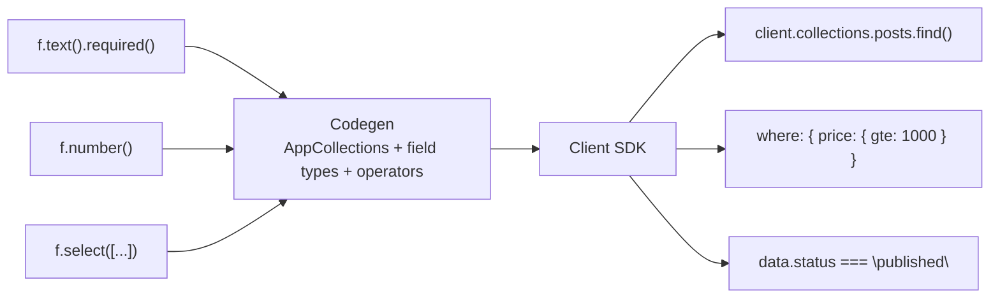

QUESTPIE provides end-to-end TypeScript type safety. Types flow from your field definitions through codegen to the client SDK. No manual type definitions needed.

## The Type Flow



## Generated Types

Codegen produces:

```ts
// From .generated/
export type AppConfig = {
	collections: {
		posts: {
			select: {
				id: string;
				title: string;
				body: string | null;
				status: "draft" | "published";
			};
			insert: {
				title: string;
				body?: string | null;
				status?: "draft" | "published";
			};
			where: {
				title?: string | { contains?: string };
				status?: "draft" | "published" | { in?: string[] };
			};
			orderBy: { title?: "asc" | "desc"; createdAt?: "asc" | "desc" };
		};
		// ...
	};
};
```

## Client Autocompletion

The client uses `AppConfig` which includes collections, globals, and routes:

```ts
const client = createClient<AppConfig>({
	baseURL: "http://localhost:3000",
	basePath: "/api",
});

// Autocomplete: collections.posts, collections.barbers, ...
// Autocomplete: where.status, where.title, ...
// Autocomplete: routes.createBooking, routes.getActiveBarbers, ...
// Autocomplete: routes["health"], routes["webhooks/stripe"], ...
```

## Server Context Types

Codegen augments `AppContext` so handlers get typed DI:

```ts
// In any handler — everything is typed
handler: async ({ input, collections, queue, email, blog }) => {
	const post = await collections.posts.findOne({
		where: { id: input.postId }, // typed
	});
	// post.title — string
	// post.status — "draft" | "published"

	await queue.notifyBlogSubscribers.publish({
		postId: post.id, // typed payload
		title: post.title,
	});
};
```

## Route Return Types

Route return types come from `.outputSchema()`. The schema both validates the
response at runtime and types the client call — and the handler's return is
checked against it at compile time:

```ts
// Server
export default route()
	.post()
	.schema(z.object({ barberId: z.string() }))
	.outputSchema(z.object({ name: z.string(), isActive: z.boolean() }))
	.handler(async ({ input, collections }) => {
		const barber = await collections.barbers.findOne({
			where: { id: input.barberId },
		});
		if (!barber) throw new Error("Not found");
		return { name: barber.name, isActive: barber.isActive };
	});

// Client — typed from the output schema
const barber = await client.routes.getBarber({ barberId: "abc" });
// barber: { name: string; isActive: boolean }
```

Routes without an output schema return `any` on the client. Handler-return
inference is intentionally not used for the route's type — it would make the
route definition's type depend on the handler body, which circularly
references the app context inside modules.

## Related Pages

- [Codegen](/docs/backend/architecture/codegen) — What gets generated
- [Querying](/docs/frontend/querying) — Query operators
- [Typed Routes](/docs/backend/business-logic/routes) — Server routes
