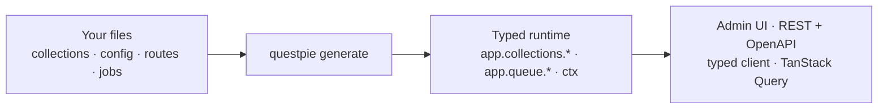

QUESTPIE is a **server-first TypeScript framework**. You define your schema once with file-convention factories, run codegen, and get a typed runtime, an admin UI, a REST API, OpenAPI docs, a typed client, and TanStack Query, all projected from that one schema. Nothing is defined twice.

This page gives you the whole mental model fast, then a scannable tour of every core concept. Read it first; follow the links to go deep on any one.

## What you write vs. what you get

You write **declarations**, plain files that describe collections, fields, access rules, routes, jobs. You run `questpie generate`. Codegen reads those files and projects them into everything downstream:



The admin panel, the client SDK, and the OpenAPI spec are **projections** of your schema, the same way a mobile app would be, not separate definitions you keep in sync by hand. Change a field, re-run codegen, and every layer updates with correct types.

<Callout type="info" title="One term, one concept">
	A *collection* is a database table. A *global* is a singleton. A *field* describes one column. A *module* (or *plugin*) is config you add. These names mean the same thing on the server, in codegen, in the client, and in the admin, no synonyms.
</Callout>

## What you get out of the box

Scaffold a new app with `bunx create-questpie my-app` and you ship from a real starting point, not an empty shell. Every scaffold boots immediately with:

- **Auth, server + client**, Better Auth (email/password) wired as `config/auth.ts`, plus a typed auth client.
- **A typed frontend client**, `createClient<AppConfig>(...)` with full inference from your schema.
- **TanStack Query, wired**, `createQuestpieQueryOptions(client)` gives you `queryOptions`/`mutationOptions` builders for every collection, global, and route.
- **An admin UI**, mounted at `/admin` (on the TanStack Start and Next.js runtimes).
- **OpenAPI + Scalar docs**, a live REST reference at `/api/docs`.
- **A branded landing page**, at `/`, surfacing your entry points (admin, API docs).
- **Committed codegen output**, a `docker-compose` (Postgres + extensions), `.env`, and the full script set (`dev`, `db:push`, `migrate*`).

Pick a runtime and follow its [getting-started guide](/docs/getting-started/tanstack-start) to a booting app.

<Callout type="info" title="Four runtimes, one core">
	TanStack Start and Next.js are fullstack (admin UI included); Hono and Elysia are headless API + typed-client. The `src/questpie/**` core is identical across all four, only a thin runtime adapter (how the handler is mounted) differs.
</Callout>

## Your first collection, end to end

Here is the whole payoff in three steps: define a collection, generate, query it with full types.

**1. Define the schema.** Collection files live in `src/questpie/server/collections/`. The `f` argument is the field builder, you destructure it from the `.fields()` callback, you never import individual field factories.

```ts title="src/questpie/server/collections/posts.collection.ts"
import { collection } from "#questpie/factories";

export const posts = collection("posts")
	.fields(({ f }) => ({
		title: f.text(255).required(),
		body: f.richText(),
		author: f.relation("user"),
		status: f.select([
			{ value: "draft", label: "Draft" },
			{ value: "published", label: "Published" },
		]),
		publishedAt: f.datetime(),
	}))
	.title(({ f }) => f.title);
```

<Callout type="info" title="Import from `#questpie/factories`, not `questpie`">
	Codegen generates the `collection()` factory so that module-contributed field types (`f.richText()`, `f.blocks()` from the admin module) appear on `f`. A bare `import { collection } from "questpie"` only sees the 15 built-in field types. Always import from `#questpie/factories`. See [Codegen](/docs/extend/codegen) for how the generated factory is wired.
</Callout>

**2. Run codegen.** This discovers your files and writes the typed runtime to `src/questpie/server/.generated/`.

```bash title="Terminal"
questpie generate
```

**3. Query it with the typed client.** Your `where`, `orderBy`, `with`, and the result are all inferred from the schema above:

```ts title="src/lib/posts.ts"
import { client } from "@/lib/client";

const result = await client.collections.posts.find({
	where: { status: "published" },
	orderBy: { publishedAt: "desc" },
	with: { author: true },
	limit: 10,
});

result.docs[0].title;
//               ^ string
result.docs[0].author;
//               ^ the related user row, typed, because of `with: { author: true }`
```

`find()` returns a paginated envelope: `{ docs, totalDocs, totalPages, page, hasNextPage, ... }`. That same schema now also serves `GET /api/posts`, appears in `/api/docs`, and renders a list + form in the admin, with zero extra code.

## The 101 tour, every core concept

A one-line map of the whole framework. Each entry links to its dedicated page.

### Data modeling

**[Collections](/docs/concepts/collections)**, typed, versioned database tables with hooks, access rules, relations, and (with the admin module) an automatic admin UI. The `collection(name)` builder is the unit you compose everything else onto.

```ts
collection("posts").fields(({ f }) => ({ title: f.text().required() }));
```

**[Globals](/docs/concepts/globals)**, singletons (site settings, a homepage). Same field API as collections, but `get`/`update` only, no create/delete, no `where`.

```ts
global("settings").fields(({ f }) => ({ siteName: f.text().required() }));
```

**[Fields](/docs/concepts/fields)**, the building blocks of a row. 15 built-ins cover the common cases; chain modifiers like `.required()`, `.default()`, `.localized()`, and `.array()` on any of them.

| Field | What it stores |
| --- | --- |
| `f.text(max?)` / `f.textarea()` | strings (varchar / unbounded) |
| `f.email()` / `f.url()` | validated strings |
| `f.number(mode?)` | integer, decimal, bigint, … |
| `f.boolean()` | true/false |
| `f.date()` / `f.datetime()` / `f.time()` | dates and times |
| `f.select([...])` | a literal-union enum (add `.array()` for multi-select) |
| `f.relation(target)` | a typed foreign key (see Relations) |
| `f.upload({ to })` | a file reference into an assets collection |
| `f.object({...})` / `f.json()` | nested JSONB (typed or schema-less) |
| `f.richText()` / `f.blocks()` | admin-module rich content |

**[Relations](/docs/concepts/relations)**, typed foreign keys. `f.relation("user")` is a belongs-to; `.hasMany({ foreignKey })` and `.manyToMany({ through })` give you the other directions. Load them with `with: { author: true }`.

```ts
author: f.relation("user");
comments: f.relation("comment").hasMany({ foreignKey: "postId" });
```

<Callout type="info" title="Relation targets are validated after codegen">
	Pre-codegen, `f.relation("usr")` is just a string. Once codegen runs, the target name is validated against your real collections, a typo becomes a compile error.
</Callout>

### Rules and lifecycle

**[Access control](/docs/concepts/access-control)**, per-operation rules on `.access({ read, create, update, delete })`. Return a boolean to allow/deny, or a `where`-shaped object to filter rows (row-level security). Rules run with the full request context (`session`, `db`, …).

```ts
collection("posts").access({
	read: true,
	update: ({ session }) => !!session?.user,
});
```

<Callout type="warn" title="Secure by default, except routes">
	An `undefined` access rule on a collection requires a session, it does not default to public. Routes are the opposite: a route with no `.access()` is **public** until you add one. Be deliberate about both. See [Access control](/docs/concepts/access-control) and [Routes](/docs/concepts/routes).
</Callout>

**[Hooks](/docs/concepts/hooks)**, lifecycle callbacks on `.hooks({ ... })`: `beforeChange`, `afterChange`, `beforeDelete`, and more. Each receives the full app context. Use `onAfterCommit(cb)` for side effects (jobs, emails, search) so they only fire once the transaction is durable.

```ts
collection("posts").hooks({
	afterChange: async ({ data, queue, onAfterCommit }) => {
		onAfterCommit(() => queue.notifySubscribers.publish({ postId: data.id }));
	},
});
```

<Callout type="warn" title="Don't run output hooks inside an open transaction">
	Block/upload `afterRead` work re-entering an open tx can deadlock the database driver. Schedule durable-data side effects with `onAfterCommit` instead. See [Hooks](/docs/concepts/hooks).
</Callout>

**[Validation](/docs/concepts/validation)**, Zod schemas for create and update are generated automatically from your field definitions. Use `.validation({ refine, exclude })` only when you need to tighten or drop a specific field.

### Business logic

**[Routes](/docs/concepts/routes)**, custom HTTP endpoints as files in `src/questpie/server/routes/`. Chain `.post().schema(...).handler(...)`; the handler gets a typed `input` plus the full context (`collections`, `queue`, `db`, `session`). No imports, no singletons, everything arrives through context.

```ts
import { route } from "questpie/services";
import { z } from "zod";

export default route()
	.post()
	.schema(z.object({ postId: z.string() }))
	.handler(async ({ input, collections }) => {
		return collections.posts.findOne({ where: { id: input.postId } });
	});
```

**[Jobs](/docs/concepts/jobs)**, background work as `*.job.ts` files. Define a payload schema and handler; dispatch with `queue.<name>.publish(payload)`. Add `options.cron` for a recurring schedule. Adapters: pg-boss, BullMQ, Cloudflare Queues.

```ts
import { job } from "questpie";
import { z } from "zod";

export default job({
	name: "send-digest",
	schema: z.object({ userId: z.string() }),
	handler: async ({ payload, email }) => {
		/* … */
	},
});
```

<Callout type="warn" title="There is no `questpie worker` CLI command">
	Workers start in code. Write a script that imports your built app and calls `app.queue.listen()` (long-running) or `app.queue.runOnce()` (one serverless batch). See [Jobs](/docs/concepts/jobs).
</Callout>

**[Services](/docs/concepts/services)**, reusable singletons (a Stripe client, a third-party SDK) injected into context. Dependencies come from the `create(ctx)` argument, there is no separate `deps` array.

```ts
import { service } from "questpie/services";

export default service({
	create: ({ db }) => new BillingClient(db),
});
```

**[Emails](/docs/concepts/emails)**, typed templates as `emails/*.ts`. A template returns `{ subject, html }`; send it with `email.sendTemplate({ template, to, input })`. Adapters: SMTP, Resend, Plunk, or a dev console logger.

```ts
import { email } from "questpie/services";
import { z } from "zod";

export default email({
	name: "welcome",
	schema: z.object({ name: z.string() }),
	handler: ({ input }) => ({ subject: `Welcome, ${input.name}`, html: "…" }),
});
```

**[Blocks](/docs/concepts/blocks)**, composable content blocks for page-builder fields (admin module). Declare a block with `block(name).fields(...)`, then store a tree of them in a `f.blocks()` field.

### The client

**[Typed client SDK](/docs/client/sdk)**, `createClient<AppConfig>(...)` from `questpie/client`. Gives you `client.collections.*`, `client.globals.*`, `client.routes.*`, `client.search`, and `client.realtime`, every method typed from your schema. `AppConfig` is the generated type of your app.

```ts
import { createClient } from "questpie/client";
import type { AppConfig } from "@/questpie/server/app";

export const client = createClient<AppConfig>({ baseURL, basePath: "/api" });
```

**[TanStack Query](/docs/client/tanstack-query)**, `createQuestpieQueryOptions(client)` from `@questpie/tanstack-query` builds `queryOptions`/`mutationOptions` you pass straight into `useQuery`/`useMutation`. Query keys, locale, and stage are handled for you. Pass `{ realtime: true }` to `find`/`count`/`get` for live updates.

```ts
const { data } = useQuery(q.collections.posts.find({ limit: 10 }));
const create = useMutation(q.collections.posts.create());
```

**[Realtime](/docs/client/realtime)**, `client.collections.posts.live(query, onSnapshot)` opens a live subscription; the first snapshot arrives immediately, then updates stream over a single multiplexed SSE connection.

### Infrastructure (adapters)

QUESTPIE talks to infrastructure through **adapters**, you swap the backend without touching your app code. Each is configured once in `questpie.config.ts`.

| Concern | Built-in / default | Other adapters |
| --- | --- | --- |
| **[Queue](/docs/adapters/queue)** | none | pg-boss, BullMQ, Cloudflare Queues |
| **[Search](/docs/adapters/search)** | Postgres (FTS + trigram) | pgvector (semantic) |
| **[Realtime](/docs/adapters/realtime)** | poll-based | Postgres `NOTIFY`, Redis Streams |
| **[Storage](/docs/adapters/storage)** | local filesystem | S3, R2 (via files-sdk) |
| **[Email](/docs/adapters/email)** | console (dev) | SMTP, Resend, Plunk |
| **[KV](/docs/adapters/kv)** | in-memory | Redis, Cloudflare KV |

```ts title="src/questpie/server/questpie.config.ts"
import { runtimeConfig } from "questpie/app";
import { pgBossAdapter } from "questpie/adapters/pg-boss";

export default runtimeConfig({
	queue: { adapter: pgBossAdapter({ connectionString: process.env.DATABASE_URL }) },
});
```

### The admin panel

**[Admin UI](/docs/admin)**, add the `@questpie/admin` module and your collections get a full panel: list views, forms, filters, and media, all generated from the same schema via introspection. Customize per collection with `.admin()`, `.list()`, `.form()`, and `.actions()`; the admin's own collections follow the exact same file conventions as yours.

### Extending the framework

**[Modules and plugins](/docs/extend/modules)**, a module is plain data (`collections`, `routes`, `jobs`, `services`, a codegen `plugin`) you add to `src/questpie/server/modules.ts`. Admin, OpenAPI, MCP, and workflows all use this path. [Build your own](/docs/extend/build-a-plugin) to package reusable schema + behavior.

**[Codegen](/docs/extend/codegen)**, the engine that turns your files into the typed runtime. `questpie generate` runs it once; `questpie dev` watches and regenerates on file add/remove. Codegen output is committed to git. A module's codegen `plugin` lets a package contribute its own file conventions without you editing config.

<Callout type="warn" title="Re-run codegen after adding or removing files">
	New collections, routes, and jobs only enter the typed runtime once `questpie generate` (or `questpie dev`) regenerates `.generated/`. Editing the *body* of an existing file does not require a regen, only adding/removing files does.
</Callout>

## Where to next

- **[Getting started: TanStack Start](/docs/getting-started/tanstack-start)**, scaffold → `docker compose up` → `db:push` → a booting app.
- **[Collections](/docs/concepts/collections)**, the deep dive on the unit you'll use most.
- **[Fields](/docs/concepts/fields)**, every built-in field type and the chain-modifier model.
- **[Client SDK](/docs/client/sdk)**, the typed client and how every call is inferred from your schema.
- **[Codegen](/docs/extend/codegen)**, the engine that turns your files into the typed runtime.

### Suggested learning paths

Pick the on-ramp that matches what you're here to do. Each is an ordered path through the canonical pages, read them in sequence and every step builds on the last.

- **New dev (build something)**, [TanStack Start](/docs/getting-started/tanstack-start) → [Collections](/docs/concepts/collections) → [Fields](/docs/concepts/fields) → [Relations](/docs/concepts/relations) → [Access control](/docs/concepts/access-control) → [Client SDK](/docs/client/sdk) → [TanStack Query](/docs/client/tanstack-query). Add [Hooks](/docs/concepts/hooks), [Jobs](/docs/concepts/jobs), and [Routes](/docs/concepts/routes) when you need behavior.
- **Backend / data modeler**, [Collections](/docs/concepts/collections) → [Fields](/docs/concepts/fields) → [Relations](/docs/concepts/relations) → [Validation](/docs/concepts/validation) → [Access control](/docs/concepts/access-control) → [Hooks](/docs/concepts/hooks).
- **Frontend integrator**, [Client SDK](/docs/client/sdk) → [TanStack Query](/docs/client/tanstack-query) → [Realtime](/docs/client/realtime).
- **Extender / plugin author**, [Codegen](/docs/extend/codegen) → [Modules](/docs/extend/modules) → [Build a plugin](/docs/extend/build-a-plugin).
- **AI agent**, the QUESTPIE skills (by name) plus `llms.txt`/`llms-full.txt` are the agent on-ramp.
