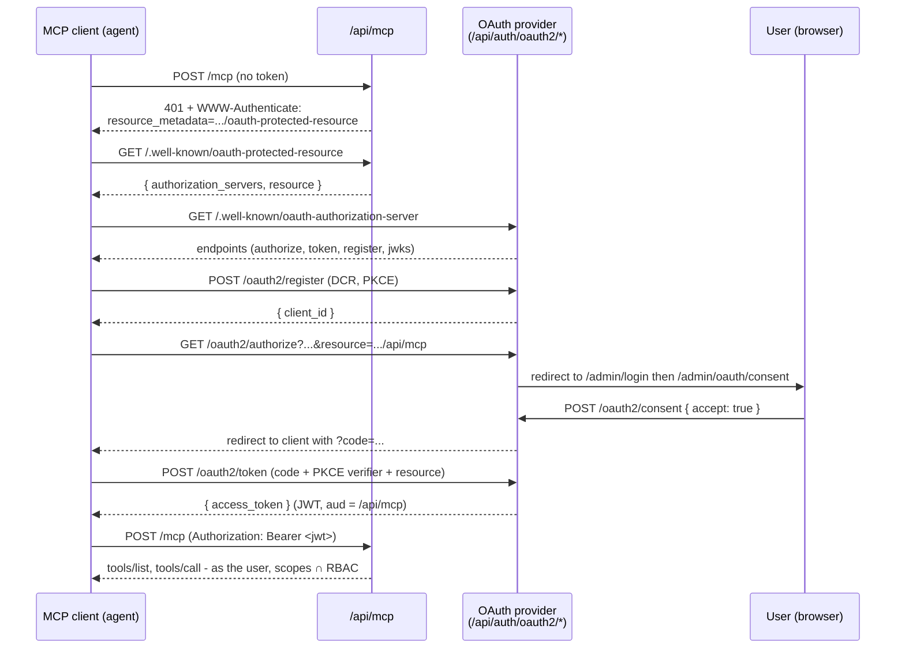
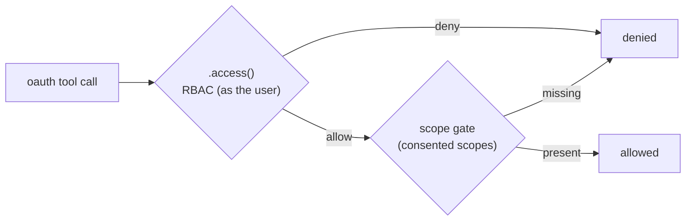

Your [MCP endpoint](/docs/integrations/mcp) at `/api/mcp` is not meant to be open. When an external AI agent (Claude, an IDE, an autonomous agent on someone else's machine) connects, it should act **as a specific person**, with exactly the permissions that person has, and only the slice of them they explicitly granted. QUESTPIE does this with a standard **OAuth 2.1** authorization-code + PKCE flow: the agent registers itself, the user signs in and approves a consent screen, and the app issues a short-lived access token bound to your MCP endpoint. Every tool call then runs as that user, gated by `scopes ∩ RBAC` - the consented scopes AND the user's own `.access()` rules, never more than either.

This is the remote, network-facing story. Local, trusted clients (a CLI on your own machine) use the [stdio transport](/docs/integrations/mcp#stdio-transport) and are unaffected - they run as a `system` principal with no OAuth.

<Callout type="info" title="Prerequisites">
Read the [MCP integration](/docs/integrations/mcp) page first - it covers `mcpModule`, how collections/globals/routes become tools, and the `config/mcp.ts` policy surface. This page adds the OAuth 2.1 auth layer on top. Familiarity with [Access control](/docs/concepts/access-control) helps too, since scopes layer on top of your existing RBAC.
</Callout>

## What you get

- **A real OAuth 2.1 provider**, backed by [`@better-auth/oauth-provider`](https://better-auth.com) + the `jwt()` plugin. It ships with your app's auth config - you don't stand up a separate identity server.
- **Dynamic client registration (RFC 7591)**, so an MCP client self-registers at `/api/auth/oauth2/register` - no manual client-secret handoff.
- **Authorization-code + PKCE**, the OAuth 2.1 flow for public clients. PKCE is enforced for every registered client.
- **A human consent screen** at `/admin/oauth/consent`, rendering the requested scopes in plain English so the user approves exactly what the agent asked for.
- **Audience-bound, short-lived JWT access tokens** (RFC 8707). A token is bound to your `/api/mcp` endpoint and expires in an hour, so it can't be replayed against other resources and revocation is cheap.
- **Root discovery documents** - `/.well-known/oauth-authorization-server`, `/.well-known/oauth-protected-resource`, and `/jwks` - so a compliant MCP client discovers where to authenticate on its own.
- **The `scopes ∩ RBAC` model**, a first-class `principal` (`user` / `oauth` / `system`), and least-privilege scopes layered on top of your existing access rules.

## Enabling it

The OAuth provider, the token tables, and the discovery endpoints all ship with the **starter module**, which the **admin module** bundles. So on a runtime that includes admin (TanStack Start, Next.js), an admin-enabled app **already has** the OAuth provider, the `jwks`/`oauth-*` tables, and root discovery - there is nothing extra to configure for auth. All you add is the MCP route itself.

**Scaffolding a new app** - select the `MCP` module in `create-questpie`:

```bash title="Terminal"
bunx create-questpie my-app
# → in the module multiselect, check:
#   MCP - Model Context Protocol endpoint (OAuth 2.1)
```

On TanStack Start / Next.js the scaffold already checks `Admin` by default, which brings in the starter (and therefore the OAuth provider). Adding `MCP` mounts `/api/mcp` on top.

**Adding it to an existing app** - add `mcpModule` to your server modules and re-run codegen:

```ts title="src/questpie/server/modules.ts"
import { adminModule } from "@questpie/admin/modules/admin";
import { openApiModule } from "@questpie/openapi";
import { mcpModule } from "@questpie/mcp/modules/mcp";

const modules = [adminModule, openApiModule, mcpModule] as const;

export default modules;
```

```bash title="Terminal"
questpie generate
```

That is the whole setup on an admin-enabled app: `adminModule` provides the OAuth provider + tables + discovery (via the starter it bundles), and `mcpModule` mounts the OAuth-gated `/api/mcp` route. This is exactly the composition the end-to-end test (`packages/mcp/test/oauth-mcp-e2e.test.ts`) exercises.

<Callout type="info" title="Headless runtimes (Hono, Elysia) add the OAuth provider with `oauthModule`">
The OAuth provider lives in a self-contained, composable **`oauthModule`** (`packages/questpie/src/server/modules/oauth/`), the `oauthProvider()` + `jwt()` plugins, the `oauth-*` tables + `jwks`, and the discovery routes. `starterModule` bundles it and `adminModule` pulls the starter in, so an admin-enabled app gets it for free (as above). A **headless / custom-auth** app that ships neither can add `oauthModule` on top of its own better-auth model to get the same provider + tables + discovery, HTTP MCP then works there too. (This shipped in 3.3.0, it is no longer a hand-wire-it-yourself follow-up.) With no provider at all, `/api/mcp` still mounts but stays `401` with nothing to discover. Local [stdio](/docs/integrations/mcp#stdio-transport) needs no OAuth and works everywhere.
</Callout>

## The flow

A compliant MCP client drives the whole thing itself once you point it at `https://your-app/api/mcp`. Here is what happens end to end.



Step by step:

1. **Discovery via `401`.** An unauthenticated `POST /mcp` returns `401` with a `WWW-Authenticate: Bearer resource_metadata="…/.well-known/oauth-protected-resource"` header. The client reads the [Protected Resource metadata](https://datatracker.ietf.org/doc/html/rfc9728) there, which points at the authorization server, then reads the [Authorization Server metadata](https://datatracker.ietf.org/doc/html/rfc8414) at `/.well-known/oauth-authorization-server` to find the endpoints below.
2. **Dynamic client registration (DCR).** The client `POST`s to `/api/auth/oauth2/register` (RFC 7591) to obtain a `client_id`. Registered clients are public (`token_endpoint_auth_method: "none"`), so PKCE is required.
3. **Authorize + PKCE.** The client sends the user's browser to `/api/auth/oauth2/authorize` with `response_type=code`, a PKCE `code_challenge`, and - critically - **`resource=<your-app>/api/mcp`** ([RFC 8707](https://datatracker.ietf.org/doc/html/rfc8707)), which binds the eventual token's audience to your MCP endpoint.
4. **Sign in + consent.** If the user isn't signed in, the provider redirects to `/admin/login`. Once signed in, it redirects to the consent screen at `/admin/oauth/consent`, which shows the requested scopes in plain English. Approving `POST`s `{ accept: true, oauth_query }` to `/api/auth/oauth2/consent`; the provider persists the consent and redirects back to the client with an authorization `code`.
5. **Token exchange.** The client exchanges the `code` at `/api/auth/oauth2/token`, sending the PKCE `code_verifier` and the same `resource`. It receives a short-lived (1-hour) access token.
6. **Call the endpoint.** The client sends `Authorization: Bearer <token>` on `POST /mcp`. The app verifies the token statelessly against `/jwks`, resolves it to an `oauth` principal (the real user + consented scopes), and dispatches tool calls under `scopes ∩ RBAC`.

<Callout type="info" title="Discovery lives at the server root, not under `/api/auth`">
Better Auth serves OAuth metadata under its own base path (`/api/auth/*`), but MCP clients expect it at the server root. QUESTPIE's core module (always included) re-exposes all three documents at the root as ordinary routes - `/.well-known/oauth-authorization-server`, `/.well-known/oauth-protected-resource`, and `/jwks` - each delegating to the provider's own helpers, so the advertised issuer/JWKS/audience always match how tokens are actually issued.
</Callout>

<Callout type="warn" title="A token is a verifiable JWT only when the client sets `resource`">
The `resource=<mcp-endpoint-url>` parameter (RFC 8707) at both **authorize** and **token** is what makes the provider mint a JWT whose `aud` is your MCP endpoint. Without it you get an opaque access token that the stateless `/jwks` verification can't validate, and the `/mcp` route will reject it. A compliant MCP client sets `resource` automatically from the Protected Resource metadata; if you drive the flow by hand, you must set it yourself.
</Callout>

## The scope model

Scopes describe **what slice of your app** an agent asked for. They are declarative and derived from your data model - one per resource and operation - plus two coarse umbrellas for convenience.

| Scope pattern | Grants | Example |
|---|---|---|
| `collections:<name>:read` | list / get / count on that collection | `collections:posts:read` |
| `collections:<name>:write` | create / update on that collection | `collections:posts:write` |
| `collections:<name>:delete` | delete on that collection | `collections:posts:delete` |
| `globals:<name>:read` | read that global | `globals:settings:read` |
| `globals:<name>:write` | update that global | `globals:settings:write` |
| `routes:<key>:invoke` | call that exposed route tool | `routes:reports/revenue:invoke` |
| `collections:read` *(umbrella)* | the `:read` verb across **all** collections | - |
| `collections:write` *(umbrella)* | the `:write` verb across **all** collections | - |

The mapping is pure data, parameterized by `(resource kind, name, verb)` - adding a collection, global, or route contributes its scopes automatically, with no framework code to touch.

<Callout type="info" title="Umbrellas exist for `read` and `write` only - never `delete` or `invoke`">
A granular `collections:posts:read` requirement is *also* satisfied by holding the coarse `collections:read` umbrella (and likewise for `write`). But there is **no** umbrella for `:delete` or `routes:…:invoke`: those always require the exact granular scope. `read` and `write` umbrellas are independent - holding `collections:write` never satisfies a `:read` requirement, and vice versa - and an umbrella never crosses resource kinds (`collections:read` never grants a `globals:…` scope). This keeps the convenience narrow and least-privilege.
</Callout>

### Effective permission = scopes ∩ RBAC

This is the load-bearing guarantee. An `oauth` token represents a **real person**, so that person's access rules always apply first - then the consented scopes narrow further. The scope gate is **additive-only**: it can remove access from an OAuth caller, never grant it.



Both gates must pass, in either direction of narrowing:

- **Scopes narrow RBAC.** A collection whose RBAC allows a user everything, reached with a token that only holds `collections:posts:read`, exposes only the read tools - create/update/delete stay hidden and are denied even on a direct call.
- **RBAC narrows scopes.** A collection whose RBAC denies `update`/`delete` stays locked even if the token holds `…:write` and `…:delete` scopes. The scope gate can't grant past what `.access()` allows.

Out-of-scope (and out-of-RBAC) tools are **absent from `tools/list`** *and* rejected if the client calls them directly by name.

<Callout type="info" title="`user` and `system` principals are unchanged">
The scope gate only applies to the `oauth` principal. A first-party admin cookie/bearer session is a `user` principal - no scopes, RBAC as today. A trusted local [stdio](/docs/integrations/mcp#stdio-transport) worker is a `system` principal - it bypasses both the RBAC and scope gates entirely (full access). Only the network-facing OAuth path is scope-gated.
</Callout>

### What the user sees on the consent screen

The consent page renders each requested scope as a human-readable line, so the granting user understands exactly what they're approving:

| Scope | Rendered as |
|---|---|
| `openid` | Verify your identity |
| `email` | View your email address |
| `collections:posts:read` | Read the Posts collection |
| `collections:posts:write` | Create and update the Posts collection |
| `collections:read` | Read all your collections |
| `routes:reports/revenue:invoke` | Run the Reports/revenue action |

Unknown scopes fall back to a readable rendering of the raw string rather than a blank row, so a new resource never shows up unlabeled.

<Callout type="warn" title="Consent is a real admin page, not a server-rendered provider template">
The consent screen is a QUESTPIE admin page at `/admin/oauth/consent` (the provider's `consentPage`). It reads the signed authorization query from the URL and drives `POST /oauth2/consent`. There is no `getConsentHTML` helper - the installed provider does not expose one. Trusted clients that skip consent (`skip_consent`) never reach this page; the provider handles them server-side.
</Callout>

## Custom tool scopes

Custom tools defined with [`mcpTool`](/docs/integrations/mcp#custom-tools) participate in the same gate. Declare the scopes a tool requires via its `scopes` config, and the gate enforces them for OAuth callers alongside the tool's `access` rule:

```ts title="src/questpie/server/mcp-tools/recalculate-stats.ts"
import { mcpTool } from "@questpie/mcp";
import { z } from "zod";

export default mcpTool("recalculate-stats", {
  description: "Recompute cached site statistics.",
  inputSchema: z.object({ since: z.string().optional() }),
  scopes: ["collections:stats:write"], // OAuth callers must hold this
  access: ({ session }) => session?.user?.role === "admin",
}).handler(async ({ input, ctx }) => {
  const updated = await ctx.services.stats.recompute(input.since);
  return { structuredContent: { updated } };
});
```

As always, `scopes` is an OAuth-only narrowing on top of `access` - a `user` or `system` caller ignores it, and it can never grant past the `access` rule.

## Security

- **Audience-bound tokens (RFC 8707).** Each token's `aud` is your `/api/mcp` URL, and verification rejects any token minted for a different resource - a token issued for one app's MCP endpoint can't be replayed against another endpoint.
- **Short TTL.** Access tokens expire in **1 hour**, so a leaked token has a small window and revocation stays cheap (there's a `/oauth2/revoke` endpoint for refresh tokens and consent).
- **Stateless verification.** Tokens are verified locally against the published `/jwks` key set on every request - no database round-trip on the hot path. The token is signed with **EdDSA (Ed25519)**; an unsigned or wrong-key token can never pass verification.
- **No token ever elevates.** A malformed, expired, wrong-audience, or wrong-issuer token resolves to **no principal** - the request falls through to the normal (unauthenticated) path and the `/mcp` route answers `401`. `system` mode is only ever set by a trusted transport (stdio), never derived from a token.
- **PKCE, always.** Every DCR-registered client is public and must use PKCE; there is no way to register a client that opts out.

<Callout type="info" title="RBAC is the floor, scopes are the ceiling">
Because effective permission is `scopes ∩ RBAC`, an over-broad scope grant can never bypass your access rules, and a misconfigured access rule can never be widened by a scope. Design your `.access()` rules as the real security boundary; treat scopes as the user's least-privilege consent on top.
</Callout>

## Related

- [MCP integration](/docs/integrations/mcp) - the base MCP module: how collections/globals/routes become tools, `config/mcp.ts`, custom tools, and the stdio transport.
- [Access control](/docs/concepts/access-control) - the `.access()` RBAC rules that every OAuth tool call runs through first; scopes narrow, never widen, what they allow.
- [Admin auth](/docs/admin/auth) - the auth config the OAuth provider ships in, and the `/admin/login` page the flow redirects to.
- [Modules](/docs/extend/modules) - `mcpModule` and `adminModule` are modules you add; admin bundles the starter that carries the OAuth provider.
- [Routes](/docs/concepts/routes) - how a route opts into MCP tool exposure via `meta.mcp.expose`, gaining a `routes:<key>:invoke` scope.
