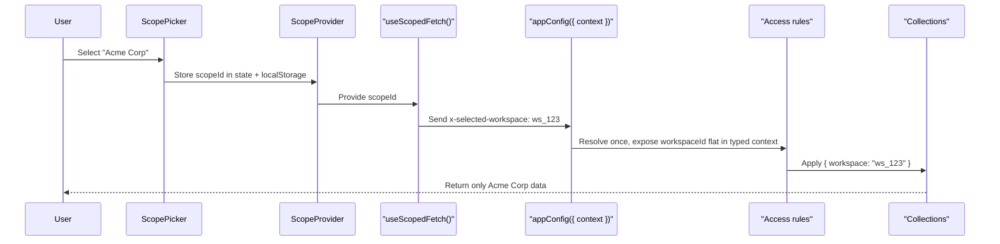

QUESTPIE supports multi-tenant applications through a **scope-based** architecture. A "scope" can represent anything: organizations, workspaces, properties, cities, brands — any entity that partitions data.

The pattern: **HTTP header carries a scope ID → `appConfig({ context })` derives typed context once per request → access rules filter data**.

## Context Resolver

The context resolver lives in `config/app.ts`. It runs **once per HTTP request**, and the returned object travels with the request — it arrives flat on every access rule, hook, route handler, and `getContext()` call.

```ts title="src/questpie/server/config/app.ts"
import { appConfig } from "questpie/app";

export default appConfig({
	context: async ({ request, session, collections }) => {
		const workspaceId = request.headers.get("x-selected-workspace");

		// Validate membership with the typed collections API (system mode)
		if (workspaceId && session?.user) {
			const member = await collections.workspace_members.findOne({
				where: { workspace: workspaceId, user: session.user.id },
			});
			if (!member) throw new Error("No access to this workspace");
		}

		return { workspaceId: workspaceId || null };
	},
});
```

The resolver receives the base request params plus the full system-mode service surface (typed via codegen):

| Parameter     | Type                        | Description                                     |
| ------------- | --------------------------- | ----------------------------------------------- |
| `request`     | `Request`                   | Incoming HTTP request (Web API)                 |
| `session`     | `{ user, session } \| null` | Resolved auth session                           |
| `db`          | `Database`                  | Raw database client                             |
| `collections` | `CollectionsAPI`            | Typed collections (system mode, hooks run)      |
| `globals`     | `GlobalsAPI`                | Typed globals                                   |
| `logger`      | `LoggerService`             | App logger                                      |
| `kv`          | `KVService`                 | Key-value store                                 |
| `queue`       | `QueueClient`               | Queue client                                    |
| `t`           | `(key, params?) => string`  | Translations                                    |
| `services`    |                             | User services from `services/`                  |

Lifecycle rules:

- **Once per HTTP request** — nested CRUD, relation hydration, and hooks never re-run it.
- **No request → no resolver.** Jobs, seeds, and scripts skip it; extension types are `Partial<…>`, so always narrow.
- **Throwing fails the request** before any rule or handler runs — ideal for tenant validation.
- **Expensive lookups become lazy closures** — the resolver's closure scope lives exactly one request, so a memoized `async` function gives per-request caching with zero framework machinery.

## Data Isolation

Read the derived context **flat** in access rules to enforce tenant isolation:

```ts title="collections/projects.ts"
import { collection } from "#questpie/factories";

export default collection("projects")
	.fields(({ f }) => ({
		title: f.text().label("Title").required(),
		workspace: f.relation("workspaces").required(),
	}))
	.access({
		read: ({ workspaceId }) => {
			if (!workspaceId) return false;
			return { workspace: workspaceId };
		},
		create: ({ workspaceId }) => !!workspaceId,
		update: ({ workspaceId }) => {
			if (!workspaceId) return false;
			return { workspace: workspaceId };
		},
		delete: ({ workspaceId }) => {
			if (!workspaceId) return false;
			return { workspace: workspaceId };
		},
	})
	.hooks({
		beforeChange: async ({ data, operation, workspaceId }) => {
			if (operation === "create" && workspaceId) {
				data.workspace = workspaceId;
			}
		},
	});
```

Access rules can return:

- `true` — allow all records
- `false` — deny all records
- `{ field: value }` — where-clause filter (row-level security)

## Reading Context Anywhere

Inside any code running within the request (hooks, services, utils), `getContext()` exposes the resolved extensions flat and typed:

```ts
import { getContext } from "questpie";
import type { App } from "#questpie";

function currentWorkspaceOrThrow() {
	const { workspaceId } = getContext<App>(); // typed: string | null | undefined
	if (!workspaceId) throw new Error("No workspace selected");
	return workspaceId;
}
```

## Admin Scope UI

### ScopeProvider

Wrap your admin with `ScopeProvider` to enable scope selection:

```tsx title="routes/admin/$.tsx"
import {
	AdminLayout,
	AdminRouter,
	ScopePicker,
	ScopeProvider,
} from "@questpie/admin/client";

function AdminPage() {
	return (
		<ScopeProvider
			headerName="x-selected-workspace"
			storageKey="admin-workspace"
		>
			<AdminContent />
		</ScopeProvider>
	);
}
```

| Prop           | Type             | Required | Description                                            |
| -------------- | ---------------- | -------- | ------------------------------------------------------ |
| `headerName`   | `string`         | Yes      | HTTP header for scope ID (must match the resolver)     |
| `storageKey`   | `string`         | No       | localStorage key for persistence                       |
| `defaultScope` | `string \| null` | No       | Default scope if none stored                           |

### ScopePicker

A dropdown for selecting the current scope. Place it in the sidebar:

```tsx
<AdminLayout
	admin={admin}
	basePath="/admin"
	slots={{
		afterBrand: (
			<div className="px-3 py-2 border-b">
				<ScopePicker
					collection="workspaces"
					labelField="name"
					placeholder="Select workspace..."
					allowClear
					clearText="All Workspaces"
					compact
				/>
			</div>
		),
	}}
>
	<AdminRouter basePath="/admin" />
</AdminLayout>
```

Three data source modes:

```tsx
// From a collection
<ScopePicker collection="workspaces" labelField="name" />

// Static options
<ScopePicker options={[
  { value: "ws_1", label: "Workspace 1" },
  { value: "ws_2", label: "Workspace 2" },
]} />

// Async loader
<ScopePicker loadOptions={async () => {
  const res = await fetch("/api/my-workspaces");
  return res.json();
}} />
```

### useScopedFetch

Inject the scope header into all API calls automatically:

```tsx
import { useScopedFetch } from "@questpie/admin/client";

function AdminContent() {
	const scopedFetch = useScopedFetch();

	const client = useMemo(
		() => createClient<typeof app>({ baseURL: "/api", fetch: scopedFetch }),
		[scopedFetch],
	);

	return <AdminProvider client={client} />;
}
```

## Validating Access

In production, verify the user belongs to the selected scope — throw from the resolver to fail the request before any handler or rule runs (see the resolver example above). Throwing an `ApiError` maps to a structured HTTP error response:

```ts title="src/questpie/server/config/app.ts"
import { appConfig } from "questpie/app";
import { ApiError } from "questpie/errors";

export default appConfig({
	context: async ({ request, session, collections }) => {
		const workspaceId = request.headers.get("x-selected-workspace");

		if (workspaceId && session?.user) {
			const member = await collections.workspace_members.findOne({
				where: { workspace: workspaceId, user: session.user.id },
			});
			if (!member) throw ApiError.forbidden({
				operation: "read",
				resource: "workspaces",
				reason: "Not a member of the selected workspace",
			});
		}

		return { workspaceId: workspaceId || null };
	},
});
```

## Request-Scoped Services

For advanced isolation, use a request-scoped service:

```ts title="services/scoped-db.ts"
import { service } from "questpie/services";
export default service({
	lifecycle: "request",
	deps: ["db", "session"] as const,
	create: ({ db, session }) => createScopedDb(db, session?.user?.tenantId),
	dispose: (scopedDb) => scopedDb.release(),
});
```

## Request Flow



## Next Steps

- [Access Control](/docs/backend/rules/access-control) — where-clause filters and role-based rules
- [Services](/docs/backend/business-logic/services) — request-scoped services for tenant isolation
- [Authentication](/docs/production/authentication) — session-based auth with Better Auth
