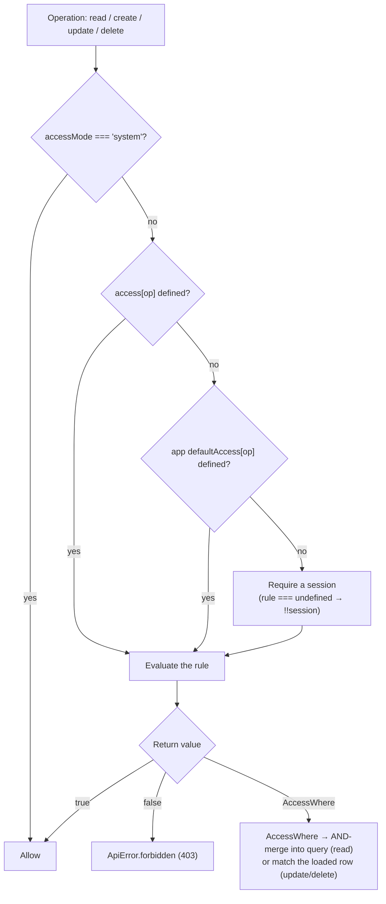

Access control decides **who can do what** to your data. You attach rules per operation, `read`, `create`, `update`, `delete`, `purge`, plus `transition`, `serve`, and `introspect`, in a single `.access({ ... })` call on a collection or global. Each rule runs with the full request context (`session`, `db`, the loaded row, the input) and returns a boolean to allow or deny, or a `where`-shaped object to filter rows. The same engine guards the REST API, the typed client, and the admin UI, you write the rule once, and every entry point obeys it.

## What it does

- **Authorizes every operation**, one rule per `read` / `create` / `update` / `delete` / `purge`.
- **Filters rows (row-level security)**, return a `where`-shaped object from `read` and it is `AND`-merged into the query; rows the caller can't see never come back.
- **Scopes individual fields**, hide a field on read or freeze it on write per operation with `access.fields`, independent of the row rules.
- **Runs secure by default**, a collection with no rule for an operation requires an authenticated session. You opt into public access explicitly with `read: true`.
- **Bypasses cleanly for trusted code**, seeds, jobs, and internal scripts run in `accessMode: "system"`, which skips every access and field check.
- **Fails with typed errors**, denials throw `ApiError.forbidden` (HTTP 403); every error serializes to a stable JSON shape the typed client surfaces.

## Quick start

Attach `.access({ ... })` to a collection. A boolean allows or denies outright; a function gets the request context and returns a boolean or a row filter.

```ts title="src/questpie/server/collections/posts.ts"
import { collection } from "#questpie/factories";

export const posts = collection("posts")
	.fields(({ f }) => ({
		title: f.text(255).required(),
		body: f.richText(),
		authorId: f.relation("user"),
		status: f.select([
			{ value: "draft", label: "Draft" },
			{ value: "published", label: "Published" },
		]),
	}))
	.access({
		// Signed-in users see their own posts; everyone else sees published ones.
		read: ({ session }) =>
			session?.user ? { authorId: session.user.id } : { status: "published" },
		// Must be signed in to create.
		create: ({ session }) => !!session?.user,
		// Only the author may edit or delete. `data` is the existing row.
		update: ({ session, data }) => data.authorId === session?.user?.id,
		delete: ({ session, data }) => data.authorId === session?.user?.id,
	});
// Full option list and the per-operation context table are below.
```

That single object now governs `GET/POST/PATCH/DELETE /api/posts`, every `client.collections.posts.*` call, and the admin panel for this collection.

<Callout type="warn">
	**Secure by default, collections require a session.** Leaving an operation's
	rule out does **not** make it public: the framework requires an authenticated
	session for it (`rule === undefined → !!session`). To make an operation public
	you must say so explicitly with `read: true`. (Routes are the opposite, a
	route with no `.access()` is public until you add one. See
	[Routes](/docs/concepts/routes).)
</Callout>

## What the rule returns

A function rule can return three kinds of value, and the framework reacts to each:

| Return value            | Effect                                                                                                                                                                                                          |
| ----------------------- | --------------------------------------------------------------------------------------------------------------------------------------------------------------------------------------------------------------- |
| `true`                  | Allow the operation.                                                                                                                                                                                            |
| `false`                 | Deny, throws `ApiError.forbidden` (403).                                                                                                                                                                        |
| an `AccessWhere` object | Filter: on `read` it is `AND`-merged into the query `WHERE`; on `update`/`delete`/`purge` the loaded row is tested against it. A purge mismatch is disclosure-safe not-found; ordinary writes return forbidden. |

A bare boolean shorthand, `read: true`, `create: false`, is the same as a function that always returns it.

## How a rule resolves

When a request hits a collection operation, exactly one rule is chosen and evaluated in this order:



So the resolution for each ordinary CRUD operation is: **collection's own `access[op]` → app-level `defaultAccess[op]` → require a session**. `defaultAccess` is set app-wide (next section); the starter module sets it to require a session for ordinary CRUD operations, which is where the secure-by-default behavior comes from.

<Callout type="warn" title="Purge is independently default-deny">
	`purge` never falls back to `delete` or to the authenticated-session rule. Its
	resolution is `collection access.purge` → `defaultAccess.purge` → `false`.
	Missing, denied, already purged, and row-filter-mismatched targets all return
	not-found so callers cannot probe protected records. See [Soft delete and
	durable retention](/docs/schema/soft-delete).
</Callout>

<Callout type="info">
	**`.access()` replaces; `.hooks()` merges.** Calling `.access()` again
	**overwrites** the whole access object, the last call wins. (Contrast
	[`.hooks()`](/docs/schema/hooks), which concatenates handlers per stage.)
	Set every operation you care about in one `.access({ ... })` call. Across
	modules, `.merge()` lets a later module's `access` override an earlier one
	key-by-key.
</Callout>

### App-wide defaults with `appConfig`

To set the fallback for **every** collection and global at once, configure `access` in `config/app.ts`. The framework exposes it at runtime as `app.defaultAccess`, and it sits in the resolution chain between a collection's own rule and the require-a-session fallback.

```ts title="src/questpie/server/config/app.ts"
import { appConfig } from "#questpie/factories";

export default appConfig({
	access: {
		// Default for any collection/global that doesn't set its own rule.
		read: ({ session }) => !!session,
		create: ({ session }) => !!session,
		update: ({ session }) => !!session,
		delete: ({ session }) => !!session,
		purge: false,
	},
});
```

`appConfig({ access })` accepts `read`, `create`, `update`, `delete`, `purge`, `transition`, `serve`, and `introspect`, the same operation keys as a collection, **minus `fields`** (per-field rules belong on the collection or global that owns the field). Modules can contribute a `defaultAccess` too, and they compose. Leave app-wide purge denied unless every collection should share a carefully reviewed retention authority.

<Callout type="info" title="Configure app-wide defaults in app config">
	Set app-wide rules with `appConfig({ access })` or a module's
	`defaultAccess`. A collection's `.access({ ... })` overrides the app default
	for each operation it defines; other operations fall through to the default,
	then to the authenticated-session policy.
</Callout>

## The per-operation context

Every rule function receives an `AccessContext`, the full app context (`db`, `session`, `collections`, `globals`, `queue`, `kv`, `storage`, `search`, `realtime`, `mailer`, `logger`, plus any context extensions you added in `appConfig({ context })`), plus a few operation-specific keys. What's populated depends on the operation:

| Operation | `ctx.data`                   | `ctx.input`                       | Can return `AccessWhere`?                 |
| --------- | ---------------------------- | --------------------------------- | ----------------------------------------- |
| `read`    | none (no row loaded)         | none                              | yes, merges into the query                |
| `create`  | none (no row yet)            | the raw input, **pre-validation** | no, there's no row to match               |
| `update`  | the **existing** row         | the patch                         | yes, checked against the loaded row       |
| `delete`  | the **existing** row         | none                              | yes, checked against the loaded row       |
| `purge`   | the **existing deleted** row | `{ id }`                          | yes, checked inside the purge transaction |

```ts
.access({
	// read/create: `data` is NOT loaded, branch on session, not on the row.
	read: ({ session, request }) => {
		const isAdminUi = request?.url.includes("/admin/api/");
		if (isAdminUi) return true; // differentiate admin vs frontend by URL
		return { status: "published" }; // public callers see published only
	},
	// create: `input` is the raw, pre-validation payload.
	create: ({ session, input }) =>
		!!session?.user && input?.status !== "published", // can't publish on create
	// update/delete/purge: `data` is the existing row.
	update: ({ session, data }) =>
		data.authorId === session?.user?.id || session?.user?.role === "admin",
})
```

<Callout type="info">
	**`request` is only set over HTTP.** `ctx.request` is present when the
	operation comes through an HTTP adapter, use it to tell the admin API apart
	from the public API by URL or header. Direct server calls
	(`app.collections.posts.find(...)`) carry no `request`.
</Callout>

### `read` vs `update`/`delete`/`purge`: where the filter lands

The same `AccessWhere` shape behaves differently depending on the operation:

- On **`read`**, the `AccessWhere` is `AND`-merged into the query's `WHERE` (`{ AND: [yourWhere, accessWhere] }`). Non-matching rows are filtered out of the result, this is row-level security, applied in SQL.
- On **`update`** / **`delete`**, the already-loaded row is tested against the `AccessWhere` in JavaScript. A mismatch throws `forbidden`. In bulk updates and deletes, each row is checked individually.
- On **`purge`**, the locked row is checked inside the purge transaction. A mismatch returns the same not-found error as a missing or already purged row.

```ts title="Row-level read: a user only ever sees their own orders"
.access({
	read: ({ session }) => {
		if (!session?.user) return false;                // deny anonymous
		if (session.user.role === "admin") return true;  // admins see everything
		return { customerId: session.user.id };          // everyone else: own rows only
	},
})
```

<Callout type="warn">
	**`AccessWhere` does strict equality only.** The matcher supports field
	equality plus `AND` / `OR` / `NOT`, **no** operators like `gt`, `in`, or
	`like`. `{ status: "published" }` works; `{ views: { gt: 100 } }` does not. For
	anything richer, return a boolean computed in the rule body, you have the full
	`db` and `session`, so do the lookup yourself and return `true`/`false`.
</Callout>

`AccessWhere` nests with the boolean combinators:

```ts
read: ({ session }) => ({
	OR: [{ authorId: session?.user?.id }, { status: "published" }],
});
```

## Field-level access

Use `access.fields` to allow or deny **individual fields** per operation, keyed by field path (dotted for nested fields, e.g. `"settings.email"`). Each entry takes `read`, `create`, and `update`, booleans or predicates over a slim field context.

```ts title="Hide a field on read, freeze it on update"
.access({
	read: true,
	fields: {
		// Only admins see the internal note; everyone else gets it omitted.
		internalNotes: {
			read: ({ user }) => user?.role === "admin",
		},
		// `email` can be set on create but never changed afterward.
		email: {
			update: false,
		},
	},
})
```

Each flag's effect when it resolves to `false`:

| Flag            | When `false`                                                                                                              |
| --------------- | ------------------------------------------------------------------------------------------------------------------------- |
| `read: false`   | the field is **omitted** from the response                                                                                |
| `create: false` | providing the field on create throws `forbidden` (with the `fieldPath`)                                                   |
| `update: false` | **changing** the field throws `forbidden` (with the `fieldPath`), submitting the unchanged value passes through untouched |

On a write, only fields actually present in the input are checked, and on update a value equal to the existing one is skipped, so resubmitting the whole record without changing a frozen field is fine. Field rules receive a **slim** context, `{ req?, user, doc?, operation }`, not the full app context. `user` is your generated session user; `doc` is the row on read/update/delete (`undefined` on create); `operation` is the current operation. Field rules only allow or deny; they cannot return an `AccessWhere`.

<Callout type="info">
	**`access.fields` is the source of truth, and field flags fold into it.**
	`f.text().input(false)` contributes `{ create: false, update: false }` and
	`.output(false)` contributes `{ read: false }`, merged into the same
	field-access map. Put per-field rules in `access.fields` so collection-level
	access remains the single read/write policy surface.
	Meta fields (`id`, `_title`, `createdAt`, `updatedAt`, `deletedAt`) are never
	read-filtered.
</Callout>

## Order of operations on a write

Knowing the exact sequence helps you reason about which rule fires first and where to put logic. For a **create** the framework runs:

1. **Row access**, `access.create` evaluated; `false` → `forbidden`.
2. `beforeValidate` hook (transform input).
3. **Field write access**, each field in the input checked against `access.fields[...].create`; a denied field → `forbidden`.
4. **Validation**, the generated Zod schema parses the input.
5. `beforeChange` hook → **INSERT** → `afterChange` hook.
6. `afterRead` hook (transform output).
7. **Field read filter**, `access.fields[...].read` applied to the returned row.

For an **update** it's the same shape, with `access.update` first (plus the `AccessWhere` row-match), then `beforeValidate`, validation, `access.fields[...].update`, `beforeChange`, **UPDATE**, `afterChange`, the `afterRead` hook, and finally the field read filter. **Reads** run `access.read` (producing the merged `WHERE`), the **SELECT**, then the field read filter and `afterRead`.

<Callout type="info">
	**The field read filter and `afterRead` run in opposite orders on writes vs
	reads.** On a **write** (create/update) the `afterRead` hook fires *before*
	the field read filter strips denied fields, so your hook sees the full row,
	then the filter runs last on the way out. On a **read** the field read filter
	runs *before* `afterRead`. If an `afterRead` hook depends on a field that a
	`read` rule denies, that field is present after a write but already stripped
	on a plain read.
</Callout>

<Callout type="info">
	**Access runs before validation; field-write runs before validation too.**
	Row-level access and field-level *write* access both gate the input **before**
	the Zod schema sees it, so a denied write never reaches validation.
	Field-level *read* filtering runs on the way out, after the row is loaded. See
	[Hooks](/docs/schema/hooks) for the full lifecycle and
	[Validation](/docs/schema/validation) for the schema step.
</Callout>

## Beyond CRUD: `transition`, `serve`, `introspect`

Three more operations have their own rules, each with a deliberate fallback chain.

**`transition`**, guards workflow stage changes (`transitionStage`; requires versioning + workflow enabled). `ctx.data` is the existing row.

> Resolution: `access.transition` → `access.update` → app `defaultAccess.update`. It falls back to **`update`**, not to `defaultAccess.transition`, and a denial is reported with `operation: "update"`.

**`serve`**, guards serving an upload's **bytes** by key (`GET /:collection/files/:key`). `ctx.data` is the upload row.

> Resolution: `access.serve` → collection `access.read` → app `defaultAccess.serve` → **allow**. App-level `defaultAccess.read` is deliberately _not_ in this chain: listing rows and fetching bytes by key are distinct permissions.

<Callout type="warn">
	**`serve` falls open, and private files always check the token too.** If
	`serve`, the collection's `read`, and `defaultAccess.serve` are all undefined,
	byte serving is **allowed**. For `visibility: "private"` uploads a
	signed-token check always applies **in addition** to this rule, but for
	`"public"` uploads, set `serve` explicitly if the bytes shouldn't be
	world-readable.
</Callout>

**`introspect`**, guards the schema/meta endpoints (`GET /:collection/{schema,meta}`) that the admin UI and OpenAPI generator read.

> Resolution: `access.introspect` → app `defaultAccess.introspect` → **visible iff at least one CRUD op (`read`/`create`/`update`/`delete`) is allowed for the current user**. An explicit `introspect` rule overrides that any-op default.

## The system bypass

Seed scripts, jobs, and internal server code need to read and write everything without tripping access rules. That's `accessMode: "system"`: it makes the access engine return `true` immediately, skips field read **and** write filtering, and bypasses the `transition` / `serve` checks.

You set it on the **context**, then pass that context to CRUD calls. Inside a seed, `createContext` is handed to you. See [Seeds](/docs/schema/seeds) for the full seed lifecycle:

```ts title="src/questpie/server/seeds/posts.ts"
import { seed } from "questpie";

export default seed({
	id: "demoPosts",
	description: "Seed demo posts with full access",
	category: "dev",
	async run({ collections, createContext, log }) {
		const ctx = await createContext({
			accessMode: "system", // bypass all access + field rules
		});

		// Pass ctx as the second argument to any operation.
		const existing = await collections.posts.findOne(
			{ where: { slug: "seeded-post" } },
			ctx,
		);
		if (!existing) {
			await collections.posts.create({ title: "Seeded post" }, ctx);
			log("Seeded demo post");
		}
	},
});
```

Outside a seed, build the context from the app instance, handy in server-side data loaders or scripts:

```ts title="src/lib/server-helpers.ts"
import { app } from "#questpie";

export async function createServerContext() {
	return app.createContext({ accessMode: "system" });
}
```

<Callout type="warn">
	**`system` skips everything, keep it server-only.** System mode is a complete
	bypass of both row-level and field-level access. Never derive it from
	user-controlled input. Direct backend calls default to system mode; the HTTP
	adapter runs requests in `"user"` mode so the public API is always enforced.
</Callout>

## Globals

Globals (singletons) use the same model with a narrower surface: `.access({ read, update, transition, introspect, fields })`. There is **no** `create`, `delete`, or `serve` (a global is one row, not an upload), and `fields` entries take only `read` / `update`.

```ts title="src/questpie/server/globals/site-settings.ts"
import { global } from "#questpie/factories";

export const siteSettings = global("siteSettings")
	.fields(({ f }) => ({
		siteName: f.text().required(),
		maintenanceMode: f.boolean(),
	}))
	.access({
		read: true, // settings are public
		update: ({ session }) => session?.user?.role === "admin",
	});
```

<Callout type="info">
	**Global rules return booleans only.** With a single row there is nothing to
	filter, so global access rules cannot return an `AccessWhere`, only `true` /
	`false` (or a predicate that returns one). On `update`, `ctx.data` is the
	existing record (`undefined` on the very first write) and `ctx.input` is the
	patch. The same `transition` / `introspect` fallback chains apply.
</Callout>

## Throwing your own errors

Returning `false` produces a generic `forbidden`. To short-circuit with a specific reason or status, throw an `ApiError` from inside the rule (or a hook). The static factories cover the standard HTTP cases:

```ts
import { ApiError } from "questpie/errors";

.access({
	update: ({ session, data }) => {
		if (!session?.user) {
			throw ApiError.unauthorized(); // 401, not signed in
		}
		if (data.locked && session.user.role !== "admin") {
			throw ApiError.forbidden({
				operation: "update",
				resource: "posts",
				reason: "This post is locked", // shown verbatim to the client
			}); // 403, with a custom reason
		}
		return true;
	},
})
```

| Factory                                                                    | Code                    | HTTP |
| -------------------------------------------------------------------------- | ----------------------- | ---- |
| `ApiError.unauthorized(message?, messageKey?, messageParams?)`             | `UNAUTHORIZED`          | 401  |
| `ApiError.forbidden(context, messageKey?, messageParams?)`                 | `FORBIDDEN`             | 403  |
| `ApiError.notFound(resource, id?, messageKey?, messageParams?)`            | `NOT_FOUND`             | 404  |
| `ApiError.badRequest(message?, fieldErrors?, messageKey?, messageParams?)` | `BAD_REQUEST`           | 400  |
| `ApiError.conflict(message, messageKey?, messageParams?)`                  | `CONFLICT`              | 409  |
| `ApiError.internal(message?, cause?, messageKey?, messageParams?)`         | `INTERNAL_SERVER_ERROR` | 500  |

Every factory takes an optional `messageKey` (plus `messageParams` for interpolation) so the error can be localized for the requesting user instead of reaching the client as the untranslated `message`. Omit it and you get the built-in default key for that code. `notFound` always exposes `{{resource}}` and `{{id}}` to the translation, `forbidden` always exposes `{{reason}}`, and anything you pass in `messageParams` overrides them.

`ApiError.forbidden(context)` takes `{ operation, resource, reason, requiredRole?, userRole?, fieldPath? }`. A `reason` of `"Access denied"` triggers the built-in localized message; any other `reason` is sent to the client verbatim. `401` means _no auth_; `403` means _authenticated but not permitted_, reach for `unauthorized` vs `forbidden` accordingly. Every `ApiError` serializes to a stable JSON shape (`{ code, message, fieldErrors?, context? }`) the typed client surfaces, and the full code set (`BAD_REQUEST`, `UNAUTHORIZED`, `FORBIDDEN`, `NOT_FOUND`, `CONFLICT`, `VALIDATION_ERROR`, `HOOK_ERROR`, …) is exported from `questpie/errors`.

## TypeScript

Inline rules are typed for you, `session` resolves to your generated session user and `data` to the collection's row, contextually:

```ts
.access({
	update: ({ session, data }) => {
		//        ^ generated session   ^ this collection's row, typed
		return data.authorId === session?.user?.id;
	},
})
```

For **shared helpers** in routes, services, jobs, or scripts, import the generated `AccessRuleContext<K>` alias, `K` narrows `ctx.data` to that collection's row:

```ts title="src/questpie/server/lib/access.ts"
import type { AccessRuleContext } from "#questpie";

export function isOwner(ctx: AccessRuleContext<"posts">) {
	return ctx.data?.authorId === ctx.session?.user?.id; // ctx.collections typed too
}
```

<Callout type="warn">
	**Cycle rule for collection-imported helpers.** Import `AccessRuleContext<K>`
	only from files that a collection does **not** import (routes, services, jobs,
	scripts). A helper that a collection imports must take the package-level
	`AccessContext` from `questpie` instead, and annotate its return type
	explicitly, otherwise codegen hits a type cycle (TS2456/TS7022). `ctx.app`,
	`ctx.collections`, and `ctx.session` stay fully typed either way.
</Callout>

The full set of access types, `CollectionAccess`, `AccessRule`, `RowAccessRule`, `AccessContext`, `AccessWhere`, `FieldAccess`, `FieldAccessRule`, `FieldAccessRuleContext`, `GlobalAccess`, `GlobalAccessRule`, `GlobalAccessContext`, `AccessMode`, is exported from `questpie/types`.

```ts
import type {
	CollectionAccess,
	AccessRule,
	AccessWhere,
	AccessMode,
} from "questpie/types";
```

## Related

- [Hooks](/docs/schema/hooks), lifecycle callbacks that run alongside access checks; use `beforeChange` to stamp ownership on write and `afterChange` (via `onAfterCommit`) for side effects.
- [Validation](/docs/schema/validation), Zod schemas generated from your fields; access runs **before** validation on writes.
- [Collections](/docs/schema/collections), the builder you attach `.access()` to.
- [Globals](/docs/schema/globals), singletons with the same access model, minus create/delete/serve.
- [Routes](/docs/concepts/routes), custom endpoints with their own `.access()` (public by default, the inverse of collections).
- Runnable example: [`examples/toy-factory-backend`](https://github.com/questpie/questpie/tree/main/examples/toy-factory-backend), collections with real `.access({ ... })` rules and a cycle-safe shared helper in `lib/access.ts`.
