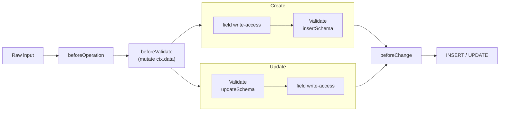

Every collection compiles two Zod schemas, one for create, one for update, automatically from your field definitions. You don't write or maintain them: the field is the source of truth. On every write, QUESTPIE parses the input against the right schema and rejects bad data with a typed `VALIDATION_ERROR` (HTTP 400) **before** anything touches the database. When the field defaults aren't enough, you tighten a single field with `.zod()`, customize the whole collection with `.validation()`, or normalize raw input in a `beforeValidate` hook so it passes the schema you didn't loosen.

## What it does

- **Generates `insertSchema` + `updateSchema` from your fields**, no schema files to keep in sync; field type defaults (`f.email()` format, `f.text(120)` max length, `f.select([...])` enum) come free.
- **Makes the update schema partial**, every field is optional on update, so a patch only carries what changed.
- **Rejects bad input with a typed error**, a failed `parse` throws `ApiError` with code `VALIDATION_ERROR` (HTTP 400) and per-field `fieldErrors` the admin and client render inline.
- **Refines or replaces any field's schema with `.zod(fn)`**, and the returned schema's output type flows back into the field's TypeScript value type.
- **Customizes the whole collection with `.validation({ exclude, refine })`**, drop fields from validation or layer refinements on top of the generated schema.
- **Transforms input before validation**, mutate `ctx.data` in a `beforeValidate` hook to trim, default, or derive values so they validate as-is.

## Quick start

Validation is on by default. Declare fields and the create/update schemas already exist, reach for `.zod()` only when you need a constraint the field type doesn't express:

```ts
// src/questpie/server/collections/post.ts
import { collection } from "#questpie/factories";

export default collection("post")
	.fields(({ f }) => ({
		title: f.text(120).required(),
		// Refine a field's generated schema, value type stays `string`
		slug: f
			.text()
			.required()
			.zod((s) =>
				s.regex(/^[a-z0-9-]+$/, "Use lowercase letters, numbers, and dashes"),
			),
		// `f.email()` already validates email format, no `.zod()` needed
		contact: f.email(),
	}))
	.title(({ f }) => f.title);
```

That's the whole surface for the common case. The generated schemas now back `POST /api/post` and `PATCH /api/post/:id`, the typed client's `create` / `update`, and the admin form, all enforcing the same rules. Every option is in [Full API](#full-api) below.

<Callout
	type="info"
	title="Import the factory from `#questpie/factories`, not `questpie`"
>
	The generated `collection()` factory carries every field type, including
	module-contributed ones (`f.richText()`, `f.blocks()`). A bare `import{" "}
	{collection} from "questpie"` only sees the builtin field types.
</Callout>

## When validation runs

On create and update, validation sits between input transformation and the database write. The runtime order in the CRUD generator is fixed, but **field write-access and schema validation run in the opposite relative order on create vs. update**: create checks field write-access _before_ the schema, update parses the schema _first_:



<Callout
	type="info"
	title="Why the create/update order differs, and why it rarely matters"
>
	On create, a denied field write-access aborts before the schema ever parses;
	on update, the schema parses first and *then* field write-access is checked.
	Either way both gates run before `beforeChange` and before any row is written,
	so a denied or invalid write never reaches the database, the only observable
	difference is *which* error (`FORBIDDEN` vs `VALIDATION_ERROR`) a request that
	trips both gates gets back.
</Callout>

Two consequences matter:

- **`beforeValidate` is your pre-validation transform.** It runs _before_ the schema parses, with `ctx.data` as the mutable input. Trim, lowercase, default, or derive values there and they're validated as-is. After the schema passes, `beforeChange` runs on the _validated_ data, too late to fix a value the schema already rejected.
- **A failed parse aborts the operation.** The CRUD generator wraps `insertSchema.parse` / `updateSchema.parse` and rethrows any Zod error as `ApiError.fromZodError(error)`, no row is written, no `beforeChange` / `afterChange` runs, and the caller gets a `VALIDATION_ERROR`.

```ts
// src/questpie/server/collections/post.ts
import { collection } from "#questpie/factories";

function slugify(input: string): string {
	return input
		.toLowerCase()
		.replace(/[^a-z0-9]+/g, "-")
		.replace(/^-|-$/g, "");
}

export default collection("post")
	.fields(({ f }) => ({
		title: f.text(120).required(),
		slug: f
			.text()
			.required()
			.zod((s) => s.regex(/^[a-z0-9-]+$/, "Must be a slug")),
	}))
	.hooks({
		// Derive a valid slug from the title BEFORE the regex above runs
		beforeValidate: ({ data }) => {
			if (data.title && !data.slug) {
				data.slug = slugify(data.title);
			}
		},
	})
	.title(({ f }) => f.title);
```

<Callout
	type="info"
	title="`ctx.data` in `beforeValidate` is the input, mutated in place"
>
	It's `TInsert` on create and `TUpdate` on update, assign to it to transform;
	don't return anything. The hook fires only on create and update (never read or
	delete).
</Callout>

## Full API

The validation surface is three primitives: `.zod()` on a field, `.validation()` on the collection, and a `beforeValidate` hook. Most collections use none of them, the field defaults are enough.

### `.zod(fn)`, refine or replace one field's schema

`.zod(fn)` is the field-level escape hatch. You receive the field's auto-derived Zod schema and return a new one. The returned schema's **output type propagates to the field's value type**, so refining versus replacing has different type consequences:

```ts
// src/questpie/server/collections/product.ts
import { collection } from "#questpie/factories";
import { z } from "zod";

export default collection("product")
	.fields(({ f }) => ({
		// REFINE, add a runtime check, keep the type as `string`
		sku: f
			.text()
			.required()
			.zod((s) =>
				s.refine((v) => v.startsWith("SKU-"), "Must start with SKU-"),
			),

		// REPLACE, narrow a loose JSON field to a concrete shape.
		// `settings` is now typed { theme: "light" | "dark"; compact: boolean }
		settings: f.json().zod(() =>
			z.object({
				theme: z.enum(["light", "dark"]),
				compact: z.boolean(),
			}),
		),
	}))
	.title(({ f }) => f.sku);
```

**How the return type maps to the field value type:**

| You call                                                   | Schema output           | Field value type       |
| ---------------------------------------------------------- | ----------------------- | ---------------------- |
| `.zod((s) => s.refine(...))` / `.regex(...)` / `.min(...)` | same as input           | unchanged              |
| `.zod(() => z.object({...}))` (replace)                    | the new schema's output | narrows to that output |
| `.zod((s) => s)` returning a plain `ZodType`               | `unknown`               | unchanged (kept as-is) |

The transform is applied after auto-derivation, when the field's schema is compiled into the collection's create/update schemas (`toZodSchema()` runs, then the result is overlaid onto the column-derived schema). The field definition is the validation source of truth wherever one exists.

<Callout type="info" title="`.zod()` validates; `$type<T>()` only types">
`f.json().$type<Layout>()` sets the TypeScript value type with **no runtime check**, bad data still gets in. Pair it with `.zod()` (or replace the schema as above) when you also need the value enforced at runtime.
</Callout>

<Callout
	type="warn"
	title="`.zod()` on relation and upload fields is skipped on input"
>
	Their foreign-key columns accept app-defined ids (custom ids, auth-provider
	ids), so the collection schema keeps the **column-derived** shape for these
	fields and skips the field's `.zod()` overlay on input, the field schema's
	uuid check would otherwise reject a valid app id. Validate relation targets in
	a `beforeChange` hook instead. `input(false)` fields are also skipped
	(system-written).
</Callout>

### `.validation({ exclude, refine })`, customize the whole collection

Schemas are generated whether or not you call `.validation()`, it exists purely to **drop fields** from validation or **layer refinements** across the collection. Both options are optional:

```ts
// src/questpie/server/collections/article.ts
import { collection } from "#questpie/factories";

export default collection("article")
	.fields(({ f }) => ({
		title: f.text(200).required(),
		email: f.text().required(), // plain text, not f.email()
		internalNotes: f.text(),
	}))
	.validation({
		// Refinements layer ON TOP of each field's own schema
		refine: {
			email: (s) => s.email("Enter a valid email address"),
		},
		// Excluded keys are validated by neither schema
		exclude: { internalNotes: true },
	})
	.title(({ f }) => f.title);
```

| Option    | Type                                 | Effect                                                                                                            |
| --------- | ------------------------------------ | ----------------------------------------------------------------------------------------------------------------- |
| `exclude` | `Record<string, true>`               | Removes those keys from both the create and update schemas. Use for fields written by the system or migrated raw. |
| `refine`  | `Record<string, (schema) => schema>` | Applies a transform on top of the named field's generated schema, for both create and update.                     |

<Callout
	type="info"
	title="`refine` composes with `.zod()`, it doesn't replace it"
>
	A field's own `.zod()` runs first (it's baked into `toZodSchema()`), then
	`.validation({refine})` wraps that result. Prefer `.zod()` for a single field;
	reach for `.validation({refine})` when you're tuning several fields together
	or keeping validation config out of the field list.
</Callout>

<Callout type="warn" title="`.validation()` replaces; it does not merge">
	Each `.validation()` call recomputes both schemas from scratch and overwrites
	the builder's `validation` state, the last call wins. Pass all your `exclude`
	/ `refine` in one call.
</Callout>

### `beforeValidate` hook, transform input first

`beforeValidate` is a normal collection hook that runs on create and update, before the schema parses. Use it to normalize input so it satisfies a constraint you didn't loosen, the canonical case is deriving a slug:

```ts
// from examples/tanstack-barbershop/src/questpie/server/collections/barbers.ts
.hooks({
	beforeValidate: async (ctx) => {
		// Generate slug from name if not provided (for create or update)
		if (ctx.data.name && !ctx.data.slug) {
			ctx.data.slug = slugify(ctx.data.name);
		}
	},
});
```

For everything `beforeValidate` and `beforeChange` can do, `ctx` shape, execution order, the full hook list, see [Hooks](/docs/schema/hooks).

## Create vs. update schema

Each collection compiles into a `ValidationSchemas` pair (`{ insertSchema, updateSchema }`,

- **`insertSchema`** validates create input. Required fields are required; `.inputOptional()` / optional fields are optional.
- **`updateSchema`** is the insert schema made **partial**, every field becomes optional, so a patch only needs to carry the fields that changed.

This is why a `PATCH` with `{ title: "New title" }` passes even when the collection has other required fields: on update, "required" means "can't be set to null," not "must be present."

<Callout type="info" title="These are input schemas, not the output type">
They validate what callers *send*. The shape you *read back* (`CollectionDoc<"post">`) includes generated fields, `id`, timestamps, computed `_title`, that input never carries. `f.text().input(false)` fields are written by the system and are likewise excluded from input validation.
</Callout>

## How validation composes with field constraints

A field's runtime schema and its database column are derived together, then the field schema is overlaid so your `.zod()` wins. The layers, in order:

1. **Field type defaults**, `f.email()` adds email format, `f.text(120)` adds a max length, `f.select([...])` restricts to its values, `f.number("int")` requires an integer. These come free with the field type.
2. **Your `.zod()` transform**, refines or replaces the field's schema. This is the source of truth for that field's input validation (except relation / upload / `input(false)`, which keep the column-derived shape, see the warning above).
3. **`.validation({ refine })`**, a final per-field wrap layered on top of (2), applied across the collection.
4. **`updateSchema` partial**, on update only, the composed field schema is made optional.

So `f.email().zod((s) => s.endsWith("@acme.com"))` validates _both_ that the value is an email (from the type) _and_ that it ends with `@acme.com` (from your refine), refinements add to the field's constraints, they don't discard them.

<Callout
	type="warn"
	title="`.required()` is a field modifier, not a Zod call, keep them straight"
>
	`.required()` makes the column non-nullable and the field required in create
	input. Format and value constraints are `.zod()` (or the field type's own
	checks). Use `.required()` for presence, `.zod()` for shape.
</Callout>

## Validation errors

A failed parse becomes an `ApiError` via `ApiError.fromZodError`:

- **`code`** is `VALIDATION_ERROR`, which maps to **HTTP 400**.
- **`fieldErrors`** is an array of `{ path, message, value, ... }`, one per Zod issue, `path` is the issue path joined with `.` (e.g. `"items.0.title"`) so nested and array fields point at the exact offender, and `value` is the offending input (`issue.input`).
- The typed client surfaces this as a thrown error you can catch; the admin form renders `fieldErrors` inline against each input.

```jsonc
// 400 response body (shape)
{
	"code": "VALIDATION_ERROR",
	"message": "Validation failed",
	"fieldErrors": [
		{
			"path": "slug",
			"message": "Use lowercase letters, numbers, and dashes",
			"value": "My Post",
		},
	],
}
```

To raise your own validation failure from a hook, for cross-field rules a single-field schema can't express, throw `ApiError.badRequest(message, fieldErrors?)` from `beforeChange`. It carries the same `fieldErrors` shape to the client (HTTP 400).

```ts
import { ApiError } from "questpie/errors";

// inside .hooks({ beforeChange })
beforeChange: ({ data, operation }) => {
	if (operation === "create" && data.endsAt <= data.startsAt) {
		throw ApiError.badRequest("End must be after start", [
			{ path: "endsAt", message: "Must be after startsAt" },
		]);
	}
},
```

<Callout
	type="warn"
	title="Globals validate differently, no generated schema, no `.zod()` overlay"
>
	A global builds a column-derived `updateSchema` from its fields, but the
	global CRUD path does **not** parse it at runtime and has **no `.validation()`
	method and no `beforeValidate` stage**. Globals enforce shape through their
	field-level input hooks (coercion / defaults) plus field write-access, not a
	Zod `updateSchema`, and field `.zod()` overlays do not apply. For cross-field
	rules on a global, validate in a `beforeChange` hook and throw
	`ApiError.badRequest`.
</Callout>

## TypeScript

You rarely touch the schemas directly, they're applied for you. The type you _do_ use is the generated document type, which already reflects every `.zod()` narrowing:

```ts
// src/questpie/server/some-helper.ts
import type { CollectionDoc, CollectionWhere } from "#questpie";

// The row you read back, includes id, timestamps, and `.zod()`-narrowed fields
type Post = CollectionDoc<"post">;

// A typed filter for that collection
type PostFilter = CollectionWhere<"post">;
```

`CollectionDoc<K>` and `CollectionWhere<K>` are the **app-bound** helpers generated into `#questpie` (`src/questpie/server/.generated/index.ts`), they resolve a collection name to its concrete read / filter shape. The matching **create-input** shape is exactly what `insertSchema` validates; you rarely annotate it by hand (the client's `create()` already takes it), but the `CollectionInsert<T>` / `CollectionSelect<T>` generics are exported from `questpie/types` (or the `questpie` root) if you need them in shared helpers, pass a collection type (e.g. `CollectionInsert<typeof postCollection>`). Because `.zod(() => z.object({...}))` propagates its output type, a replaced `settings` field shows up as that exact object type on `CollectionDoc<"product">`, the runtime schema and the static type never drift.

The Zod-facing primitives are exported from the package when you build or inspect schemas by hand:

- `ValidationSchemas` (`{ insertSchema, updateSchema }`) and the schema factories `createCollectionValidationSchemas` / `mergeFieldsForValidation` from `questpie/builders`.
- `ApiError`, `ApiErrorCode`, `FieldError`, and the `CMS_ERROR_CODES` map from `questpie/errors`.

## Related

- **[Fields](/docs/concepts/fields)**, the field types whose defaults seed every schema, and the full `.zod()` / `.required()` / `.input()` / `$type()` modifier surface.
- **[Hooks](/docs/schema/hooks)**, `beforeValidate` (transform input) and `beforeChange` (cross-field checks on validated data); full lifecycle order and `ctx` shape.
- **[Access control](/docs/schema/access-control)**, the other gate on writes; field write-access runs just before the schema on create (and just after it on update, see the diagram above), and `ApiError.forbidden` is its denial.
- **[Globals](/docs/schema/globals)**, singletons that enforce field shape through input hooks rather than a parsed schema (see the callout above).
- **Example**, [`examples/tanstack-barbershop`](https://github.com/questpie/questpie/tree/main/examples/tanstack-barbershop): `collections/barbers.ts` shows `.required()` + `.inputOptional()` fields and a `beforeValidate` slug derivation.
