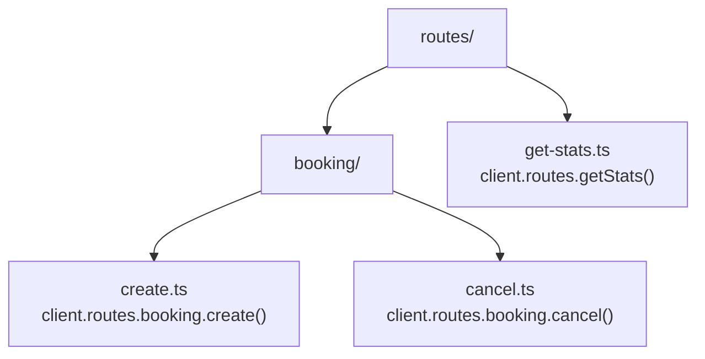
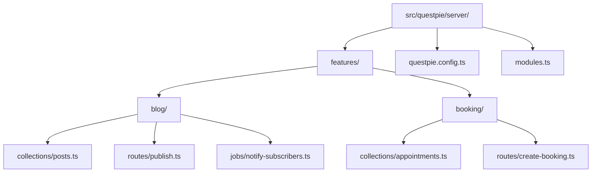

QUESTPIE uses a **file convention** — your project structure determines what gets discovered and wired into the runtime. No manual registration required.

## Standard Layout

```mermaid
flowchart TD
	App["my-app/"]
	RootConfig["questpie.config.ts<br/>CLI config"]
	Src["src/"]
	Questpie["questpie/"]
	Server["server/"]
	RuntimeConfig["questpie.config.ts<br/>Runtime config"]
	AppReexport["app.ts<br/>Re-export generated app"]
	Modules["modules.ts<br/>Module dependencies"]
	Collections["collections/<br/>posts.ts, categories.ts, comments.ts"]
	Globals["globals/<br/>site-settings.ts"]
	ServerRoutes["routes/<br/>create-booking.ts, get-stats.ts"]
	Jobs["jobs/<br/>send-email.ts"]
	Services["services/<br/>blog.ts"]
	Blocks["blocks/<br/>hero.ts, gallery.ts"]
	Emails["emails/<br/>appointment-confirmation.ts"]
	Config["config/<br/>auth.ts, app.ts, admin.ts, openapi.ts"]
	ServerGenerated[".generated/<br/>index.ts, module.ts"]
	Admin["admin/"]
	AdminEntry["admin.ts<br/>Re-exports generated admin config"]
	AdminHooks["hooks.ts<br/>Typed React hooks"]
	AdminGenerated[".generated/client.ts<br/>Admin client config"]
	AdminBlocks["blocks/<br/>hero.tsx, gallery.tsx"]
	Lib["lib/client.ts<br/>Client SDK setup"]
	FrameworkRoutes["routes/api/$.ts<br/>API catch-all handler"]

	App --> RootConfig
	App --> Src
	Src --> Questpie
	Questpie --> Server
	Server --> RuntimeConfig
	Server --> AppReexport
	Server --> Modules
	Server --> Collections
	Server --> Globals
	Server --> ServerRoutes
	Server --> Jobs
	Server --> Services
	Server --> Blocks
	Server --> Emails
	Server --> Config
	Server --> ServerGenerated
	Questpie --> Admin
	Admin --> AdminEntry
	Admin --> AdminHooks
	Admin --> AdminGenerated
	Admin --> AdminBlocks
	Src --> Lib
	Src --> FrameworkRoutes
```



## Discovery Rules

Codegen discovers files based on **directory name** and **export pattern**:

| Directory       | Export           | Key derivation                   | Example                                                   |
| --------------- | ---------------- | -------------------------------- | --------------------------------------------------------- |
| `collections/`  | Default or named | Factory string arg               | `collection("blog-posts")` → `blogPosts`                  |
| `globals/`      | Default or named | Factory string arg               | `global("siteSettings")` → `siteSettings`                 |
| `routes/`       | Default          | Filename → camelCase/slash path  | `create-booking.ts` → `createBooking`                     |
| `jobs/`         | Default          | Filename → camelCase             | `send-email.ts` → `sendEmail`                             |
| `routes/` (raw) | Default          | Filename → slash path            | `webhook.ts` → `webhook`                                  |
| `services/`     | Default          | Filename → camelCase             | `blog.ts` → `blog`                                        |
| `blocks/`       | Named exports    | Factory string arg → export name | `block("hero")` → `hero`                                  |
| `emails/`       | Default          | Filename → camelCase             | `appointment-confirmation.ts` → `appointmentConfirmation` |

Factory string args are the runtime identity. Hyphens are camelized (`"blog-posts"` → `blogPosts`), while underscores are preserved (`"site_settings"` → `site_settings`).

### Single-file conventions

Some configs are single files instead of directories:

| File                 | Purpose                                                                    |
| -------------------- | -------------------------------------------------------------------------- |
| `questpie.config.ts` | Runtime config (DB, adapters, secrets)                                     |
| `modules.ts`         | Module dependencies array                                                  |
| `config/auth.ts`     | Auth config via `authConfig()` (Better Auth options)                       |
| `config/app.ts`      | App config via `appConfig()` (locale, access, hooks)                       |
| `config/admin.ts`    | Admin config via `adminConfig()` (sidebar, dashboard, branding, UI locale) |
| `config/openapi.ts`  | OpenAPI config via `openApiConfig()` (spec info, Scalar)                   |

### Nested routes

Routes support nested directories for namespacing:



## The `.generated/` Directory

Running `bunx questpie generate` creates `.generated/` with:

### `index.ts` — App instance and types

```ts
// Auto-generated — do not edit
import type { AppCollections, AppGlobals, AppRoutes, AppJobs } from "./module";

export type AppConfig = {
	collections: AppCollections;
	globals: AppGlobals;
	routes: AppRoutes;
	// ... auth, locales
};

export { app, createContext } from "./app";
export type { AppConfig, AppCollections, AppGlobals, AppRoutes, AppJobs };
```

### Module augmentation

The generated code augments `AppContext` so every handler gets typed DI:

```ts
declare global {
	namespace Questpie {
		interface AppContext {
			db: Database;
			email: MailerService<AppEmailTemplates>;
			queue: QueueClient<AppJobs>;
			collections: AppCollections;
			globals: AppGlobals;
			session: Session | null;
			// ... custom services
		}
	}
}
```

This is why `collections`, `queue`, `email` are available and typed in every handler — codegen generates the augmentation from your file structure.

## The `#questpie` Imports

QUESTPIE uses Node.js [subpath imports](https://nodejs.org/api/packages.html#subpath-imports) (the `"imports"` field in `package.json`) to wire your code to the generated output:

| Import                | Resolves to               | Use for                                       |
| --------------------- | ------------------------- | --------------------------------------------- |
| `#questpie`           | `.generated/index.ts`     | `app` instance, `AppConfig` type              |
| `#questpie/factories` | `.generated/factories.ts` | `collection()`, `global()`, `sidebar()`, etc. |

Collection, global, and admin singleton files import from `#questpie/factories`:

```ts
import { collection } from "#questpie/factories";
```

The generated factories file provides typed builders with all plugin extensions (e.g. `.admin()`, `.form()`, `.list()`) and the merged field set (builtins + module-contributed fields like `richText`, `blocks`).

Routes, jobs, and seeds import from the bare `questpie` package:

```ts
import { route } from "questpie";
import { job } from "questpie";
import { seed } from "questpie";
```

## By-Feature Layout

For larger projects, you can organize by feature instead of by type:



Both layouts can coexist. Codegen scans all configured paths.

## What's Next

- [Collections](/docs/backend/data-modeling/collections) — Define your data models
- [Fields](/docs/backend/data-modeling/fields) — Field types and options
- [File Convention](/docs/backend/architecture/file-convention) — Deep dive into discovery mechanics
