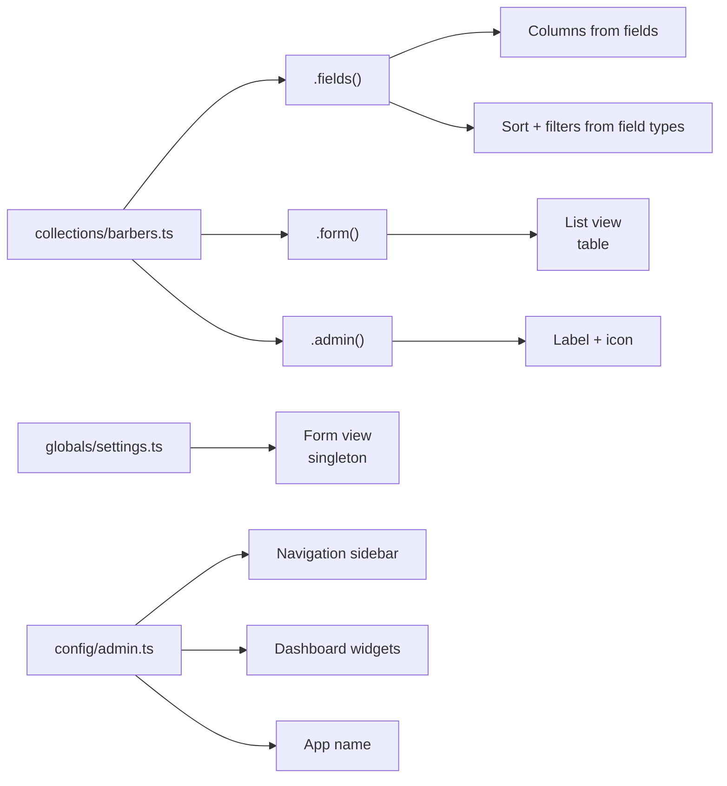

The admin panel is **a projection**, not the framework. It reads your server schema via introspection and generates an interface. Your backend works without it. Add it when you need an internal tool.

## Sections

- **[Setup](/docs/workspace/setup)** — Enable the admin module
- **[Views](/docs/workspace/views)** — List views, form views, dashboard, sidebar
- **[Blocks](/docs/workspace/blocks)** — Content blocks for page builders
- **[Actions](/docs/workspace/actions)** — CRUD actions and custom actions
- **[Branding](/docs/workspace/branding)** — Name, chrome, theme
- **[Filters](/docs/workspace/filters)** — Filters and saved views
- **[Media](/docs/workspace/media)** — File uploads and asset management
- **[Visibility](/docs/workspace/visibility)** — Reactive field visibility rules
