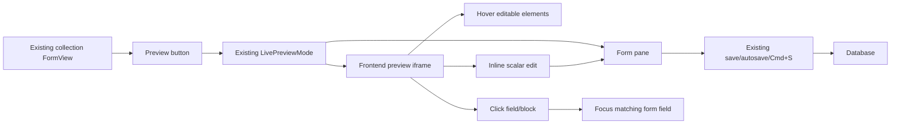
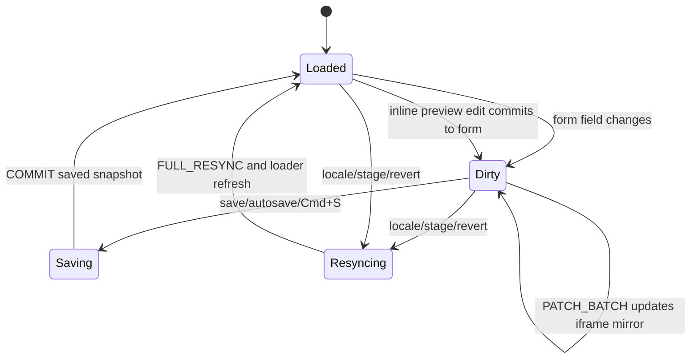

Live Preview enhances the existing collection form. It does not introduce a separate visual-edit form API, a second default form view, or a parallel preview surface.

## Product Model



Visual editing means the iframe becomes interactive:

- Hovering annotated fields and blocks shows editable affordances.
- Clicking a field or block focuses the matching control in the form.
- Supported scalar fields can be edited inline in the iframe.
- Unsaved form changes are mirrored into the iframe before persistence.

The iframe never persists data. It can request edits, but only the admin form mutates the edit state, and only the existing save path writes to the database.

## State Model

There are three relevant states:

| State                      | Owner                 | Meaning                                |
| -------------------------- | --------------------- | -------------------------------------- |
| Canonical persisted record | Database              | Last saved version                     |
| Editing record             | Admin React Hook Form | Current unsaved editor state           |
| Preview draft mirror       | Frontend iframe       | Rendering copy of unsaved editor state |



During editing, the admin form is authoritative. The iframe is a mirror optimized for visual context.

## Runtime Pieces

| Area                   | Responsibility                                                                                       |
| ---------------------- | ---------------------------------------------------------------------------------------------------- |
| `FormView`             | Owns the form lifecycle, actions, save, autosave, locks, history, workflow, and Preview button       |
| `LivePreviewMode`      | Renders the existing split view or mobile tabs                                                       |
| `PreviewPane`          | Mints the preview token, hosts the iframe, validates messages, and bridges messages to the form      |
| `useCollectionPreview` | Runs in the frontend page, tracks preview mode, local mirror data, focused field, and selected block |
| `PreviewProvider`      | Supplies preview state to annotated frontend components                                              |
| `PreviewField`         | Marks a rendered field, supports focus/click sync, and optional inline scalar editing                |
| `BlockRenderer`        | Renders block trees, wraps block instances, and preserves block IDs for selection                    |

## Block Paths

Normal fields use direct paths:

```txt
title
description
seo.title
```

Block fields use the blocks field name, `_values`, and the block instance ID:

```txt
content._values.<blockId>.title
content._values.<blockId>.description
content._values.<blockId>.cta.label
```

Block content has separate structure, values, and prefetched data:

```ts
type BlockContent = {
	_tree: Array<{ id: string; type: string; children: unknown[] }>;
	_values: Record<string, Record<string, unknown>>;
	_data?: Record<string, unknown>;
};
```

Inline editing targets `_values`. Add, remove, reorder, and nesting operations stay in the existing block editor and can trigger a full refresh or resync.

## Workflow

Workflow stage changes are persistence events. When a record transitions between stages, the preview should resync because the loader may now read a different version. Public page reads use:

```ts
stage: "published";
```

Draft-mode preview reads load the working stage so editors can see unpublished edits.
