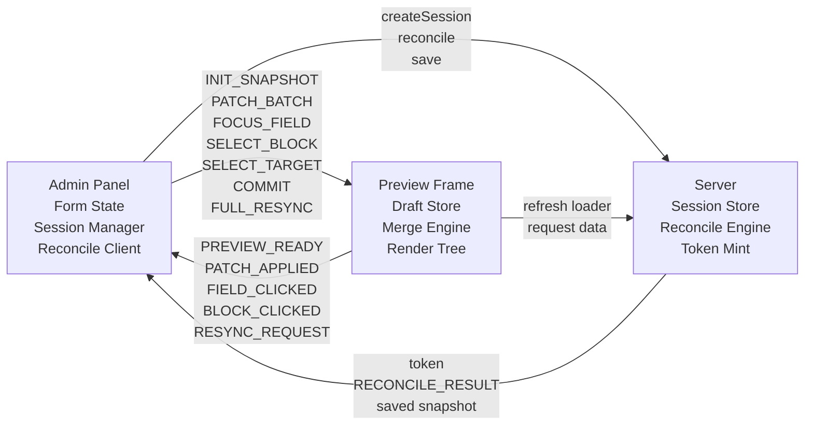
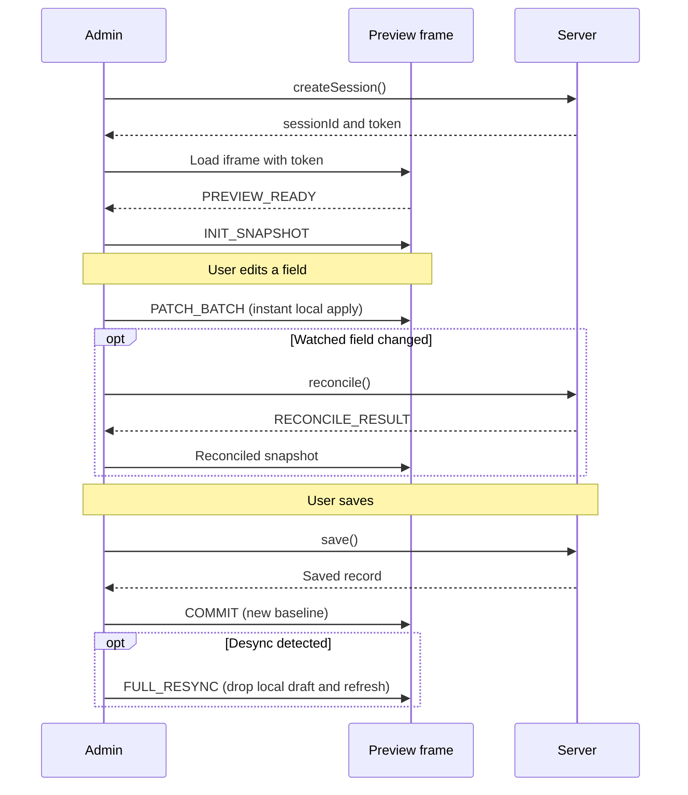

The preview system replaces the current `edit -> save/autosave -> invalidate -> reload iframe` cycle with a patch-based draft preview flow. The preview reflects form changes instantly without writing to the database, while a server reconcile step keeps derived data (slugs, URLs, relations, computed fields) authoritative.

This page documents the target architecture. For the current preview system, see [Live Preview](/docs/workspace/live-preview).

<Callout type="info">
	The patch-based preview flow ships today as the **Visual Edit Workspace** —
	see [Visual Edit Workspace](./visual-edit) for the user-facing flow and
	[Protocol & Reliability](./protocol) for the wire format. The shipped exports
	are `VisualEditFormHost`, `VisualEditWorkspace`, `VisualInspectorPanel`,
	`useCollectionPreview`, `PreviewProvider`, `PreviewField`, and
	`BlockScopeProvider`.
</Callout>

## Design Goals

1. **Instant preview** -- no DB write roundtrip. Form edits appear in the iframe immediately.
2. **Preview decoupled from save** -- save remains a persistence concern. Preview freshness does not depend on it.
3. **Server-authoritative reconcile** -- slug/URL changes, reactive compute, relation lookups, block prefetch, and locale-aware shaping are handled server-side. The client never guesses derived data.
4. **Robust admin-iframe protocol** -- typed message contract, sequence numbers, session IDs, protocol versioning.
5. **Clean DX** -- one hook on the admin side, one hook on the frontend side, declarative collection config.

## Problems With Refresh-Only Preview

| Problem                     | Impact                                                                                            |
| --------------------------- | ------------------------------------------------------------------------------------------------- |
| Preview tied to persistence | Every preview update requires a save or autosave, creating unnecessary DB writes and latency      |
| Correctness of derived data | URL/slug changes, relation resolution, and block prefetch all stale until next full reload        |
| Fragile DX                  | Frontend must manually wire refresh, field focus, and block click handling with raw `postMessage` |
| Full iframe reload          | After invalidation, the entire iframe navigates, losing scroll position and client state          |

## Architecture Overview



### Three-Layer Model

**Layer 1 -- Local Draft Patches (client-only, instant)**

Form edits produce JSON patches. These patches are sent directly to the preview iframe via `postMessage`. The iframe's draft store merges them on top of the last known snapshot. This gives sub-frame latency for simple field changes like text, toggles, and numbers.

**Layer 2 -- Server Reconcile (async, authoritative)**

When a patch touches a watched field (e.g., `slug`, `locale`), or when the patch batch includes relation/block changes, the admin sends the patch set to the server reconcile endpoint. The server applies the patches to the current snapshot, computes all derived data, and returns a `RECONCILE_RESULT`. The iframe replaces its local draft with the reconciled snapshot.

**Layer 3 -- Save/Commit (persistence)**

Save writes to the database as it does today. After a successful save, the admin sends a `COMMIT` message to the iframe. The iframe treats the committed snapshot as the new baseline. This is the only point where the preview and the database converge.

## Session Lifecycle



## Protocol

The shipped same-tab transport uses plain object messages with a `type` discriminant. `PATCH_BATCH` carries a monotonic sequence number; other messages are unsequenced:

```ts
type PatchBatchMessage = {
	type: "PATCH_BATCH";
	seq: number;
	ops: PreviewPatchOp[];
};
```

### Admin to Frame

| Message            | Payload                   | Purpose                                  |
| ------------------ | ------------------------- | ---------------------------------------- |
| `INIT_SNAPSHOT`    | Full record snapshot      | Bootstrap the iframe draft store         |
| `PATCH_BATCH`      | Array of JSON patches     | Incremental field updates                |
| `FOCUS_FIELD`      | `{ fieldPath: string }`   | Highlight a field in the preview         |
| `SELECT_BLOCK`     | `{ blockId: string }`     | Highlight a block in the preview         |
| `SELECT_TARGET`    | `{ fieldPath, blockId? }` | Mirror inspector selection               |
| `COMMIT`           | `{ data }`                | Mark current state as persisted baseline |
| `FULL_RESYNC`      | `{ reason? }`             | Drop local draft and re-run refresh      |
| `NAVIGATE_PREVIEW` | `{ url }`                 | Navigate inside the preview origin       |

### Frame to Admin

| Message            | Payload                               | Purpose                            |
| ------------------ | ------------------------------------- | ---------------------------------- |
| `PREVIEW_READY`    | `{}`                                  | Iframe loaded and ready to receive |
| `PATCH_APPLIED`    | `{ seq, applied, timestamp }`         | Confirm a patch batch landed       |
| `FIELD_CLICKED`    | `{ fieldPath, blockId?, fieldType? }` | User clicked a preview field       |
| `BLOCK_CLICKED`    | `{ blockId: string }`                 | User clicked a preview block       |
| `REFRESH_COMPLETE` | `{ timestamp }`                       | Refresh fallback completed         |
| `RESYNC_REQUEST`   | `{ reason? }`                         | Frame requests a full resync       |

For the full typed contract and message schemas, see [Protocol Reference](/docs/workspace/live-preview/protocol).

## Preview Strategy

The `.preview()` config on a collection declares how the preview behaves:

```ts title="collections/pages.ts"
import { collection } from "#questpie/factories";

export const pages = collection("pages")
	.preview({
		url: ({ draft, locale }) =>
			draft.slug === "home" ? "/" : `/${draft.slug}`,
		watch: ({ f }) => [f.slug, f.locale],
		strategy: "hybrid",
	})
	.fields(({ f }) => ({
		title: f.text().required().localized(),
		slug: f.text().required(),
		content: f.blocks().localized(),
	}));
```

### Strategy Options

| Strategy    | Behavior                                                                                                                                                                             |
| ----------- | ------------------------------------------------------------------------------------------------------------------------------------------------------------------------------------ |
| `"instant"` | Patches applied locally only. No server reconcile. Best for simple pages with no derived data.                                                                                       |
| `"server"`  | Every patch batch goes through server reconcile before reaching the iframe. Highest correctness, higher latency.                                                                     |
| `"hybrid"`  | Patches applied locally for instant feedback. Server reconcile runs in parallel for watched fields. Reconciled result replaces local draft when it arrives. **Recommended default.** |

### Watch Fields

The `watch` option declares which fields trigger a server reconcile. When a patch touches a watched field, the admin sends the patch batch to the reconcile endpoint instead of (or in addition to) sending it directly to the iframe.

Typical watch targets:

- `slug` -- URL recomputation
- `locale` -- locale-aware shaping
- Relation fields -- prefetch resolution
- Block fields -- block data prefetch

## DX API

### Admin Side

```ts
const preview = useAdminPreview({
	form, // React Hook Form instance
	collection, // Collection name
	recordId, // Current record ID
	locale, // Current locale
});
```

The hook returns:

```ts
type AdminPreview = {
	sessionId: string;
	isActive: boolean;
	open: () => void;
	close: () => void;
	iframeRef: React.RefObject<HTMLIFrameElement>;
	// Internal: patch dispatch, reconcile, commit are handled automatically
};
```

The admin form integration is automatic. `useAdminPreview` subscribes to form changes, computes patches, and dispatches them through the session transport. No manual wiring required.

### Frontend Side

```tsx title="routes/pages/$slug.tsx"
import { useRouter } from "@tanstack/react-router";
import {
	BlockRenderer,
	PreviewField,
	PreviewProvider,
	type BlockContent,
	useCollectionPreview,
} from "@questpie/admin/client";
import admin from "@/questpie/admin/.generated/client";

function Page({ initialData }) {
	const router = useRouter();
	const { data, isPreviewMode, focusedField, handleFieldClick } =
		useCollectionPreview({
			initialData,
			onRefresh: () => router.invalidate(),
		});

	return (
		<PreviewProvider
			isPreviewMode={isPreviewMode}
			focusedField={focusedField}
			onFieldClick={handleFieldClick}
		>
			<PreviewField field="title">
				<h1>{data.title}</h1>
			</PreviewField>
			<PreviewField field="content">
				<BlockRenderer
					content={data.content as BlockContent}
					renderers={admin.blocks}
				/>
			</PreviewField>
		</PreviewProvider>
	);
}
```

### Components

| Component                            | Purpose                                                                                        |
| ------------------------------------ | ---------------------------------------------------------------------------------------------- |
| `<PreviewProvider>`                  | Context provider. Wraps the page, provides focus/selection state.                              |
| `<PreviewField field="...">`         | Marks a region as corresponding to a field path. Handles click-to-focus and highlight styling. |
| `<BlockRenderer onBlockClick={...}>` | Marks block regions through renderer wrappers and handles click-to-select.                     |
| `<BlockScopeProvider>`               | Resolves field paths inside block renderers to the correct block value path.                   |

These components replace manual `postMessage` wiring. They handle bidirectional focus sync, click events, and highlight rendering internally.

## Reconcile Engine

The server reconcile endpoint receives a session ID and a batch of patches, then returns the authoritative snapshot:

```text
POST /api/preview/reconcile

Request:
  { sessionId, patches: JSONPatch[], seq }

Response:
  { snapshot, computedFields, url, seq }
```

The reconcile engine:

1. Loads the session's current baseline snapshot
2. Applies the incoming patches
3. Runs slug generation, URL computation, locale shaping
4. Resolves relation lookups (populates referenced records)
5. Runs block prefetch for any blocks that declare `prefetch`
6. Returns the full reconciled snapshot

This is the same pipeline that runs during normal record retrieval, ensuring the preview matches production output exactly.

## Realtime Transport

For **same-tab preview** (iframe embedded in the admin panel), `postMessage` is the transport. It is synchronous within the same browser tab, requires no network, and has no serialization overhead for structured-cloneable data.

For **shared preview** (detached window, second device, collaborative preview), the existing QUESTPIE realtime infrastructure (WebSocket channels) carries the same message types. The protocol is transport-agnostic -- the message contract is identical regardless of whether delivery happens via `postMessage` or WebSocket.

See [Same-Tab Recipe](/docs/workspace/live-preview/same-tab-recipe) and [Shared Preview](/docs/workspace/live-preview/shared-preview) for implementation details.

## Code Boundaries

```text
@questpie/admin (server)
  src/server/preview/
    session.ts          -- Session creation, storage, token mint
    reconcile.ts        -- Reconcile engine
    routes.ts           -- HTTP endpoints

@questpie/admin (client)
  src/client/preview/
    transport.ts        -- postMessage send/receive, WebSocket fallback
    session.ts          -- Session state machine
    patches.ts          -- Form diff -> JSON patch conversion
    hooks.ts            -- useAdminPreview

@questpie/preview (shared package)
  src/
    contract.ts         -- Message types, envelope, protocol version
    patches.ts          -- Patch apply/merge utilities

@questpie/admin/client (frontend)
  src/client/preview/
    use-collection-preview.ts  -- Draft store + iframe message listener
    preview-field.tsx          -- PreviewProvider, PreviewField
    block-scope-context.tsx    -- BlockScopeProvider
  src/client/blocks/
    block-renderer.tsx         -- BlockRenderer click/select integration
```

The shared message contract lives in a single file (`contract.ts`) imported by both admin and frontend packages. No message type is defined in two places.

## Rollout Phases

### Phase 1 -- Harden Existing Preview

Stabilize the current preview system before introducing the new transport:

- Origin validation on all `postMessage` handlers
- Navigation prevention (block iframe from leaving the preview URL)
- Fix relation/block focus sync edge cases
- Fix stuck refresh after failed save
- Fix URL invalidation on slug change

### Phase 2 -- Patch-Based Same-Tab Preview

Replace the save-reload cycle with direct patch delivery:

- Implement `contract.ts` with typed message envelope
- Build admin-side patch computation from form state diff
- Build iframe-side draft store with patch merge
- Wire the admin preview bridge and `useCollectionPreview`
- Ship `<PreviewProvider>`, `<PreviewField>`, and block click integration

### Phase 3 -- Hybrid Reconcile

Add server reconcile for derived data:

- Implement reconcile endpoint
- Add `watch` field declaration to `.preview()` config
- Add `strategy` option (`"instant"`, `"server"`, `"hybrid"`)
- Wire reconcile results into the iframe draft store
- Handle reconcile race conditions (stale reconcile arriving after newer patches)

### Phase 4 -- Documentation and DX

- Update this architecture page with final API
- Write [Same-Tab Recipe](/docs/workspace/live-preview/same-tab-recipe)
- Write [Shared Preview](/docs/workspace/live-preview/shared-preview)
- Write [Protocol Reference](/docs/workspace/live-preview/protocol)
- Update AGENTS.md and SKILL.md with preview conventions

### Phase 5 -- Shared Preview (Optional)

Extend the protocol over the existing QUESTPIE realtime system:

- Map preview messages to realtime channel events
- Support detached browser window as preview target
- Support second-device preview via QR code / short link
- Lay groundwork for collaborative editing preview

## Related Pages

- [Live Preview](/docs/workspace/live-preview) -- Current preview setup and configuration
- [Same-Tab Recipe](/docs/workspace/live-preview/same-tab-recipe) -- Step-by-step integration for same-tab preview
- [Shared Preview](/docs/workspace/live-preview/shared-preview) -- Detached and multi-device preview
- [Protocol Reference](/docs/workspace/live-preview/protocol) -- Full typed message contract
- [Blocks](/docs/workspace/blocks) -- Block content and prefetch
- [Form Views](/docs/workspace/views/form-views) -- Form toolbar configuration
