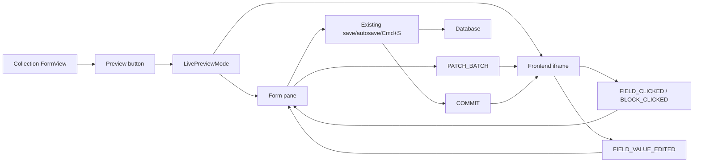

Live Preview is one editor, not a second form. A collection with `.preview({ url })` keeps the normal `FormView`, shows the existing Preview button, and opens `LivePreviewMode`: the collection form on one side and your frontend in an iframe on the other.

The form remains the source of truth for editing. The iframe mirrors the current form state, supports field and block focus, and can request inline scalar edits, but it never writes to the database directly. Save, autosave, Cmd+S, history, workflow transitions, locks, and custom actions all continue through the existing form lifecycle.



## Enable Preview

Add `.preview()` to the collection and keep the normal form view:

```ts title="src/questpie/server/collections/pages.ts"
import { collection } from "#questpie/factories";

export const pages = collection("pages")
	.fields(({ f }) => ({
		title: f.text(255).required().localized(),
		slug: f.text(255).required(),
		description: f.textarea().localized(),
		content: f.blocks().localized(),
		metaTitle: f.text(255).localized(),
		metaDescription: f.textarea().localized(),
	}))
	.preview({
		enabled: true,
		position: "right",
		defaultWidth: 50,
		url: ({ record }) => {
			const slug = record.slug as string;
			return slug === "home" ? "/?preview=true" : `/${slug}?preview=true`;
		},
	})
	.form(({ v, f }) =>
		v.collectionForm({
			sidebar: { position: "right", fields: [f.slug] },
			fields: [
				{ type: "section", label: "Page", fields: [f.title, f.description] },
				{ type: "section", label: "Content", fields: [f.content] },
				{
					type: "section",
					label: "SEO",
					layout: "grid",
					columns: 2,
					fields: [f.metaTitle, f.metaDescription],
				},
			],
		}),
	);
```

`.preview()` enables the Preview button. `v.collectionForm()` remains the default editor surface.

## Prepare The Frontend

Your frontend page should:

1. Load the page through a draft-mode-aware loader.
2. Use `stage: "published"` for public reads when workflow is the publication source.
3. Call `useCollectionPreview({ initialData, onRefresh })`.
4. Wrap the rendered page in `PreviewProvider`.
5. Annotate editable fields with `PreviewField`.
6. Render block content through `BlockRenderer` so block IDs and block field paths are preserved.

```tsx title="src/components/pages/page-renderer.tsx"
import {
	BlockRenderer,
	PreviewField,
	PreviewProvider,
	useCollectionPreview,
} from "@questpie/admin/client";
import { useRouter } from "@tanstack/react-router";
import { admin } from "@/questpie/admin/admin";

export function PageRenderer({ page }) {
	const router = useRouter();
	const preview = useCollectionPreview({
		initialData: page,
		onRefresh: () => router.invalidate(),
	});

	return (
		<PreviewProvider preview={preview}>
			<article className={preview.isPreviewMode ? "questpie-preview" : ""}>
				<PreviewField field="title" editable="text" as="h1">
					{preview.data.title}
				</PreviewField>

				<BlockRenderer
					content={preview.data.content}
					renderers={admin.blocks}
					data={preview.data.content?._data}
					selectedBlockId={preview.selectedBlockId}
					onBlockClick={
						preview.isPreviewMode ? preview.handleBlockClick : undefined
					}
				/>
			</article>
		</PreviewProvider>
	);
}
```

For a complete page setup, see [Prepare a Page](/docs/workspace/live-preview/prepare-page).

## Workflow Publishing

When versioning workflow is enabled, workflow stage is the publication source. Public page loaders should read `stage: "published"`. Preview loaders should read the working stage when draft mode is active, and published content otherwise.

Do not add a duplicate `isPublished` field for page publication when workflow already controls publishing. If a project keeps a boolean named `isPublished`, treat it as a separate business flag.

## Related Pages

- [Prepare a Page](/docs/workspace/live-preview/prepare-page) — collection config, loaders, frontend preview wiring, and annotations
- [Architecture](/docs/workspace/live-preview/architecture) — source-of-truth model and boundaries
- [Protocol Reference](/docs/workspace/live-preview/protocol) — message contract, diagrams, and security rules
- [Blocks](/docs/workspace/blocks) — block content and renderer annotations
- [Versioning & Workflow](/docs/backend/data-modeling/versioning-workflow) — stage reads and transitions
