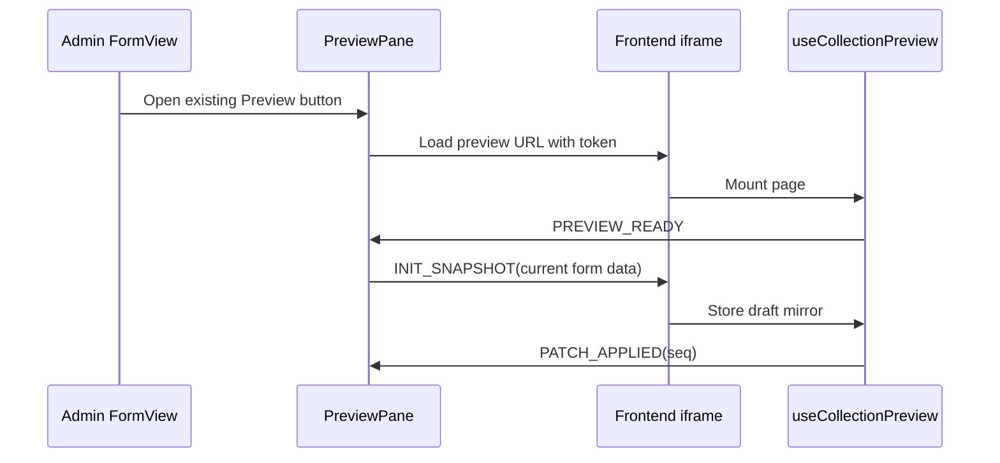
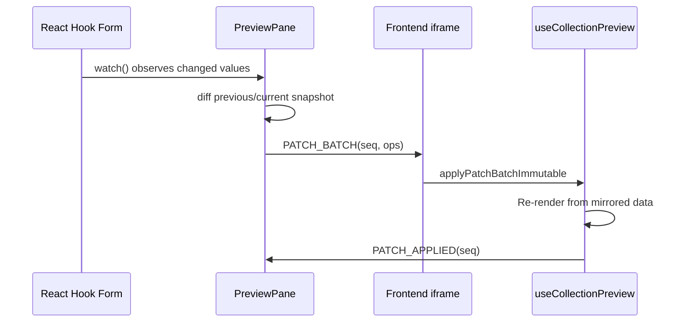
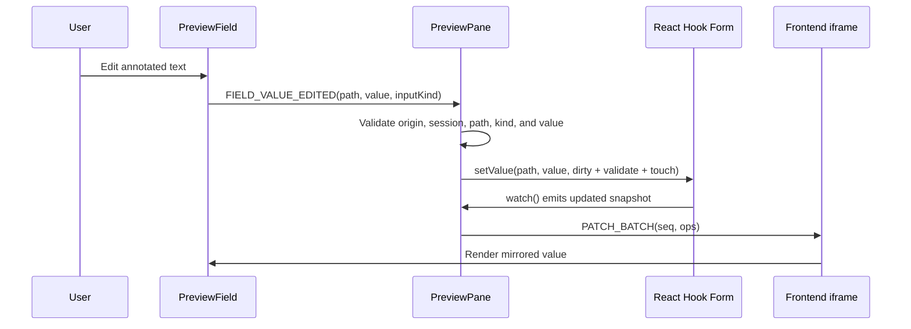
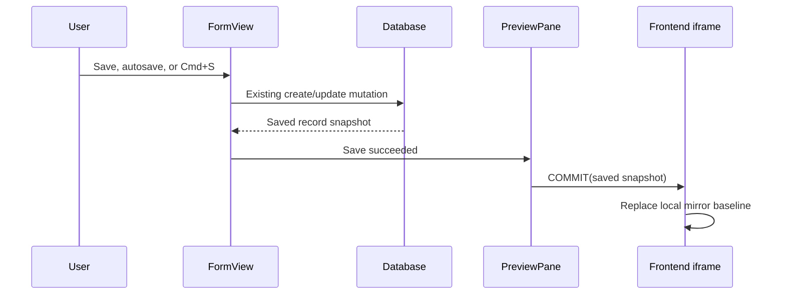
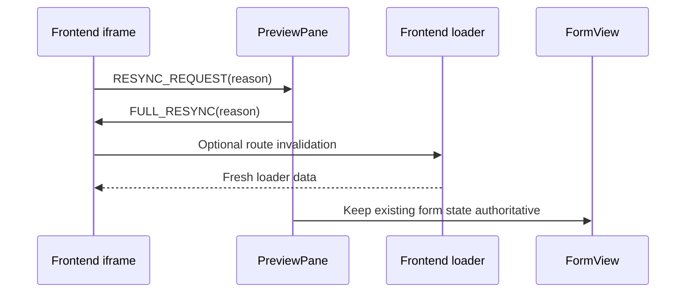
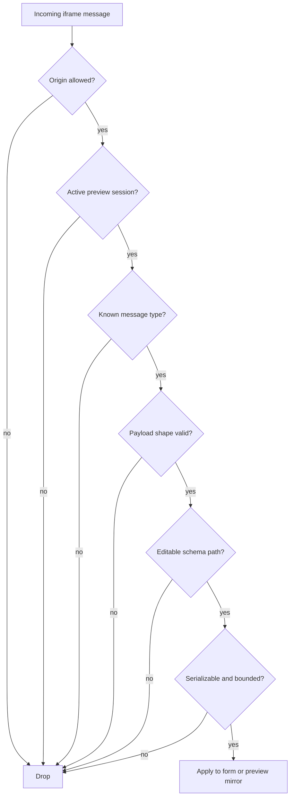

The preview protocol connects the admin form and the frontend iframe. Messages are implementation details of the current Live Preview system: the form is authoritative, the iframe mirrors data, and persistence still goes through the existing save/autosave path.

## Message Families

| Direction        | Message              | Purpose                                            |
| ---------------- | -------------------- | -------------------------------------------------- |
| preview -> admin | `PREVIEW_READY`      | iframe loaded and can receive messages             |
| admin -> preview | `INIT_SNAPSHOT`      | seed iframe local draft from the form snapshot     |
| admin -> preview | `PATCH_BATCH`        | apply unsaved field changes                        |
| preview -> admin | `PATCH_APPLIED`      | acknowledge an applied patch batch                 |
| admin -> preview | `PREVIEW_REFRESH`    | ask iframe to re-run its loader                    |
| preview -> admin | `REFRESH_COMPLETE`   | refresh finished                                   |
| preview -> admin | `FIELD_CLICKED`      | user clicked an annotated frontend field           |
| preview -> admin | `BLOCK_CLICKED`      | user clicked an annotated frontend block           |
| admin -> preview | `FOCUS_FIELD`        | highlight a frontend field                         |
| admin -> preview | `SELECT_BLOCK`       | highlight a frontend block                         |
| preview -> admin | `FIELD_VALUE_EDITED` | user committed an inline scalar edit in the iframe |
| admin -> preview | `COMMIT`             | save succeeded, replace mirror with saved snapshot |
| admin -> preview | `FULL_RESYNC`        | discard local mirror and reload from the loader    |
| preview -> admin | `RESYNC_REQUEST`     | iframe detected mismatch and asks for refresh      |

## Handshake



## Patch Batch



Patch paths use dot notation:

```ts
type PreviewPatchOp = {
	op: "set" | "remove";
	path: string;
	value?: unknown;
};

type PatchBatchMessage = {
	type: "PATCH_BATCH";
	seq: number;
	ops: PreviewPatchOp[];
	snapshotVersion?: number;
};
```

Examples:

```txt
title
seo.description
content._values.block_123.heading
```

## Inline Edit



Suggested payload:

```ts
type FieldValueEditedMessage = {
	type: "FIELD_VALUE_EDITED";
	path: string;
	value: unknown;
	inputKind: "text" | "textarea" | "number" | "boolean";
	blockId?: string;
	fieldType?: "regular" | "block" | "relation";
};
```

The admin must only call `form.setValue` after the message is validated against the active schema and supported editable field types.

## Commit



`COMMIT` does not save from the iframe. It tells the iframe that the existing form save succeeded and that the saved snapshot is now the baseline.

## Resync



Use `FULL_RESYNC` for locale changes, workflow stage changes, restore/revert actions, sequence gaps, schema mismatches, and block tree changes that cannot be safely patched.

## Security Rules



Admin-side handlers must validate:

- message origin
- active preview session
- message type and payload shape
- field path exists in the active collection schema or block value map
- field type supports the requested inline edit kind
- value is serializable and reasonably sized

Do not use wildcard `postMessage` targets when the preview origin can be resolved from `.preview({ url })`. Do not allow iframe messages to set arbitrary form paths.
