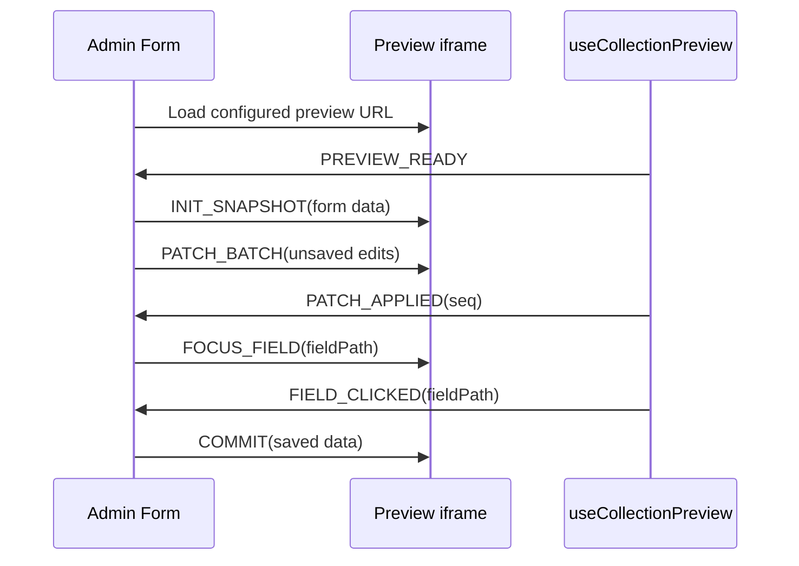

Same-tab preview is the default QUESTPIE preview experience. The admin keeps the existing form open and renders the configured frontend URL in an iframe. The two sides communicate over `postMessage`.

Use this recipe when the preview runs inside `LivePreviewMode`.

## Minimal Renderer

```tsx title="src/components/pages/page-renderer.tsx"
import {
	PreviewField,
	PreviewProvider,
	useCollectionPreview,
} from "@questpie/admin/client";
import { useRouter } from "@tanstack/react-router";

export function PageRenderer({ page }) {
	const router = useRouter();
	const preview = useCollectionPreview({
		initialData: page,
		onRefresh: () => router.invalidate(),
	});

	return (
		<PreviewProvider preview={preview}>
			<main>
				<PreviewField field="title" editable="text" as="h1">
					{preview.data.title}
				</PreviewField>
				<PreviewField field="description" editable="textarea" as="p">
					{preview.data.description}
				</PreviewField>
			</main>
		</PreviewProvider>
	);
}
```

## What The Hook Does

`useCollectionPreview`:

- detects whether the page is running inside the admin iframe
- sends `PREVIEW_READY` to the parent
- receives snapshot, patch, focus, block selection, refresh, commit, and resync messages
- exposes mirrored `data` for rendering
- exposes `focusedField`, `selectedBlockId`, `handleFieldClick`, and `handleBlockClick`
- calls `onRefresh` when the iframe should re-run the route loader

## Same-Tab Flow



## Blocks

Render block content with `BlockRenderer` so block IDs and nested block scopes are preserved:

```tsx
<BlockRenderer
	content={preview.data.content}
	renderers={admin.blocks}
	data={preview.data.content?._data}
	selectedBlockId={preview.selectedBlockId}
	onBlockClick={preview.isPreviewMode ? preview.handleBlockClick : undefined}
/>
```

Inside custom block renderers, annotate scalar values with `PreviewField field="..."`. The active block scope resolves those fields to paths like `content._values.<blockId>.title`.
