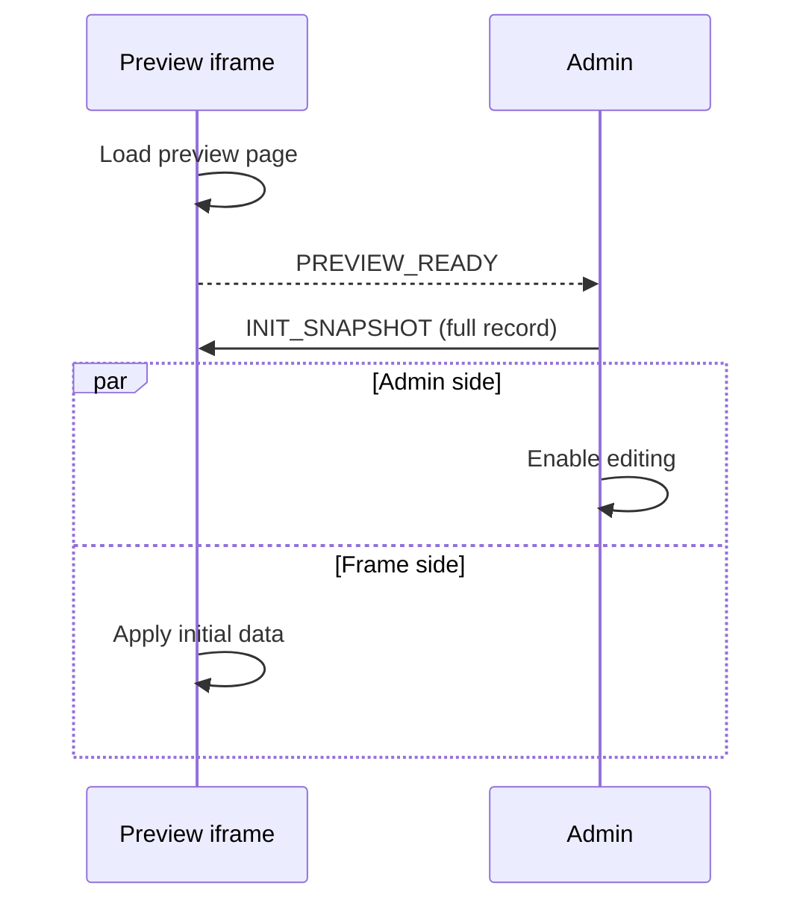
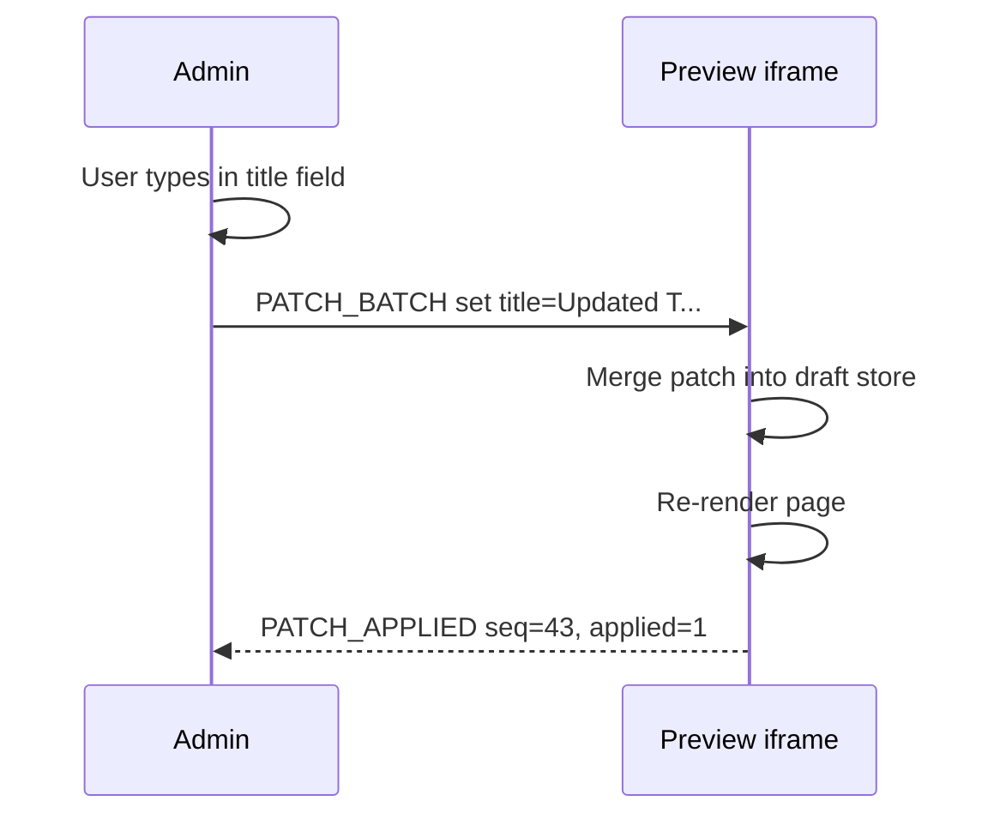
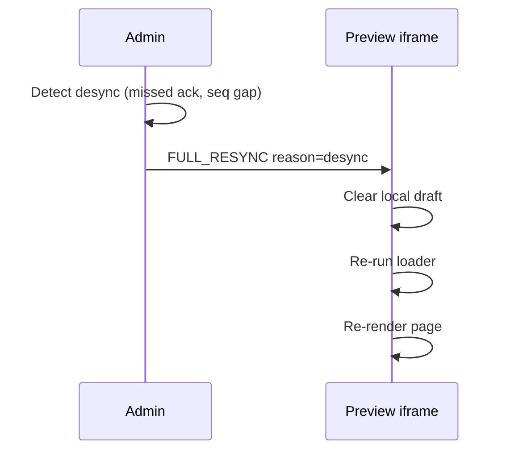

This page documents the lower-level same-tab patch API. The admin panel opens a split-screen with your frontend in an iframe on the right. Changes flow as field-level patches over `postMessage` -- no server round-trip, no polling.

<Callout type="info">
	The patch-based preview flow ships today as the **Visual Edit Workspace**.
	For the standard collection-edit flow you don't need the lower-level recipe
	on this page — enable `.form(({ v }) => v.visualEditForm({...}))` and the
	workspace handles the wire transport for you. See
	[Visual Edit Workspace](./visual-edit). Read this page when you need a
	**custom iframe runtime** that consumes the patch protocol directly.
</Callout>

## Minimal Page Example

Wire up preview in four lines: call `useCollectionPreview`, wrap with `PreviewProvider`, annotate fields with `PreviewField`.

```tsx title="routes/pages/$slug.tsx"
import { useRouter } from "@tanstack/react-router";
import {
	useCollectionPreview,
	PreviewProvider,
	PreviewField,
} from "@questpie/admin/client";

function PageRoute({ initialData }) {
	const router = useRouter();

	const preview = useCollectionPreview({
		initialData,
		onRefresh: () => router.invalidate(),
	});

	return (
		<PreviewProvider
			isPreviewMode={preview.isPreviewMode}
			focusedField={preview.focusedField}
			onFieldClick={preview.handleFieldClick}
		>
			<article>
				<PreviewField field="title">
					<h1>{preview.data.title}</h1>
				</PreviewField>
				<PreviewField field="summary">
					<p>{preview.data.summary}</p>
				</PreviewField>
			</article>
		</PreviewProvider>
	);
}
```

`useCollectionPreview` returns a `preview` object containing:

| Property          | Type             | Description                                  |
| ----------------- | ---------------- | -------------------------------------------- |
| `data`            | `TData`          | Current draft data (applies patches locally) |
| `isPreviewMode`   | `boolean`        | Whether running inside the admin iframe      |
| `focusedField`    | `string \| null` | Field path the admin is currently editing    |
| `selectedBlockId` | `string \| null` | Block the admin has selected                 |
| `isDraftActive`   | `boolean`        | Whether patch preview is currently active    |

## Bootstrap Flow

When the admin opens live preview, the following handshake occurs:



The hook handles this automatically. When your page mounts inside an iframe, it sends `PREVIEW_READY` to the parent. The admin responds with `INIT_SNAPSHOT` carrying the full record. The hook stores this as the draft state.

Messages are plain object literals with a `type` discriminant. `PATCH_BATCH` additionally carries `seq` for ordering:

```ts
{
  type: "PATCH_BATCH",
  seq: 42,
  ops: [{ op: "set", path: "title", value: "Updated Title" }]
}
```

## Patch Application

After bootstrap, every keystroke in the admin form produces a `PATCH_BATCH` message containing one or more field-level patches:

```ts
// Admin sends:
{
  type: "PATCH_BATCH",
  seq: 43,
  ops: [
    { op: "set", path: "title", value: "Updated Title" },
    { op: "set", path: "slug", value: "updated-title" }
  ]
}
```

The hook merges each patch into the local draft store by path and triggers a React re-render. No server call, no loader re-run -- just a local state update. The frame sends `PATCH_APPLIED` with the received `seq` so the admin knows the patch was applied.



## Commit Flow

When the editor clicks **Save**, the admin persists to the database and sends `COMMIT`:

```ts
// Admin sends after successful save:
{
  type: "COMMIT",
  timestamp: 1711100050000,
  snapshot: { title: "Updated Title", slug: "updated-title", ... }
}
```

The hook replaces the local draft store with the authoritative `snapshot` from the COMMIT message, resolving any drift between optimistic patches and server-computed values. It then calls `onRefresh` -- use it to refetch route data or perform side effects:

```tsx
const preview = useCollectionPreview({
	initialData,
	onRefresh: async () => {
		// Re-run the loader to get server-authoritative data
		await router.invalidate();
	},
});
```

After the refresh completes, the draft store resets to the fresh server data.

## Full Resync

If the admin detects a sequence gap or the frame falls behind, it sends `FULL_RESYNC` with a reason hint. The iframe discards its local draft and re-runs `onRefresh`:



This is a recovery mechanism. Under normal operation, patches are small and incremental. Full resync only fires when something goes wrong -- browser tab was suspended, messages were dropped, or the admin explicitly triggers it.

## Click-to-Edit

`PreviewField` makes fields clickable. `BlockRenderer` wires block clicks through `onBlockClick`. When the user clicks a field in the preview, a message is sent back to the admin to focus the corresponding form field.

### Field Click

```tsx
<PreviewField field="title">
	<h1>{preview.data.title}</h1>
</PreviewField>
```

Clicking this sends `FIELD_CLICKED` to the admin:

```ts
{
  type: "FIELD_CLICKED",
  fieldPath: "title"
}
```

The admin scrolls to and focuses the title field in the form.

### Block Click

```tsx
<BlockRenderer
	content={preview.data.content}
	renderers={admin.blocks}
	selectedBlockId={preview.selectedBlockId}
	onBlockClick={preview.handleBlockClick}
/>
```

Clicking sends `BLOCK_CLICKED`:

```ts
{
  type: "BLOCK_CLICKED",
  blockId: "abc-123"
}
```

### Admin Focus Sync (Reverse Direction)

When the editor focuses a field in the admin form, the frame receives `FOCUS_FIELD` and highlights the corresponding element. When the editor selects a block, the frame receives `SELECT_BLOCK`.

The hook tracks these as `preview.focusedField` and `preview.selectedBlockId`. `PreviewField` and `BlockRenderer` apply focus/selection state when their field path or block ID matches.

## Block Content Example

For pages with block-based content, pass `selectedBlockId` and `onBlockClick` to `BlockRenderer`. It wraps each rendered block in `BlockScopeProvider` so `PreviewField` can resolve field paths inside block renderers:

```tsx title="routes/pages/$slug.tsx"
import {
	useCollectionPreview,
	PreviewProvider,
	PreviewField,
	BlockRenderer,
} from "@questpie/admin/client";
import admin from "@/questpie/admin/.generated/client";

function PageRoute({ initialData }) {
	const router = useRouter();
	const preview = useCollectionPreview({
		initialData,
		onRefresh: () => router.invalidate(),
	});

	return (
		<PreviewProvider
			isPreviewMode={preview.isPreviewMode}
			focusedField={preview.focusedField}
			onFieldClick={preview.handleFieldClick}
		>
			<article>
				<PreviewField field="title">
					<h1>{preview.data.title}</h1>
				</PreviewField>

				{preview.data.content && (
					<BlockRenderer
						content={preview.data.content}
						renderers={admin.blocks}
						data={preview.data.content._data}
						selectedBlockId={preview.selectedBlockId}
						onBlockClick={
							preview.isPreviewMode ? preview.handleBlockClick : undefined
						}
					/>
				)}
			</article>
		</PreviewProvider>
	);
}
```

Inside a block renderer, `PreviewField` auto-resolves paths using `BlockScopeProvider`. A field named `"title"` inside block `abc123` resolves to `content._values.abc123.title`:

```tsx title="admin/blocks/hero.tsx"
import { PreviewField } from "@questpie/admin/client";
import type { BlockProps } from "../.generated/client";

export function HeroRenderer({ values, data }: BlockProps<"hero">) {
	return (
		<section className="relative min-h-[60vh] flex items-center justify-center">
			{data?.backgroundImage?.url && (
				
			)}
			<div className="relative text-center">
				<PreviewField field="title">
					<h1 className="text-5xl font-bold">{values.title}</h1>
				</PreviewField>
				<PreviewField field="subtitle">
					<p className="text-xl mt-4">{values.subtitle}</p>
				</PreviewField>
				<PreviewField field="ctaText">
					<a href={values.ctaLink} className="mt-6 inline-block btn">
						{values.ctaText}
					</a>
				</PreviewField>
			</div>
		</section>
	);
}
```

## Relation Field Example

Relations (e.g., author, category) require `fieldType="relation"` so the admin knows to open the relation editor instead of a text field:

```tsx title="routes/articles/$slug.tsx"
function ArticlePage({ initialData }) {
	const router = useRouter();
	const preview = useCollectionPreview({
		initialData,
		onRefresh: () => router.invalidate(),
	});

	return (
		<PreviewProvider
			isPreviewMode={preview.isPreviewMode}
			focusedField={preview.focusedField}
			onFieldClick={preview.handleFieldClick}
		>
			<article>
				<PreviewField field="title">
					<h1>{preview.data.title}</h1>
				</PreviewField>

				<PreviewField field="author" fieldType="relation">
					<div className="flex items-center gap-3">
						
						<span>{preview.data.author?.name}</span>
					</div>
				</PreviewField>

				<PreviewField field="categories" fieldType="relation">
					<div className="flex gap-2">
						{preview.data.categories?.map((cat) => (
							<span key={cat.id} className="px-2 py-1 bg-muted text-sm">
								{cat.name}
							</span>
						))}
					</div>
				</PreviewField>

				<PreviewField field="body">
					<RichTextRenderer content={preview.data.body} />
				</PreviewField>
			</article>
		</PreviewProvider>
	);
}
```

Clicking a relation field sends `FIELD_CLICKED` with `fieldType: "relation"` and the scoped field path, which lets the admin route the selection to the right inspector control.

## Slug/URL Watch with Server Reconcile

When the slug changes, the preview URL itself needs to update. The admin handles iframe URL changes automatically based on your collection's `.preview({ url })` config. But your frontend may also need to refetch route-specific data when the slug changes.

Use `reconcile` with server-side revalidation:

```tsx title="routes/pages/$slug.tsx"
import {
	useCollectionPreview,
	PreviewProvider,
	PreviewField,
} from "@questpie/admin/client";

function PageRoute({ initialData }) {
	const router = useRouter();
	const params = Route.useParams();

	const preview = useCollectionPreview({
		initialData,
		onRefresh: async () => {
			// The admin already updated the iframe URL to the new slug.
			// Invalidate the router to re-run the loader with the new params.
			await router.invalidate();
		},
	});

	return (
		<PreviewProvider
			isPreviewMode={preview.isPreviewMode}
			focusedField={preview.focusedField}
			onFieldClick={preview.handleFieldClick}
		>
			<PreviewField field="title">
				<h1>{preview.data.title}</h1>
			</PreviewField>
			<PreviewField field="slug">
				<p className="text-muted-foreground">/{preview.data.slug}</p>
			</PreviewField>
		</PreviewProvider>
	);
}
```

When the editor changes the slug from `about-us` to `about`, the admin:

1. Sends a `PATCH_BATCH` with `{ path: "slug", value: "about" }`
2. Updates the iframe `src` to `"/about?preview=true"` based on the collection URL builder
3. The iframe navigates, re-runs the loader, and bootstraps a new preview session

## Error Handling and Resync

The admin surfaces save and validation errors in the form shell. The iframe-side hook focuses on applying draft messages and recovering from stale data.

### Requesting Resync

If a custom iframe runtime detects it is out of sync, it can send `RESYNC_REQUEST`. The admin answers with `FULL_RESYNC`, which clears the local draft and re-runs `onRefresh`. No manual user intervention is needed.

## Message Reference

### Admin to Frame

| Type               | Payload                                         | Description                          |
| ------------------ | ----------------------------------------------- | ------------------------------------ |
| `PREVIEW_REFRESH`  | `{ changedField? }`                             | Ask the iframe to re-run its loader  |
| `INIT_SNAPSHOT`    | `{ snapshot, schemaVersion?, locale?, stage? }` | Full initial record after handshake  |
| `PATCH_BATCH`      | `{ seq, ops }`                                  | Incremental field-level patches      |
| `FOCUS_FIELD`      | `{ fieldPath }`                                 | Highlight a field in preview         |
| `SELECT_BLOCK`     | `{ blockId }`                                   | Highlight a block in preview         |
| `SELECT_TARGET`    | `{ fieldPath, kind?, blockId? }`                | Mirror inspector selection           |
| `COMMIT`           | `{ timestamp, snapshot? }`                      | Server data is authoritative (saved) |
| `FULL_RESYNC`      | `{ reason? }`                                   | Drop local draft and refresh         |
| `NAVIGATE_PREVIEW` | `{ url }`                                       | Navigate within the preview origin   |

### Frame to Admin

| Type               | Payload                               | Description                     |
| ------------------ | ------------------------------------- | ------------------------------- |
| `PREVIEW_READY`    | `{}`                                  | Frame loaded, awaiting snapshot |
| `FIELD_CLICKED`    | `{ fieldPath, blockId?, fieldType? }` | User clicked a field            |
| `BLOCK_CLICKED`    | `{ blockId }`                         | User clicked a block            |
| `REFRESH_COMPLETE` | `{ timestamp }`                       | Loader refresh completed        |
| `PATCH_APPLIED`    | `{ seq, applied, timestamp }`         | Patch batch was applied         |
| `RESYNC_REQUEST`   | `{ reason? }`                         | Frame requests full resync      |

## Refresh And Patch Behavior

The same hook handles both preview update paths:

| Message path          | Behavior                                                        |
| --------------------- | --------------------------------------------------------------- |
| `PREVIEW_REFRESH`     | Calls `onRefresh` so the iframe can re-run its loader           |
| `PATCH_BATCH`         | Applies field-level patches locally with `seq` ordering         |
| `COMMIT`              | Swaps to the saved snapshot or refreshes when no snapshot ships |
| `FULL_RESYNC`         | Clears the local draft and re-runs refresh                      |
| Preview click helpers | `PreviewField` / `BlockRenderer` route selection back to admin  |

The iframe page does not choose a protocol version. `useCollectionPreview` accepts the messages the active admin view sends and exposes the merged result through `data`.

## Related Pages

- [Live Preview](/docs/workspace/live-preview) -- Overview and collection configuration
- [Shared Preview](/docs/workspace/live-preview/shared-preview) -- Detached preview via realtime
- [Blocks](/docs/workspace/blocks) -- Block content editing
- [Block Renderers](/docs/workspace/blocks/renderers) -- Client-side block components
