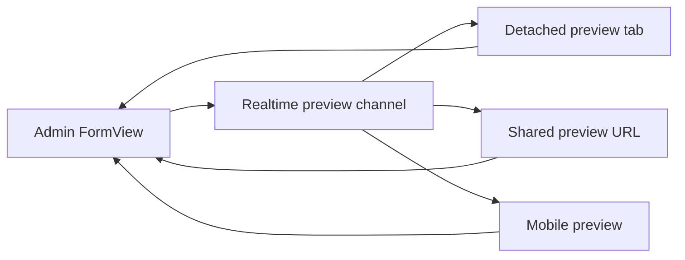

The default preview is same-tab iframe preview with `postMessage`. Detached tabs, shared stakeholder URLs, and multi-user preview require a realtime transport in addition to the same message contract.

Shared preview should preserve the same architecture:

- The admin `FormView` remains authoritative.
- The iframe or detached preview is a mirror.
- Save, autosave, Cmd+S, workflow transitions, locks, history, and actions stay in the existing form lifecycle.
- Realtime carries the same snapshot, patch, commit, focus, block, and resync concepts used by same-tab preview.

## When Realtime Helps

Use realtime transport when:

- the preview opens in a separate browser tab or monitor
- a stakeholder opens a shared preview URL
- multiple preview clients should follow one editor session
- a physical mobile device should mirror the editor session

For normal split-screen editing, same-tab `postMessage` is simpler and lower latency.

## Transport Model

The channel should be scoped by collection, record, locale, and active preview session. Messages must still be session-bound and validated before applying any edit request to the form.

## Publication Reads

Shared preview must not make draft data public by default. Public routes read `stage: "published"` when workflow controls publishing. Preview routes read the working stage only when the request is authorized through the preview token or equivalent session-bound preview mechanism.
