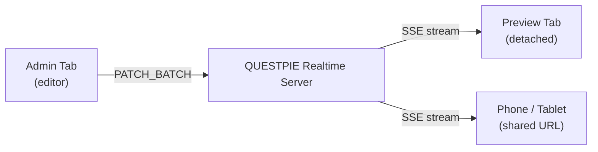

The [same-tab recipe](/docs/workspace/live-preview/same-tab-recipe) covers the default case: admin and preview in a split-screen iframe communicating over `postMessage`. This page covers the advanced case where preview runs in a separate browser tab, a shared URL, or across multiple users -- using QUESTPIE realtime as the transport.

<Callout type="info">
	The patch-based preview transport ships today via the [Visual Edit
	Workspace](./visual-edit) and `useCollectionPreview` for the in-iframe case.
	The realtime / shared-preview transport described on this page is a **design
	note** for an advanced use case (multi-user, detached tab, mobile device
	preview) that isn't wired up to a turn-key admin primitive yet. Read it for
	the design intent; a realtime-channel-aware wrapper would build on the same
	`useCollectionPreview` provider shape.
</Callout>

## When to Use Realtime

Use realtime preview when:

- **Detached preview window** -- The editor pops the preview into a separate tab or monitor. There is no iframe `postMessage` channel.
- **Shared preview URL** -- A designer or stakeholder opens the preview URL directly. They see live changes as the editor types, without needing admin access.
- **Multi-user collaboration** -- Multiple editors work on the same record. All connected preview sessions stay in sync.
- **Mobile device preview** -- The editor previews on a physical phone by opening the preview URL. Patches arrive over realtime.

For single-user split-screen editing, the direct `postMessage` transport from the [same-tab recipe](/docs/workspace/live-preview/same-tab-recipe) is simpler and has lower latency. Use that unless you need one of the scenarios above.

## Architecture



Instead of `postMessage`, patches flow through a realtime channel. The admin publishes patches to the channel. All connected preview clients subscribe and apply patches locally.

## Session Model

Each live preview session is identified by a `sessionId`. The session is scoped to a specific record and locale:

```
preview:{collectionName}:{recordId}:{locale}
```

For example: `preview:pages:abc123:en`

When the admin opens live preview for a record, it creates (or joins) a session on this channel. The `sessionId` is deterministic -- any client computing the same collection + record + locale arrives at the same channel.

### Session Lifecycle

1. **Admin opens preview** -- Publishes `INIT_SNAPSHOT` to the channel with the full record.
2. **Preview client connects** -- Subscribes to the channel via SSE. Receives the latest snapshot or buffered patches.
3. **Editing** -- Admin publishes `PATCH_BATCH` messages to the channel. All subscribers receive and apply them.
4. **Save** -- Admin publishes `COMMIT`. Preview clients call `reconcile` to refetch authoritative data.
5. **Disconnect** -- When the admin closes preview, it publishes a `SESSION_END` message over the realtime channel. Preview clients exit preview mode gracefully. (Note: `SESSION_END` is specific to the realtime transport. The `postMessage` protocol has no teardown message -- the admin simply destroys the iframe.)

## Setup

### 1. Configure Realtime Adapter

The realtime adapter must be configured in your runtime config. For development, `pgNotifyAdapter` works with a single server instance. For production with multiple instances, use `redisStreamsAdapter`.

```ts title="questpie.config.ts"
import { pgNotifyAdapter, runtimeConfig } from "questpie";

export default runtimeConfig({
	realtime: {
		adapter: pgNotifyAdapter({
			connectionString: process.env.DATABASE_URL,
		}),
	},
});
```

For production:

```ts title="questpie.config.ts"
import { redisStreamsAdapter, runtimeConfig } from "questpie";

export default runtimeConfig({
	realtime: {
		adapter: redisStreamsAdapter({
			url: process.env.REDIS_URL,
		}),
	},
});
```

### 2. Enable Preview on the Collection

Configure `.preview()` with the `realtime` option enabled:

```ts title="collections/pages.ts"
import { collection } from "#questpie/factories";

export const pages = collection("pages")
	.preview({
		url: ({ draft }) => `/${draft.slug}`,
		realtime: true,
	})
	.fields(({ f }) => ({
		title: f.text().required().localized(),
		slug: f.text().required(),
		content: f.blocks().localized(),
	}));
```

When `realtime: true`, the admin publishes patches to the realtime channel in addition to (or instead of) `postMessage`. The same-tab iframe still works -- it receives patches over both transports and deduplicates by `seq`.

### 3. Frontend Preview Page

Use the shipped `useCollectionPreview` hook for the iframe contract, then layer
the realtime channel alongside the same provider shape:

```tsx title="routes/pages/$slug.tsx"
import {
	useCollectionPreview,
	PreviewProvider,
	PreviewField,
	BlockRenderer,
} from "@questpie/admin/client";
import { client } from "@/lib/client";
import admin from "@/questpie/admin/.generated/client";

function PageRoute({ initialData, params }) {
	const router = useRouter();

	const preview = useCollectionPreview({
		initialData,
		onRefresh: () => router.invalidate(),
	});

	return (
		<PreviewProvider
			isPreviewMode={preview.isPreviewMode}
			focusedField={preview.focusedField}
			onFieldClick={preview.handleFieldClick}
		>
			<article>
				<PreviewField field="title">
					<h1>{preview.data.title}</h1>
				</PreviewField>

				{preview.data.content && (
					<BlockRenderer
						content={preview.data.content}
						renderers={admin.blocks}
						data={preview.data.content._data}
						selectedBlockId={preview.selectedBlockId}
						onBlockClick={
							preview.isPreviewMode ? preview.handleBlockClick : undefined
						}
					/>
				)}
			</article>
		</PreviewProvider>
	);
}
```

The hook detects whether it is running inside an iframe or standalone. Inside an iframe, it uses `postMessage` as primary and realtime as fallback. Standalone, it uses realtime exclusively.

## Channel Naming

Preview channels follow a fixed naming convention:

| Channel Pattern                            | Description                     |
| ------------------------------------------ | ------------------------------- |
| `preview:{collection}:{recordId}:{locale}` | Per-record preview session      |
| `preview:{global}:global:{locale}`         | Global document preview session |

Examples:

```
preview:pages:abc123:en
preview:pages:abc123:de
preview:settings:global:en
```

## Reconnect and Recovery

SSE connections can drop -- network interruptions, server restarts, mobile network switches. The realtime client handles reconnection automatically.

### Reconnect Sequence

1. SSE connection drops.
2. Client detects disconnect, enters `reconnecting` state.
3. Client retries with exponential backoff (1s, 2s, 4s, max 30s).
4. On successful reconnect, client sends its last known `seq` to the server.
5. Server replays any buffered messages since that `seq`.
6. If the buffer has been evicted (too old), server sends `FULL_RESYNC` with the current complete state.

### During Disconnect

While disconnected, the preview displays stale data. It does not attempt to apply patches from a local queue -- patches only come from the admin via realtime.

The `preview.connectionStatus` property reflects the current state:

```tsx
function PreviewStatusBanner({ preview }) {
	if (preview.connectionStatus === "reconnecting") {
		return (
			<div className="bg-warning/10 text-warning p-2 text-center text-sm">
				Reconnecting to live preview...
			</div>
		);
	}
	return null;
}
```

| Status         | Description                                |
| -------------- | ------------------------------------------ |
| `connected`    | SSE stream active, receiving patches       |
| `reconnecting` | Connection lost, retrying                  |
| `disconnected` | Gave up after max retries or session ended |

## Consistency Model

Realtime preview uses **eventual consistency** with **last-write-wins** for patches.

- Patches are ordered by `seq`. If two patches arrive for the same field, the higher `seq` wins.
- There is no conflict resolution. The admin is the single source of truth for edits. Preview clients are read-only consumers.
- Network latency means preview clients may briefly show stale data. Patches arrive within 50-200ms typically (pgNotify) or 100-500ms (Redis Streams, cross-region).
- After `COMMIT`, all clients reconcile with the server. This is the consistency checkpoint -- any drift is resolved.

## Full Detached Preview Example

This complete example shows a page that works both as a normal page and as a detached preview target:

```tsx title="routes/pages/$slug.tsx"
import { createFileRoute, useRouter } from "@tanstack/react-router";
import {
	useCollectionPreview,
	PreviewProvider,
	PreviewField,
	BlockRenderer,
	type BlockContent,
} from "@questpie/admin/client";
import { client } from "@/lib/client";
import admin from "@/questpie/admin/.generated/client";

export const Route = createFileRoute("/_app/pages/$slug")({
	loader: async ({ params }) => {
		const response = await client.collections.pages.findOne({
			where: { slug: params.slug },
			draft: true,
		});
		return { page: response.data };
	},
	component: PageComponent,
});

function PageComponent() {
	const { page } = Route.useLoaderData();
	const router = useRouter();

	const preview = useCollectionPreview({
		initialData: page,
		onRefresh: () => router.invalidate(),
	});

	return (
		<PreviewProvider
			isPreviewMode={preview.isPreviewMode}
			focusedField={preview.focusedField}
			onFieldClick={preview.handleFieldClick}
		>
			<article>
				<header className="py-16 text-center">
					<PreviewField field="title">
						<h1 className="text-5xl font-bold tracking-tight">
							{preview.data.title}
						</h1>
					</PreviewField>
				</header>

				{preview.data.content && (
					<BlockRenderer
						content={preview.data.content as BlockContent}
						renderers={admin.blocks}
						data={(preview.data.content as BlockContent)._data}
						selectedBlockId={preview.selectedBlockId}
						onBlockClick={
							preview.isPreviewMode ? preview.handleBlockClick : undefined
						}
					/>
				)}
			</article>

			{preview.isPreviewMode && (
				<div className="fixed right-4 bottom-4 z-50 rounded-full bg-foreground text-background px-4 py-2 text-sm font-medium shadow-lg">
					Live Preview
				</div>
			)}
		</PreviewProvider>
	);
}
```

Share the URL `https://yoursite.com/pages/about?preview=true` with anyone. As long as the admin has live preview open for that record, all viewers see changes in real time.

## Realtime vs PostMessage

| Aspect            | PostMessage (same-tab) | Realtime (shared)             |
| ----------------- | ---------------------- | ----------------------------- |
| Latency           | Sub-millisecond        | 50-500ms depending on adapter |
| Setup             | Zero config            | Requires realtime adapter     |
| Multi-user        | No                     | Yes                           |
| Detached window   | No                     | Yes                           |
| Mobile preview    | No                     | Yes                           |
| Offline tolerance | N/A (same tab)         | Reconnect + replay            |
| Infrastructure    | None                   | PostgreSQL or Redis           |

## Related Pages

- [Live Preview](/docs/workspace/live-preview) -- Overview and collection configuration
- [Same-Tab Recipe](/docs/workspace/live-preview/same-tab-recipe) -- Direct postMessage transport
- [Realtime Client](/docs/frontend/realtime) -- Client-side realtime subscriptions
- [Realtime (Production)](/docs/production/realtime) -- Infrastructure setup for realtime adapters
