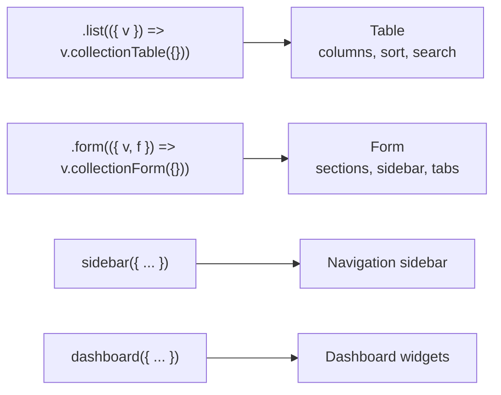

Views control how data appears in the admin panel. They're configured server-side on your collections and globals, then rendered by the admin client via registries.

## How Views Work

1. **You configure** views on collections using `.list()` and `.form()`
2. **Codegen** includes the view config in the generated types
3. **Admin client** reads the config and renders the appropriate UI

The admin never defines its own schema — it always reads from the server.

## Sections

- [List Views](/docs/workspace/views/list-views) — Tables, columns, sorting, search
- [Form Views](/docs/workspace/views/form-views) — Forms, sections, sidebar, reactive fields
- [Dashboard](/docs/workspace/views/dashboard) — Widgets, stats, charts, activity
- [Sidebar](/docs/workspace/views/sidebar) — Navigation sections and items
