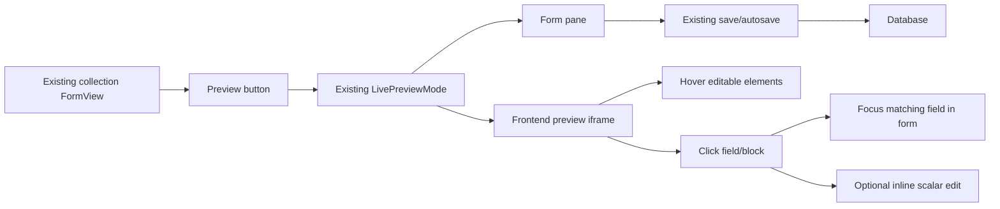
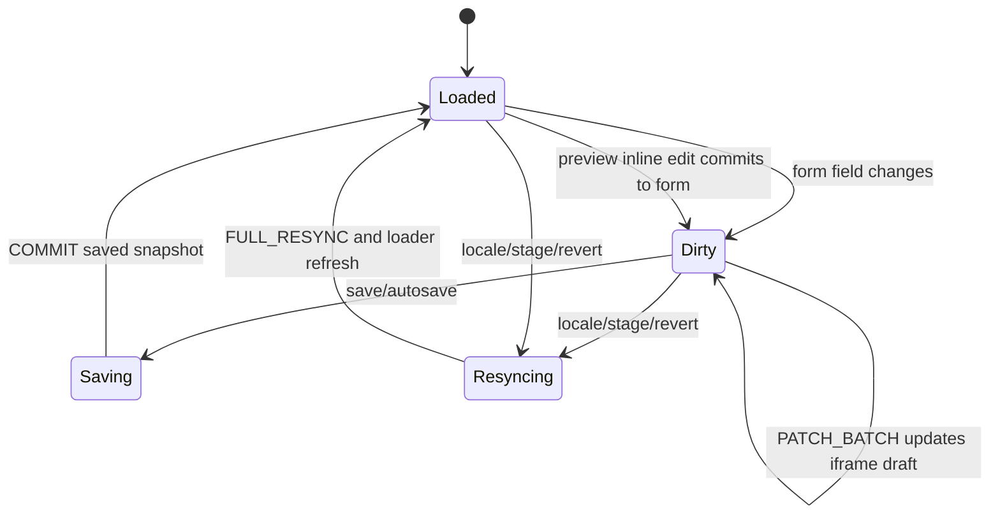
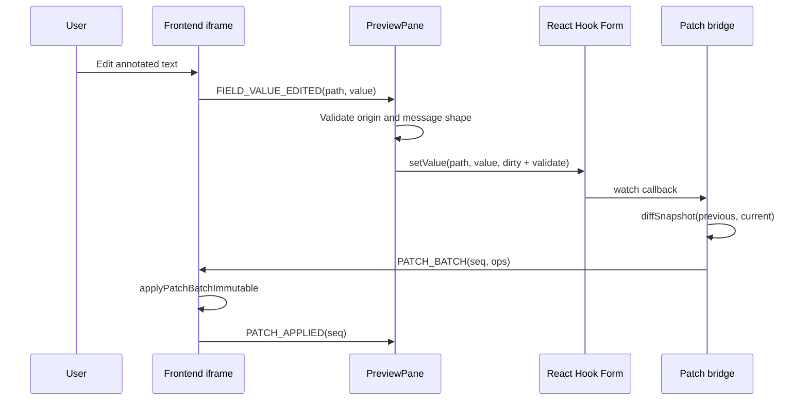
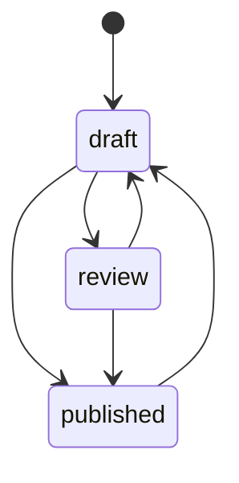
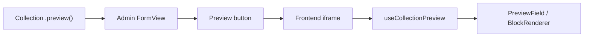

# Preview System And Visual Editing Plan For Main

This is the implementation brief for rebuilding the QUESTPIE preview and visual editing experience from a clean `main` branch.

The goal is not to create a second editor. The goal is to make the existing preview system become a real visual editing system while preserving the existing admin form workflow.

Use this document as the handoff prompt for the next implementation agent.

## Agent Brief

Start from clean `main`.

Implement visual editing as an enhancement of the existing preview system:

- keep the current collection `FormView`
- keep the current Preview button
- keep the current `LivePreviewMode` split-screen experience
- keep save/autosave/Cmd+S/workflow/history/locks/actions inside the existing form lifecycle
- add live patching, hover affordances, click-to-focus, and inline scalar editing inside the existing preview flow

Do not introduce a new default form view for visual editing. The product surface should remain one editor with one preview system.

The document is split into three parts:

1. Technical explanation
2. Implementation plan and examples
3. Documentation and AI skill notes

---

# Part 1: Technical Explanation

## 1. Product Model

The correct product model is:



Visual editing means the preview iframe becomes interactive:

- hover shows editable targets
- click focuses the matching form/block field
- supported scalar fields can be edited directly in preview
- unsaved changes are reflected immediately in the iframe

It does not mean replacing the form editor.

## 2. Existing Main System

Main already has the right foundation:

| Area | Existing main behavior |
| --- | --- |
| Form host | `packages/admin/src/client/views/collection/form-view.tsx` |
| Preview trigger | Preview button shown when collection has `.preview()` |
| Preview shell | `LivePreviewMode` renders form + iframe split view |
| Iframe host | `PreviewPane` mints preview token and renders iframe |
| Frontend hook | `useCollectionPreview` receives admin messages |
| Field annotation | `PreviewField` makes frontend fields clickable |
| Block annotation | `BlockRenderer` wraps blocks and sends block clicks |
| Persistence | existing create/update mutations |
| Workflow | existing stage badge and transition button |

The implementation should improve these pieces, not sidestep them.

## 3. Target State Model

There are three relevant states:

| State | Owner | Meaning |
| --- | --- | --- |
| Canonical persisted record | database | last saved version |
| Editing record | admin React Hook Form | current unsaved editor state |
| Preview draft mirror | iframe local state | rendering copy of unsaved editor state |

During editing, the admin form is the source of truth. The iframe is a mirror.



Important rule:

The iframe never persists data. It can request edits, but only the admin form updates the edit state, and only the existing save path writes to the database.

## 4. Message Protocol

The current refresh/focus messages stay:

| Direction | Message | Purpose |
| --- | --- | --- |
| preview -> admin | `PREVIEW_READY` | iframe loaded and can receive messages |
| admin -> preview | `PREVIEW_REFRESH` | iframe should re-run loader |
| preview -> admin | `REFRESH_COMPLETE` | refresh finished |
| preview -> admin | `FIELD_CLICKED` | user clicked annotated frontend field |
| preview -> admin | `BLOCK_CLICKED` | user clicked annotated frontend block |
| admin -> preview | `FOCUS_FIELD` | focus/highlight frontend field |
| admin -> preview | `SELECT_BLOCK` | select/highlight frontend block |

Add patch and resync messages:

| Direction | Message | Purpose |
| --- | --- | --- |
| admin -> preview | `INIT_SNAPSHOT` | seed iframe local draft from form baseline |
| admin -> preview | `PATCH_BATCH` | apply unsaved field changes |
| preview -> admin | `PATCH_APPLIED` | acknowledge applied batch |
| admin -> preview | `COMMIT` | save succeeded, replace draft with saved snapshot |
| admin -> preview | `FULL_RESYNC` | discard local draft and re-run loader |
| preview -> admin | `RESYNC_REQUEST` | iframe detected mismatch and asks for refresh |

Add inline edit message:

| Direction | Message | Purpose |
| --- | --- | --- |
| preview -> admin | `FIELD_VALUE_EDITED` | user committed an inline edit in the iframe |

Suggested inline edit payload:

```ts
type FieldValueEditedMessage = {
	type: "FIELD_VALUE_EDITED";
	path: string;
	value: unknown;
	inputKind: "text" | "textarea" | "number" | "boolean";
	blockId?: string;
	fieldType?: "regular" | "block" | "relation";
};
```

Inline edit flow:



## 5. Path Model

Normal fields use direct paths:

```txt
title
description
metaTitle
seo.title
```

Block fields use scoped paths:

```txt
content._values.<blockId>.title
content._values.<blockId>.description
content._values.<blockId>.cta.label
```

The blocks field has two parts:

```ts
type BlockContent = {
	_tree: Array<{ id: string; type: string; children: unknown[] }>;
	_values: Record<string, Record<string, unknown>>;
	_data?: Record<string, unknown>;
};
```

Rules:

- `_tree` is structure.
- `_values` is editable field data.
- Inline editing should target `_values`, not `_tree`.
- Tree changes such as add/remove/reorder stay in the existing block editor.
- Tree changes can trigger `PREVIEW_REFRESH` first; patching tree arrays can come later.

## 6. Security And Safety

All preview messages are untrusted input because they come from iframe/page content.

Admin must validate:

- message origin
- message type
- active preview session
- field path exists in the active schema or block value map
- field type supports the requested edit
- payload size is reasonable
- value is serializable

Do not allow arbitrary iframe messages to call `form.setValue` on unknown paths.

Do not use wildcard `postMessage` targets when the preview origin can be resolved.

## 7. Workflow And Publishing

Workflow is separate from preview, but preview must resync when workflow state changes.

For pages, workflow stage should be the source of truth:



Public page reads:

```ts
stage: "published";
```

Admin preview reads:

- if draft mode is active, load the working stage
- otherwise load published

Avoid duplicate publish booleans when workflow exists. If a project keeps an `isPublished` field, it must be treated as a separate business field, not the publication source of truth.

---

# Part 2: Implementation Plan And Examples

## 1. Implementation Principles

Follow these constraints:

1. Start from clean `main`.
2. Keep `FormView` as the host.
3. Keep `LivePreviewMode` as the preview surface.
4. Keep the Preview button.
5. Keep existing save/autosave/workflow behavior.
6. Add patching and visual editing inside the preview flow.
7. Keep docs and examples aligned with exported APIs only.

## 2. Phase Plan

### Phase 0: Baseline From Main

Tasks:

- create a clean branch from `main`
- inspect current `FormView`, `LivePreviewMode`, `PreviewPane`, `useCollectionPreview`, `PreviewField`, and `BlockRenderer`
- add or update tests for existing Preview button behavior before changing it

Acceptance:

- opening an edit page still shows normal form
- Preview button still opens split preview
- save still works without preview open
- save still works with preview open

### Phase 1: Patch Foundation Inside Existing Preview

Tasks:

- add `diffSnapshot`
- add `applyPatchBatchImmutable`
- extend preview message types with patch protocol
- update `useCollectionPreview` to keep local draft data
- update `PreviewPane` to send `INIT_SNAPSHOT`, `PATCH_BATCH`, `COMMIT`, and `FULL_RESYNC`
- add a form watcher bridge used only while preview is open
- deep-clone baselines and snapshots

Acceptance:

- change a simple field in the form while preview is open
- iframe updates before save
- save persists through existing mutation
- reload shows saved value
- repeated nested edits keep patching

### Phase 2: Hover And Click Selection

Tasks:

- improve `PreviewField` hover/focus state
- improve `BlockRenderer` hover/selected state
- add preview-only overlay CSS
- fix event routing so field clicks do not get swallowed by block wrappers
- focus/scroll exact form field after frontend click

Acceptance:

- hovering a frontend field shows a polished editable affordance
- hovering a block shows a block boundary
- clicking a field focuses matching field
- clicking a block selects matching block
- nested blocks route correctly
- no hover layout shift

### Phase 3: Inline Scalar Editing

Tasks:

- add `editable` prop to `PreviewField`
- implement preview-side inline edit state
- send `FIELD_VALUE_EDITED` on commit
- handle that message in admin by calling `form.setValue`
- validate field path and supported input kind
- support `text` and `textarea` first

Acceptance:

- double-click or Enter on an editable preview text starts editing
- Escape cancels
- blur or Enter commits
- committed edit updates RHF dirty state
- iframe reflects edit
- save persists edit

### Phase 4: Blocks

Tasks:

- ensure `BlockRenderer` provides `BlockScopeProvider`
- ensure custom block renderers can use `PreviewField`
- annotate barbershop blocks
- support inline scalar edits inside block values
- keep add/remove/reorder in existing block editor
- trigger refresh for tree changes if patching tree is not implemented yet

Acceptance:

- block fields show hover affordances
- block field click focuses exact block field
- inline edit inside block updates `content._values.<blockId>.<field>`
- block tree operations still work in form editor
- preview remains in sync after tree operation

### Phase 5: Page Workflow Example

Tasks:

- configure barbershop pages with versioning workflow
- public frontend reads `stage: "published"`
- preview/draft mode reads working stage
- seed demo pages by transitioning to `published`
- remove duplicate `isPublished` from pages if workflow is the publication mechanism

Acceptance:

- draft pages are hidden from public routes
- published pages are visible
- preview can show draft edits
- transition button works
- stage changes resync preview

### Phase 6: Docs And Skills

Tasks:

- update live preview docs
- add prepare-page-for-preview docs
- add protocol docs with Mermaid
- update block renderer docs
- update workflow docs
- update `questpie-admin` skill
- update `questpie` skill
- mirror skills into `packages/create-questpie/skills`

Acceptance:

- docs validation passes
- docs only mention exported APIs
- docs teach one preview system
- skills instruct AI agents to preserve existing preview flow

## 3. File-Level Worklist

Admin files:

| File | Work |
| --- | --- |
| `packages/admin/src/client/views/collection/form-view.tsx` | mount preview patch bridge while Preview is open |
| `packages/admin/src/client/components/preview/live-preview-mode.tsx` | pass refs/callbacks through existing preview surface |
| `packages/admin/src/client/components/preview/preview-pane.tsx` | send/receive patch and inline edit messages |
| `packages/admin/src/client/preview/use-collection-preview.ts` | local draft state and patch application |
| `packages/admin/src/client/preview/preview-field.tsx` | hover, focus, editable scalar fields |
| `packages/admin/src/client/preview/types.ts` | message types |
| `packages/admin/src/client/preview/diff.ts` | snapshot diff helper |
| `packages/admin/src/client/preview/patch.ts` | immutable patch applier |
| `packages/admin/src/client/blocks/block-renderer.tsx` | block hover/selection and event routing |

Barbershop files:

| File | Work |
| --- | --- |
| `examples/tanstack-barbershop/src/questpie/server/collections/pages.ts` | keep `v.collectionForm`, add workflow, remove duplicate publish flag when appropriate |
| `examples/tanstack-barbershop/src/lib/getPages.function.ts` | use draft mode and `stage: "published"` |
| `examples/tanstack-barbershop/src/components/pages/PageRenderer.tsx` | use `useCollectionPreview`, `PreviewProvider`, `BlockRenderer` |
| block renderer files | annotate fields with `PreviewField editable=...` |
| seed files | transition demo pages to `published` |
| migration files | schema changes for workflow/publish cleanup |

Docs and skills:

| File area | Work |
| --- | --- |
| `apps/docs/content/docs/workspace/live-preview/*` | preview overview, protocol, prepare guide |
| `apps/docs/content/docs/workspace/blocks/*` | block annotations |
| `apps/docs/content/docs/backend/data-modeling/versioning-workflow.mdx` | workflow stage publishing |
| `apps/docs/content/docs/examples/barbershop.mdx` | reference implementation |
| `skills/questpie-admin/*` | AI instructions for preview/admin UI |
| `skills/questpie/*` | AI instructions for workflow/public reads |
| `packages/create-questpie/skills/*` | mirrored skill copies |

## 4. Code Examples

### Collection Preview Config

```ts
export const pages = collection("pages")
	.fields(({ f }) => ({
		title: f.text(255).label("Title").required().localized(),
		slug: f.text(255).label("Slug").required().inputOptional(),
		description: f.textarea().label("Description").localized(),
		content: f.blocks().label("Content").localized(),
		metaTitle: f.text(255).label("Meta Title").localized(),
		metaDescription: f.textarea().label("Meta Description").localized(),
	}))
	.preview({
		enabled: true,
		position: "right",
		defaultWidth: 50,
		url: ({ record }) => {
			const slug = record.slug as string;
			return slug === "home" ? "/?preview=true" : `/${slug}?preview=true`;
		},
	})
	.options({
		versioning: {
			enabled: true,
			maxVersions: 50,
			workflow: {
				initialStage: "draft",
				stages: {
					draft: { label: "Draft", transitions: ["review", "published"] },
					review: { label: "In review", transitions: ["draft", "published"] },
					published: { label: "Published", transitions: ["draft"] },
				},
			},
		},
	})
	.form(({ v, f }) =>
		v.collectionForm({
			sidebar: {
				position: "right",
				fields: [f.slug],
			},
			fields: [
				{
					type: "section",
					label: "Page Info",
					fields: [f.title, f.description],
				},
				{
					type: "section",
					label: "Content",
					fields: [f.content],
				},
				{
					type: "section",
					label: "SEO",
					layout: "grid",
					columns: 2,
					fields: [f.metaTitle, f.metaDescription],
				},
			],
		}),
	);
```

Important:

- `.preview()` enables the Preview button.
- `.form()` stays `v.collectionForm`.
- Workflow stage handles publication.

### Public Page Loader

```ts
export const getPage = createServerFn({ method: "GET" })
	.inputValidator((data: { slug: string }) => data)
	.handler(async ({ data }) => {
		const headers = getRequestHeaders();
		const cookie = headers.get("cookie");
		const isDraft = isDraftMode(cookie ? String(cookie) : undefined);
		const ctx = await createRequestContext();

		const page = await app.collections.pages.findOne(
			{
				where: { slug: data.slug },
				...(isDraft ? {} : { stage: "published" }),
			},
			ctx,
		);

		if (!page) throw notFound();
		return { page };
	});
```

### Frontend Page Preview Setup

```tsx
export function PageRenderer({ page }: { page: Page }) {
	const router = useRouter();
	const preview = useCollectionPreview({
		initialData: page,
		onRefresh: () => router.invalidate(),
	});

	return (
		<PreviewProvider preview={preview}>
			<article className={preview.isPreviewMode ? "questpie-preview" : ""}>
				<BlockRenderer
					content={preview.data.content}
					renderers={admin.blocks}
					data={preview.data.content?._data}
					selectedBlockId={preview.selectedBlockId}
					onBlockClick={
						preview.isPreviewMode ? preview.handleBlockClick : undefined
					}
				/>
			</article>
		</PreviewProvider>
	);
}
```

### Custom Block Renderer Annotation

```tsx
export function HeroBlock({ values }: { values: HeroValues }) {
	return (
		<section className="hero">
			<PreviewField field="eyebrow" editable="text" as="p">
				{values.eyebrow}
			</PreviewField>

			<PreviewField field="title" editable="text" as="h1">
				{values.title}
			</PreviewField>

			<PreviewField field="description" editable="textarea" as="p">
				{values.description}
			</PreviewField>
		</section>
	);
}
```

Inside `BlockRenderer`, `BlockScopeProvider` resolves these to:

```txt
content._values.<blockId>.eyebrow
content._values.<blockId>.title
content._values.<blockId>.description
```

### Admin Inline Edit Handler

```ts
function handleFieldValueEdited(message: FieldValueEditedMessage) {
	if (!isAllowedPreviewEditPath(message.path, schema)) {
		return;
	}

	if (!isInlineEditableField(message.path, message.inputKind, schema)) {
		return;
	}

	form.setValue(message.path, message.value, {
		shouldDirty: true,
		shouldValidate: true,
		shouldTouch: true,
	});

	scrollFieldIntoView(message.path);
}
```

### Form Patch Bridge

```ts
useLivePreviewPatcher({
	form,
	previewRef,
	fields,
	schema,
	baseline: transformedItem,
	enabled: isLivePreviewOpen && canUseLivePreview,
});
```

The bridge should:

- watch form values
- diff against the last sent snapshot
- send `PATCH_BATCH`
- deep clone snapshots after each flush
- reset after save or resync

## 5. Test Plan

### Unit Tests

| Area | Required cases |
| --- | --- |
| `diffSnapshot` | primitive set/remove, nested object changes, arrays atomic |
| `applyPatchBatchImmutable` | set/remove nested paths, missing containers, array indexes |
| sequencing | stale patch batches ignored |
| path helpers | block path build/parse roundtrip |
| cloning | repeated nested edits emit repeated patches |
| inline validation | unknown paths rejected |

### Component Tests

| Component | Required cases |
| --- | --- |
| `PreviewField` | click emits field path, focused state, editable starts edit |
| `PreviewProvider` | provides preview callbacks and state |
| `BlockRenderer` | block click, nested block click, field click inside block |
| `PreviewPane` | accepts `FIELD_VALUE_EDITED`, rejects invalid origin |
| form bridge | `FIELD_VALUE_EDITED` calls `setValue` and marks dirty |

### Browser Tests

Use barbershop.

Required flow:

1. Login.
2. Open `Pages -> Home`.
3. Click Preview.
4. Hover hero title and see editable affordance.
5. Click hero title and focus matching form/block field.
6. Inline edit hero title.
7. Verify form becomes dirty.
8. Verify iframe updates before save.
9. Save.
10. Reload page and verify persisted text.
11. Edit a field inside a block.
12. Reorder a block through existing form editor.
13. Verify preview refreshes after tree operation.
14. Transition draft -> published.
15. Verify public route reads only published stage.

## 6. Implementation Matrix

| Priority | Task | Result |
| --- | --- | --- |
| P0 | Start clean from `main` | avoids carrying bad UX decisions |
| P0 | Preserve existing Preview button flow | no product regression |
| P1 | Patch protocol in existing preview | unsaved form edits update iframe |
| P1 | Local draft state in `useCollectionPreview` | frontend can render unsaved draft |
| P1 | Deep-clone patch snapshots | nested edits stay reliable |
| P1 | Commit/resync hooks on save/revert/stage | iframe does not keep stale draft |
| P2 | Polished hover/focus overlays | visual editor feels intentional |
| P2 | Better block event routing | block and field clicks do the right thing |
| P2 | Form focus from preview click | user can navigate visually |
| P3 | Inline scalar editing | frontend text can be edited directly |
| P3 | Block field inline editing | custom blocks become visually editable |
| P3 | Barbershop reference | proves the system end-to-end |
| P3 | Docs and skills | future users and agents use it correctly |

---

# Part 3: Documentation And AI Skills

## 1. Documentation Principles For Humans

Documentation should be written from the user's mental model:

> "I have a frontend page. I want editors to preview and visually edit it from the admin."

Avoid internal architecture first. Start with the workflow, then show code.

Use the term **Preview system**.

Do not use:

- Preview V2
- migration guide
- new preview system
- visual edit as a separate form view
- undocumented APIs

Docs should make this clear:

- `.preview()` enables the admin Preview button
- `useCollectionPreview` makes frontend pages preview-aware
- `PreviewField` marks editable frontend fields
- `BlockRenderer` makes blocks selectable/editable
- patches make unsaved edits visible before save
- save still happens in the admin form
- workflow stages control publishing

## 2. Recommended Docs Structure

### Live Preview Overview

Audience: users setting up preview for the first time.

Must include:

- what preview does
- end-to-end diagram
- `.preview({ url })`
- Preview button behavior
- form/iframe split screen
- save/autosave behavior
- patch behavior as an implementation detail

Suggested diagram:



### Prepare A Page For Preview

Audience: app developers.

Must include steps:

1. Configure `.preview({ url })`.
2. Make the route loader draft-mode aware.
3. Use `stage: "published"` for public reads.
4. Add `useCollectionPreview`.
5. Wrap page with `PreviewProvider`.
6. Annotate scalar fields with `PreviewField`.
7. Use `BlockRenderer` for blocks.
8. Annotate custom block fields.
9. Test in admin Preview.

### Visual Editing Guide

Audience: developers who want hover/click/inline editing.

Must explain:

- preview mode only activates inside admin iframe
- `PreviewField` hover/click behavior
- `editable="text"` / `editable="textarea"`
- block field path resolution
- what supports inline editing
- what falls back to form editing

### Blocks In Preview

Audience: developers writing custom block renderers.

Must explain:

- `BlockRenderer`
- `BlockScopeProvider`
- block field annotations
- nested blocks
- event routing
- tree changes vs value changes

### Protocol Reference

Audience: advanced implementors.

Must include:

- all message types
- direction of each message
- initial handshake
- form patch
- inline edit
- save commit
- full resync
- stage transition
- security rules

Use Mermaid sequence diagrams, not ASCII graphs.

### Workflow Publishing

Audience: app developers building draft/publish flows.

Must explain:

- versioning
- workflow stages
- public stage reads
- preview draft mode
- stage transitions
- why not to duplicate publish booleans

## 3. Documentation Quality Checklist

Every docs page should pass this checklist:

- starts with a practical user goal
- uses real exported APIs
- includes a minimal working example
- names the files where code goes
- explains what happens before save and after save
- explains what requires frontend annotations
- explains what is not supported yet
- avoids "V2" terminology
- includes Mermaid for protocol/workflow diagrams
- links to related docs without creating circular confusion

## 4. AI Skill Updates

The skills must prevent future agents from rebuilding the wrong architecture.

### `questpie-admin` Skill

Add guidance:

- The preview system is based on existing `FormView` + Preview button + `LivePreviewMode`.
- Do not introduce a separate default visual edit form view.
- Visual editing belongs inside preview mode.
- Preserve save/autosave/Cmd+S/history/workflow/locks/actions.
- Use `PreviewField` for frontend field annotations.
- Use `BlockRenderer` and `BlockScopeProvider` for blocks.
- Patches are infrastructure; UX remains the existing preview editor.

Suggested skill text:

```md
## Preview System

QUESTPIE has one preview system. Collections enable it with `.preview({ url })`.
The admin shows a Preview button in the existing collection `FormView`; clicking it
opens `LivePreviewMode`, which renders the form and frontend iframe side by side.

Do not replace the collection form with a separate visual editor view. Visual
editing enhancements (hover affordances, click-to-focus, inline scalar edits,
and patch-based iframe updates) should be implemented inside the existing preview
flow so save, autosave, Cmd+S, workflow transitions, history, locks, and actions
remain on the normal form path.
```

### `questpie` Skill

Add guidance:

- Workflow stage is the publication source when workflow is enabled.
- Public page routes should query `stage: "published"`.
- Admin preview/draft mode may load draft/current stage.
- Avoid duplicate `isPublished` unless the app explicitly needs a separate business flag.
- Do not import `app` from generated files inside collection/block/route definitions.

Suggested skill text:

```md
## Preview And Publishing

For page publishing, prefer versioning workflow stages (`draft`, `review`,
`published`) over a separate `isPublished` field. Public route loaders should
query `stage: "published"`; admin preview routes can use draft mode to load the
working stage. Stage transitions are admin workflow actions, not normal schema
fields.
```

### `create-questpie` Skill Copies

Mirror the same updates into:

- `packages/create-questpie/skills/questpie-admin`
- `packages/create-questpie/skills/questpie`

Do not let the scaffolded or bundled skills recommend an architecture different from the root skills.

## 5. Documentation Examples To Include

### Minimal Field Preview

```tsx
function BlogPost({ post }) {
	const router = useRouter();
	const preview = useCollectionPreview({
		initialData: post,
		onRefresh: () => router.invalidate(),
	});

	return (
		<PreviewProvider preview={preview}>
			<PreviewField field="title" editable="text" as="h1">
				{preview.data.title}
			</PreviewField>
			<PreviewField field="excerpt" editable="textarea" as="p">
				{preview.data.excerpt}
			</PreviewField>
		</PreviewProvider>
	);
}
```

### Minimal Block Preview

```tsx
function FeatureBlock({ values }) {
	return (
		<section>
			<PreviewField field="title" editable="text" as="h2">
				{values.title}
			</PreviewField>
			<PreviewField field="body" editable="textarea" as="p">
				{values.body}
			</PreviewField>
		</section>
	);
}
```

### Public Published Read

```ts
const page = await app.collections.pages.findOne(
	{
		where: { slug },
		...(isDraft ? {} : { stage: "published" }),
	},
	ctx,
);
```

## 6. Final Acceptance Criteria

The whole project is successful only when:

- the implementation starts from clean `main`
- existing Preview button workflow is preserved
- no new default visual form view is required
- simple form field edits patch the iframe before save
- hover states clearly show editable frontend elements
- clicking frontend fields focuses corresponding admin fields
- inline scalar editing works through admin form state
- custom block fields can be annotated and edited
- block tree operations remain in the existing block editor
- workflow stage controls publishing
- barbershop demonstrates the full flow
- docs teach the system clearly to humans
- skills teach the system clearly to AI agents
- tests cover the protocol, path mapping, patching, and browser flow

## 7. Recommended Handoff Prompt

Use this prompt for the next agent:

```md
Start from clean main. Implement QUESTPIE preview visual editing as an
enhancement of the existing preview system, not as a separate form view.

Preserve FormView, the Preview button, LivePreviewMode, and the existing
save/autosave/Cmd+S/workflow/history/locks/actions lifecycle.

Add patch-based unsaved preview updates, polished hover affordances,
click-to-focus, optional inline scalar editing through PreviewField, and
block field editing through BlockRenderer + BlockScopeProvider annotations.

Use docs/PREVIEW-SYSTEM-MAIN-IMPLEMENTATION-PLAN.md as the source of truth.
Implement incrementally with tests and update docs/skills so humans and AI
agents learn the correct architecture.
```
