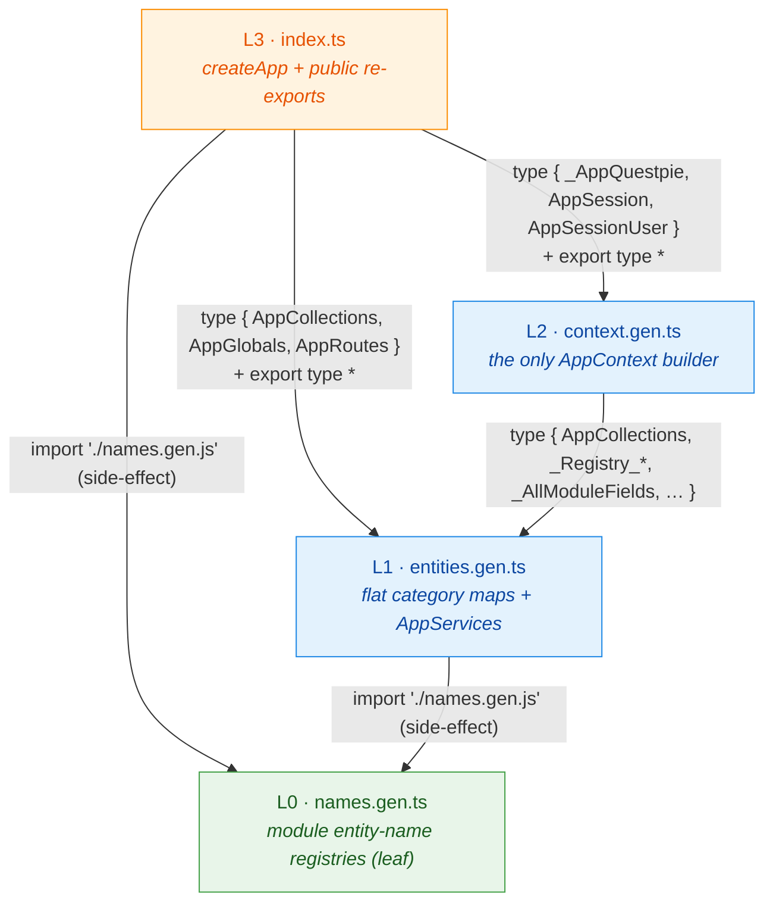
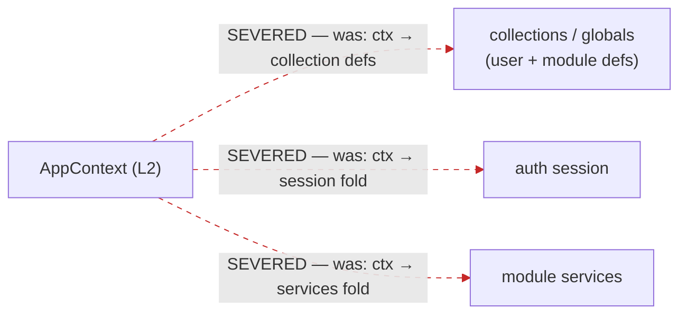

# Codegen Type-Flow Graph — the one-way layer DAG

QUESTPIE codegen emits each app's `.generated/` directory as a **strict
downward-only layer DAG**. This is what makes the `AppContext`⇄`config` cycle
and the `ctx`→user-code back-edges impossible **by construction** — not by
convention. The enforcement is `scripts/check-codegen-layers.ts`
(`bun run check:codegen-layers`), wired into the CI `build` job; this document
is the human-readable companion.

## The layers

| Layer | File | Role | May import |
| ----- | ---- | ---- | ---------- |
| **L3** | `index.ts` | Runtime tail (`createApp`) + public re-exports | L2, L1, L0 |
| **L2** | `context.gen.ts` | The **only** `AppContext` builder; owns the cycle-head carriers + the composition `declare global` | L1, L0 |
| **L1** | `entities.gen.ts` | Flat category maps (`AppCollections`/`AppGlobals`/…) + `AppServices` | L0 |
| **L0** | `names.gen.ts` | Module entity-NAME key registries (leaf) | *(nothing)* |

Imports point **DOWNWARD only**. Every edge below goes from a higher layer to a
strictly lower one; there is **no upward edge and no cycle**.

These are the **actual** emitted intra-`.generated/` edges (verified across
`examples/{toy-factory-backend,city-portal,tanstack-barbershop}/src/questpie/server/.generated`
and `packages/questpie/test/types/__fullapp__/.generated`). All other imports in
these files target lower-package modules (`#questpie/...`) or sibling generated
inputs (`../questpie.config.js`, `../modules.js`, `../collections/*`, etc.) — none
of which are part of the four-node layer graph.

## The severed back-edges

The former cycles ran through three back-edges from `ctx`/`AppContext` into
user-/module-contributed code. They are now **severed via ambient registries**
and gen-time-flat carriers, so no layer needs to reach upward to type them:

- **`ctx.collections` / `ctx.globals`** — typed from `AppCollections`/`AppGlobals`
  composed in **L1** from `typeof _modules` + named user collections. `AppContext`
  (L2) reads these named types **downward** from L1; it never folds back into the
  collection/global definitions that referenced `AppContext`.
- **`ctx.session`** — `_AppSession` is derived in **L2** from
  `InferSessionFromAuthConfig<typeof _authConfig>` (a value `typeof`, acyclic),
  not from a module-services fold.
- **`ctx.services`** — `_ModuleServices` is emitted **gen-time-FLAT** (`{}` plus
  each contributing service enumerated DIRECTLY by name in L1), never
  `ExtractModulePropArr<typeof _modules, "services">`. A fold there would
  re-materialise `ServiceCreateContext → AppContext` and re-close the cycle.
- **Module entity names** — surfaced as ambient `declare global` augmentations of
  `Questpie.<Cat>Keys` in **L0** (the leaf), so name-keying needs no upward import.

`L2` now obtains all three **downward** (named types from L1) or from acyclic
value-`typeof` carriers — the dashed red edges no longer exist in the emitted
graph.

## What the check enforces

For each generated app it parses the four layer files' import/export specifiers
and asserts:

1. `names.gen.ts` (L0) imports **none** of the other three layer files.
2. `entities.gen.ts` (L1) imports nothing from `context.gen.ts`/`index.ts`.
3. `context.gen.ts` (L2) imports nothing from `index.ts`.
4. **No cycle** among the four layer files (independent DFS, not just the rank rule).
5. All four layer files are actually present (a partial emission also fails).

A deliberate upward import injected into any `names.gen.ts` turns the check RED
(verified: it reports both the upward edge and the induced cycle, exit 1), which
proves it is not a no-op.
